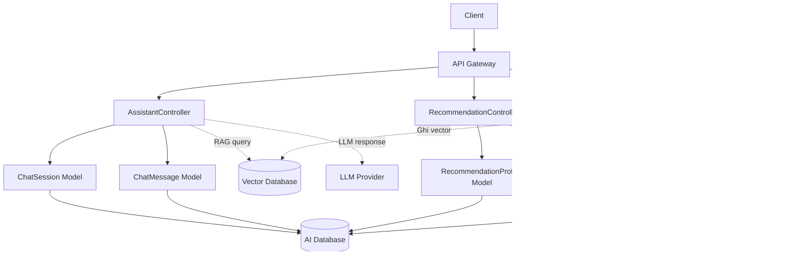
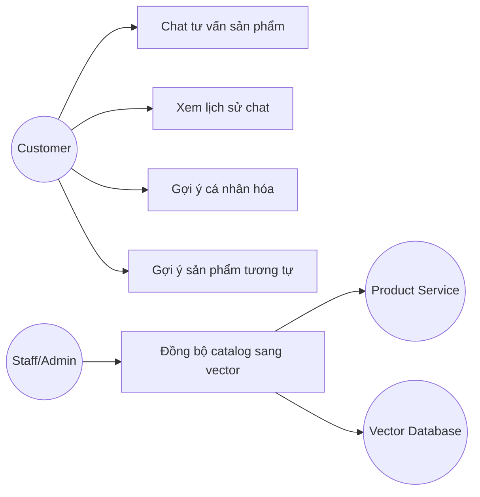
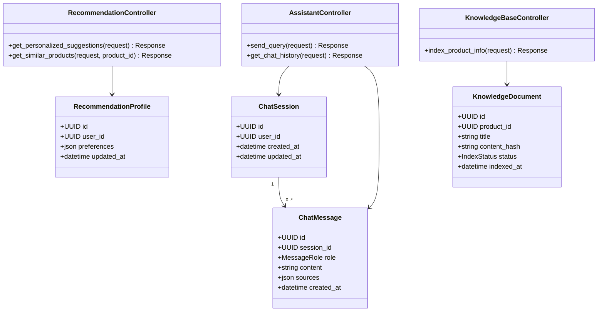
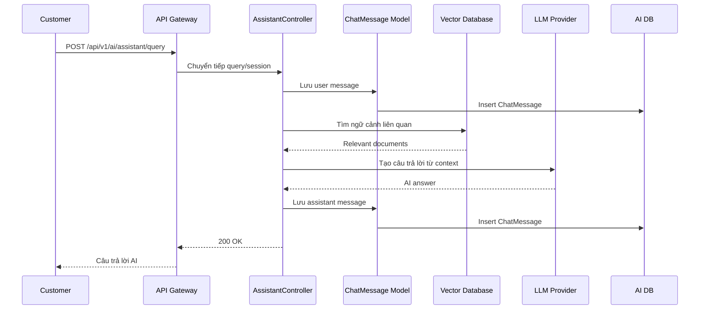
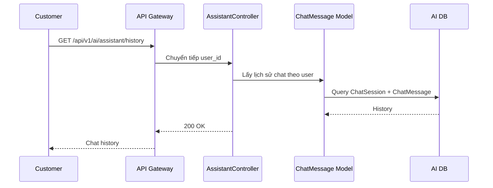
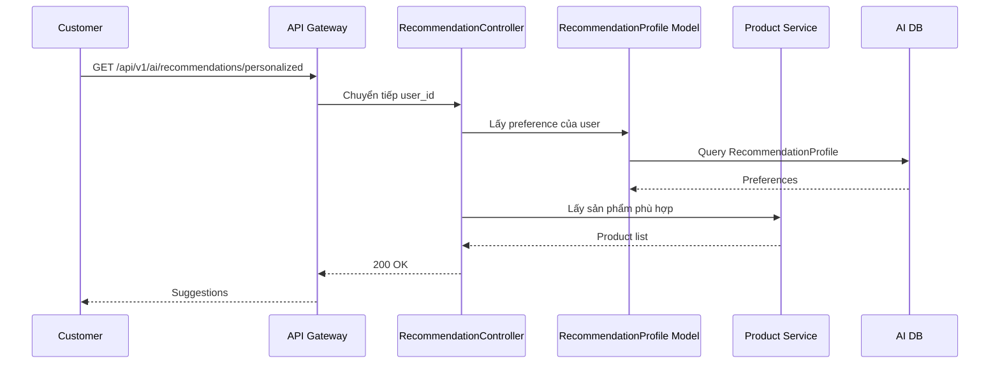
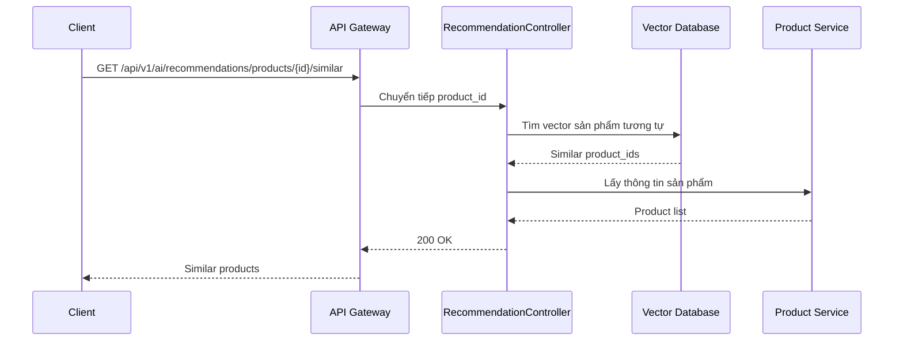
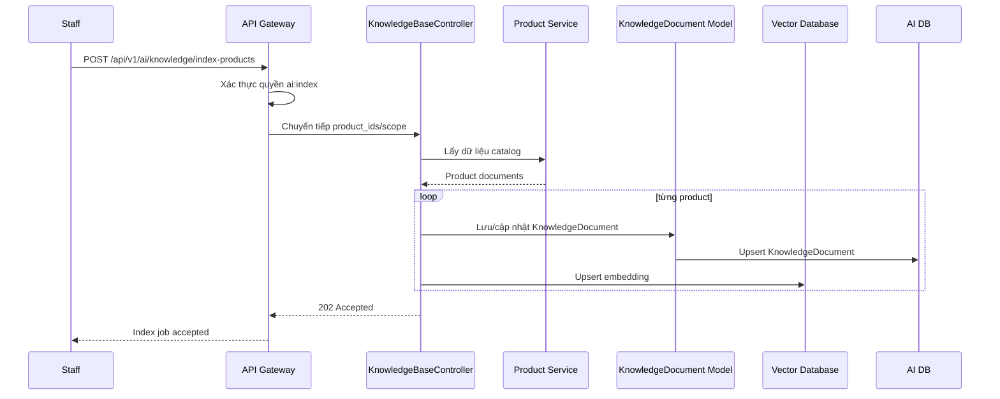

# Thiết kế chi tiết AI Service

## 1. Tổng quan service

AI Service thuộc AI Service Context, cung cấp chatbot RAG, hệ thống gợi ý sản phẩm và đồng bộ tri thức sản phẩm từ Product Service sang Vector Database. Service này không thay thế Product Service; mọi thông tin nhạy cảm về giá, tồn kho hoặc trạng thái sản phẩm cần được xác minh lại với Product Service nếu cần độ chính xác thời gian thực.

Thiết kế nội bộ dùng MVC đơn giản với `AssistantController`, `RecommendationController`, `KnowledgeBaseController` và các model `ChatSession`, `ChatMessage`, `RecommendationProfile`, `KnowledgeDocument`.

## 2. Controller và phương thức

| Controller | Phương thức | Mô tả |
| --- | --- | --- |
| AssistantController | `send_query()` | Chat với AI RAG để tư vấn sản phẩm. |
| AssistantController | `get_chat_history()` | Xem lại các cuộc hội thoại tư vấn trước đó. |
| RecommendationController | `get_personalized_suggestions()` | Lấy danh sách gợi ý sản phẩm cho trang chủ. |
| RecommendationController | `get_similar_products()` | Gợi ý sản phẩm tương đương trên trang chi tiết. |
| KnowledgeBaseController | `index_product_info()` | Đồng bộ dữ liệu Catalog sang Vector Database. |

## 3. Kiến trúc nội bộ theo MVC đơn giản



## 4. Use case



## 5. Sơ đồ lớp thiết kế



## 6. Quy tắc nghiệp vụ

- Chatbot chỉ trả lời dựa trên tri thức được index và nguồn đáng tin cậy.
- Câu trả lời nên kèm nguồn sản phẩm nếu có.
- Dữ liệu giá và tồn kho cần xác minh lại với Product Service nếu hiển thị cho khách hàng.
- Lịch sử chat chỉ thuộc về user hiện tại.
- `index_product_info()` có thể chạy theo product cụ thể hoặc toàn bộ catalog.
- KnowledgeDocument cần lưu `content_hash` để tránh index lại dữ liệu không đổi.

## 7. Thiết kế API

Base path:

```text
/api/v1/ai
```

| Controller | Method | Endpoint | Auth | Mô tả |
| --- | --- | --- | --- | --- |
| AssistantController | `send_query()` | `POST /api/v1/ai/assistant/query` | Có | Chat với AI RAG. |
| AssistantController | `get_chat_history()` | `GET /api/v1/ai/assistant/history` | Có | Lịch sử hội thoại. |
| RecommendationController | `get_personalized_suggestions()` | `GET /api/v1/ai/recommendations/personalized` | Có | Gợi ý cá nhân hóa. |
| RecommendationController | `get_similar_products()` | `GET /api/v1/ai/recommendations/products/{product_id}/similar` | Không | Gợi ý sản phẩm tương tự. |
| KnowledgeBaseController | `index_product_info()` | `POST /api/v1/ai/knowledge/index-products` | Có | Đồng bộ catalog sang Vector Database. |

## 8. Sequence diagram

### 8.1 `send_query()`



### 8.2 `get_chat_history()`



### 8.3 `get_personalized_suggestions()`



### 8.4 `get_similar_products()`



### 8.5 `index_product_info()`



## 9. Kiểm thử đề xuất

- Gửi câu hỏi RAG và nhận câu trả lời có nguồn.
- Lấy lịch sử chat đúng user.
- Gợi ý cá nhân hóa.
- Gợi ý sản phẩm tương tự.
- Index một sản phẩm.
- Index toàn bộ catalog.
- Không index lại nếu `content_hash` không đổi.
