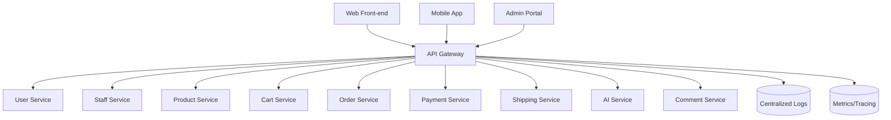
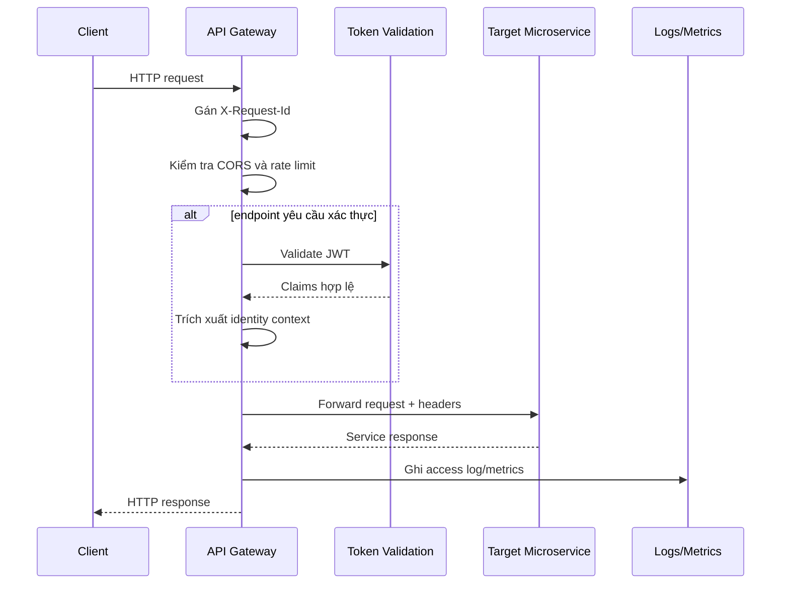
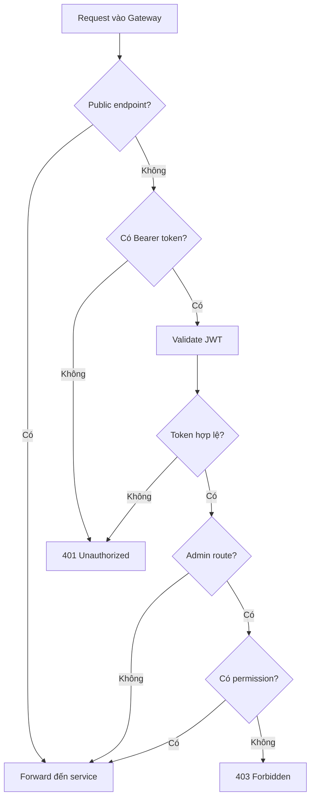

# Thiết kế API Gateway

## 1. Tổng quan

API Gateway là điểm vào duy nhất cho client bên ngoài khi truy cập hệ thống E-Commerce Microservices. Gateway chịu trách nhiệm định tuyến request đến đúng microservice, kiểm tra xác thực, áp dụng chính sách bảo mật, giới hạn tần suất truy cập, ghi log và chuẩn hóa một phần response lỗi.

Client Web, Mobile và Admin Portal không gọi trực tiếp vào các microservice. Tất cả request đi qua API Gateway để đảm bảo hệ thống có một lớp kiểm soát truy cập thống nhất.

## 2. Trách nhiệm chính

- Định tuyến request đến đúng microservice.
- Kiểm tra JWT/access token cho các endpoint yêu cầu đăng nhập.
- Chuyển tiếp identity context như `user_id`, `staff_id`, `roles`, `permissions`.
- Áp dụng CORS policy.
- Áp dụng rate limit theo IP, user hoặc endpoint.
- Ghi access log, error log và trace ID.
- Chuẩn hóa lỗi gateway như `401`, `403`, `404`, `429`, `502`, `504`.
- Ẩn địa chỉ nội bộ của các microservice.

## 3. Ngoài phạm vi

- Không xử lý nghiệp vụ đặt hàng, thanh toán, sản phẩm hoặc vận chuyển.
- Không truy cập trực tiếp database của microservice.
- Không thay thế Staff Service trong việc quản lý RBAC.
- Không lưu dữ liệu nghiệp vụ dài hạn.

## 4. Kiến trúc tổng quan



## 5. Luồng xử lý request



## 6. Route mapping

| Prefix | Service đích | Mô tả |
| --- | --- | --- |
| `/api/v1/users/**` | User Service | Đăng ký, đăng nhập, hồ sơ khách hàng. |
| `/api/v1/staff/**` | Staff Service | Nhân sự, role, permission, RBAC. |
| `/api/v1/products/**` | Product Service | Catalog, sản phẩm, danh mục, tag, tồn kho. |
| `/api/v1/cart/**` | Cart Service | Giỏ hàng. |
| `/api/v1/orders/**` | Order Service | Checkout, đơn hàng, lịch sử đơn hàng. |
| `/api/v1/payments/**` | Payment Service | Giao dịch và phương thức thanh toán. |
| `/api/v1/shipping/**` | Shipping Service | Phí vận chuyển, vận đơn, tracking. |
| `/api/v1/ai/**` | AI Service | Chatbot, gợi ý, đồng bộ tri thức. |
| `/api/v1/comments/**` | Comment Service | Đánh giá, phản hồi, kiểm duyệt bình luận. |

## 7. Header chuẩn

### 7.1 Request headers từ client

| Header | Mô tả |
| --- | --- |
| `Authorization: Bearer <token>` | Access token nếu endpoint yêu cầu xác thực. |
| `Content-Type: application/json` | Định dạng body JSON. |
| `X-Request-Id` | Trace ID do client gửi, nếu có. |
| `X-Client-Type` | Loại client: `web`, `mobile`, `admin`. |

### 7.2 Headers Gateway chuyển xuống microservice

| Header | Mô tả |
| --- | --- |
| `X-Request-Id` | Trace ID thống nhất cho toàn bộ request. |
| `X-User-Id` | ID khách hàng nếu token thuộc customer. |
| `X-Staff-Id` | ID nhân viên nếu token thuộc staff/admin. |
| `X-Roles` | Danh sách role từ token hoặc Staff Service. |
| `X-Permissions` | Danh sách quyền đã xác thực nếu cần. |
| `X-Forwarded-For` | IP gốc của client. |

## 8. Chính sách xác thực và phân quyền



Nguyên tắc:

- Public API như xem sản phẩm, tìm kiếm sản phẩm, xem review có thể không cần token.
- API customer như giỏ hàng, đơn hàng, hồ sơ cá nhân cần token customer.
- API admin như quản lý sản phẩm, staff, đơn hàng, vận chuyển cần token staff/admin và permission phù hợp.
- Gateway có thể kiểm tra permission từ claim trong token hoặc gọi Staff Service khi cần xác minh chi tiết.

## 9. Rate limit đề xuất

| Nhóm endpoint | Chính sách đề xuất |
| --- | --- |
| Auth login/register | Giới hạn theo IP và identifier để giảm brute-force. |
| Public catalog/search | Giới hạn theo IP, cao hơn auth. |
| Cart/Order/Payment | Giới hạn theo user để tránh spam nghiệp vụ. |
| Admin APIs | Giới hạn theo staff và ghi audit log. |
| AI chat | Giới hạn theo user vì chi phí xử lý cao. |

## 10. Response lỗi chuẩn của Gateway

```json
{
  "error": {
    "code": "UNAUTHORIZED",
    "message": "Token không hợp lệ hoặc đã hết hạn.",
    "request_id": "req-20260608-0001"
  }
}
```

| HTTP status | Code | Mô tả |
| --- | --- | --- |
| 400 | `BAD_REQUEST` | Request không hợp lệ ở mức Gateway. |
| 401 | `UNAUTHORIZED` | Thiếu token hoặc token không hợp lệ. |
| 403 | `FORBIDDEN` | Không có quyền truy cập. |
| 404 | `ROUTE_NOT_FOUND` | Không tìm thấy route phù hợp. |
| 429 | `RATE_LIMIT_EXCEEDED` | Vượt giới hạn request. |
| 502 | `BAD_GATEWAY` | Service đích lỗi hoặc trả response không hợp lệ. |
| 504 | `GATEWAY_TIMEOUT` | Service đích phản hồi quá thời gian. |

## 11. Cấu hình timeout và retry

| Loại request | Timeout đề xuất | Retry |
| --- | --- | --- |
| Auth/Profile | 3 giây | Không retry tự động với request ghi dữ liệu. |
| Catalog public | 3-5 giây | Có thể retry GET an toàn. |
| Checkout/Order | 5-10 giây | Không retry tự động nếu có side effect. |
| Payment callback | 5 giây | Không retry từ Gateway; gateway thanh toán có cơ chế retry riêng. |
| AI chat | 15-30 giây | Không retry tự động. |

## 12. Công nghệ triển khai đề xuất

- Nginx hoặc Kong cho API Gateway.
- JWT validation bằng public key hoặc shared secret tùy cơ chế phát hành token.
- Redis cho rate limit nếu cần triển khai phân tán.
- OpenTelemetry hoặc trace ID đơn giản cho request tracing.
- Centralized logging với ELK, Loki hoặc công cụ tương đương.

## 13. Kiểm thử đề xuất

- Route đúng từng prefix đến đúng service.
- Public endpoint hoạt động khi không có token.
- Private endpoint trả `401` khi thiếu token.
- Admin endpoint trả `403` khi thiếu permission.
- Rate limit trả `429` khi vượt ngưỡng.
- Gateway trả `504` khi service đích timeout.
- `X-Request-Id` được chuyển tiếp đến microservice.
