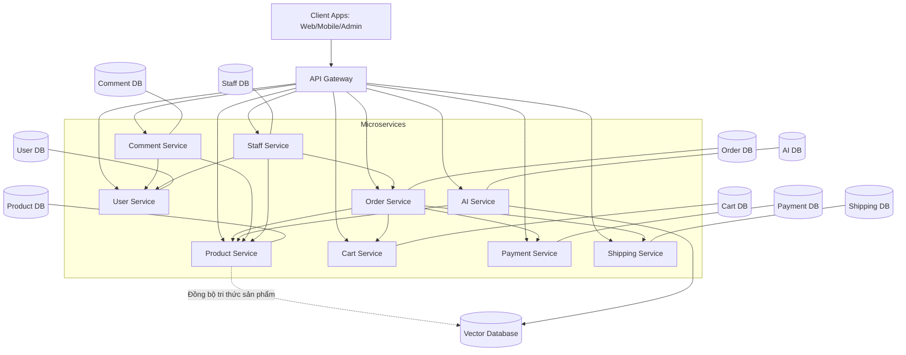
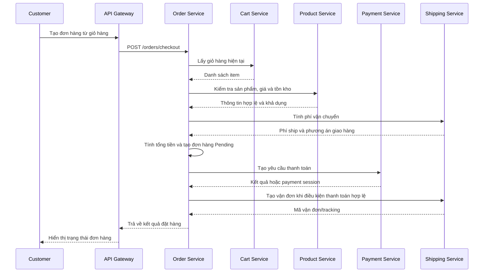
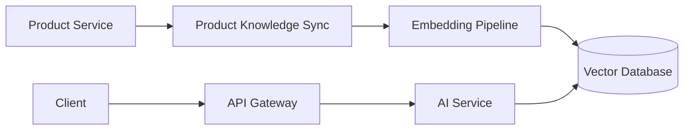

# Thiết kế hệ thống E-Commerce Microservices

## 1. Mục tiêu kiến trúc

Hệ thống E-Commerce được thiết kế theo kiến trúc Microservices và định hướng Domain-Driven Design. Mỗi microservice đại diện cho một bounded context riêng, tự sở hữu nghiệp vụ và dữ liệu của mình. Các service giao tiếp với bên ngoài thông qua REST API được điều phối bởi API Gateway.

Mục tiêu chính:

- Tách biệt rõ trách nhiệm nghiệp vụ giữa các service.
- Cho phép triển khai và mở rộng từng service độc lập.
- Giảm phụ thuộc trực tiếp giữa các module bằng cách giao tiếp qua API contract.
- Đảm bảo Order Service có khả năng điều phối quy trình đặt hàng từ giỏ hàng đến thanh toán và vận chuyển.
- Hỗ trợ AI Service đồng bộ dữ liệu sản phẩm sang Vector Database để phục vụ chatbot RAG và gợi ý sản phẩm.

## 2. Tổng quan kiến trúc

Hệ thống gồm 09 microservices chính:

| Bounded Context | Microservice | Trách nhiệm chính |
| --- | --- | --- |
| Customer Context | User Service | Quản lý tài khoản, hồ sơ khách hàng, sổ địa chỉ và kích hoạt tài khoản. |
| Staff Context | Staff Service | Quản trị nhân sự, phân quyền hệ thống theo RBAC và quản lý quyền truy cập. |
| Catalog Context | Product Service | Quản lý sản phẩm, danh mục, thương hiệu, nhãn, biến thể và tồn kho. |
| Cart Context | Cart Service | Quản lý giỏ hàng và các mặt hàng tạm thời của người dùng. |
| Ordering Context | Order Service | Xử lý quy trình đặt hàng, tính toán giá trị đơn hàng và quản lý vòng đời đơn hàng. |
| Payment Context | Payment Service | Xử lý giao dịch thanh toán, phương thức thanh toán và lịch sử giao dịch. |
| Shipping Context | Shipping Service | Quản lý đơn vị vận chuyển, tính phí và theo dõi hành trình đơn hàng. |
| AI Service Context | AI Service | Cung cấp chatbot RAG, hệ thống gợi ý và quản trị tri thức sản phẩm. |
| Comment Context | Comment Service | Quản lý đánh giá sản phẩm, bình luận và phản hồi từ khách hàng. |

## 3. Sơ đồ kiến trúc mức cao

## 4. Nguyên tắc phân tách service

### 4.1 Database per service

Mỗi service sở hữu database riêng. Service khác không được truy vấn trực tiếp database của service đó. Việc lấy dữ liệu chéo service phải thông qua REST API hoặc một cơ chế đồng bộ dữ liệu được thiết kế rõ ràng.

Quy ước sở hữu dữ liệu:

- User Service sở hữu thông tin khách hàng, tài khoản và địa chỉ.
- Staff Service sở hữu nhân sự nội bộ, vai trò, quyền và việc gán quyền.
- Product Service sở hữu catalog, thương hiệu, nhãn, SKU, biến thể và tồn kho.
- Cart Service sở hữu giỏ hàng hiện tại của user.
- Order Service sở hữu đơn hàng, dòng đơn hàng và trạng thái vòng đời đơn hàng.
- Payment Service sở hữu giao dịch, phương thức thanh toán và kết quả thanh toán.
- Shipping Service sở hữu nhà vận chuyển, gói vận chuyển, phí ship và tracking.
- AI Service sở hữu tri thức phục vụ RAG, cấu hình chatbot, log hỏi đáp và dữ liệu gợi ý.
- Comment Service sở hữu đánh giá, bình luận, phản hồi và liên kết đánh giá với user/product bằng ID.

### 4.2 Giao tiếp qua API Gateway

Client không gọi trực tiếp vào microservice. Tất cả request từ Web, Mobile và Admin Portal đi qua API Gateway để:

- Định tuyến request đến đúng service.
- Kiểm tra JWT và chuyển tiếp identity context.
- Áp dụng rate limit, logging và request tracing.
- Ẩn chi tiết nội bộ về địa chỉ service.

### 4.3 REST API là giao thức chính

Hệ thống sử dụng REST API cho giao tiếp đồng bộ:

- Client gọi API qua Gateway.
- Order Service gọi Cart Service, Product Service, Payment Service và Shipping Service trong luồng đặt hàng.
- AI Service lấy dữ liệu sản phẩm từ Product Service để đồng bộ tri thức.
- Comment Service xác minh định danh User và Product khi cần thiết bằng API hoặc cache read-model.

Event/message broker có thể được bổ sung sau cho các tác vụ bất đồng bộ như đồng bộ AI, gửi email, cập nhật tracking, index sản phẩm và ghi log sự kiện. Trong phạm vi thiết kế hiện tại, REST API là kênh tương tác chính.

## 5. Luồng nghiệp vụ đặt hàng

Order Service đóng vai trò orchestration cho quy trình đặt hàng.

### 5.1 Nguyên tắc orchestration

- Order Service là nơi quản lý trạng thái đơn hàng tổng thể.
- Cart Service chỉ cung cấp giỏ hàng hiện tại, không sở hữu đơn hàng.
- Product Service là nguồn đúng cho giá sản phẩm, SKU và tồn kho tại thời điểm đặt hàng.
- Payment Service chỉ xử lý giao dịch thanh toán và trả về kết quả thanh toán.
- Shipping Service chỉ xử lý phí giao hàng, đơn vị vận chuyển và tracking.
- Nếu một bước thất bại, Order Service cập nhật trạng thái đơn hàng và trả về lỗi nghiệp vụ rõ ràng cho client.

### 5.2 Trạng thái đơn hàng đề xuất

- `DRAFT`: Đơn hàng đang được khởi tạo.
- `PENDING_PAYMENT`: Đơn hàng chờ thanh toán.
- `PAID`: Thanh toán thành công.
- `PROCESSING`: Đơn hàng đang được xử lý.
- `READY_TO_SHIP`: Đã sẵn sàng bàn giao cho đơn vị vận chuyển.
- `SHIPPING`: Đang vận chuyển.
- `COMPLETED`: Đã giao thành công.
- `CANCELLED`: Đã hủy.
- `REFUNDED`: Đã hoàn tiền.

## 6. Đồng bộ AI Service và Vector Database

AI Service phụ trách các tính năng:

- Chatbot tư vấn sản phẩm sử dụng RAG.
- Gợi ý sản phẩm dựa trên dữ liệu catalog, lịch sử tương tác và ngữ cảnh truy vấn.
- Quản trị tri thức sản phẩm, câu hỏi thường gặp và nội dung hỗ trợ.

Luồng đồng bộ dữ liệu:

Nguyên tắc:

- Product Service vẫn là source of truth cho sản phẩm.
- AI Service chỉ lưu bản sao phục vụ truy vấn ngữ nghĩa và gợi ý.
- Khi sản phẩm thay đổi, AI Service cần đồng bộ lại nội dung liên quan.
- Vector Database không thay thế Product Database.

## 7. Liên kết Comment với User và Product

Comment Service quản lý đánh giá và bình luận bằng cách lưu các trường định danh:

- `user_id`: ID khách hàng từ User Service.
- `product_id`: ID sản phẩm từ Product Service.
- `order_id`: ID đơn hàng từ Order Service nếu cần xác minh đã mua hàng.

Comment Service không sao chép toàn bộ hồ sơ user hoặc thông tin sản phẩm. Nếu cần hiển thị tên người dùng, tên sản phẩm hoặc ảnh đại diện, service có thể:

- Gọi API đến service sở hữu dữ liệu.
- Sử dụng cache/read-model chỉ phục vụ hiển thị.
- Lưu snapshot tối thiểu tại thời điểm đánh giá, ví dụ tên hiển thị của user và tên sản phẩm.

## 8. Bảo mật và phân quyền

### 8.1 Authentication

User Service chịu trách nhiệm xác thực khách hàng và phát hành token. API Gateway kiểm tra token trước khi chuyển request đến service phía sau.

### 8.2 Authorization và RBAC

Staff Service quản lý RBAC cho nhân sự nội bộ:

- Role: Admin, Manager, Staff, Support, Operator.
- Permission: quyền hạn chi tiết theo tài nguyên và hành động.
- Assignment: gán role/permission cho staff.
- Audit: ghi nhận các thao tác quản trị quan trọng.

Service nghiệp vụ cần kiểm tra permission từ identity context do Gateway chuyển vào hoặc gọi Staff Service khi cần xác minh quyền chi tiết.

## 9. Dữ liệu và tính nhất quán

Hệ thống chấp nhận eventual consistency cho các quy trình liên service. Các service không dùng chung transaction database.

Nguyên tắc xử lý:

- Mỗi service đảm bảo tính đúng đắn trong phạm vi database của mình.
- Order Service quản lý trạng thái tổng hợp và bước bù trừ khi một thao tác liên service thất bại.
- Các request quan trọng cần có `idempotency_key` để tránh lặp giao dịch.
- Các trạng thái thanh toán, vận chuyển và đơn hàng cần được cập nhật theo trạng thái rõ ràng, có log lịch sử.

## 10. Yêu cầu phi chức năng

- **Scalability:** Cart, Product, Order và AI có thể scale độc lập khi lưu lượng tăng.
- **Decoupling:** Service chỉ phụ thuộc vào API contract, không phụ thuộc database nội bộ của service khác.
- **Observability:** Cần có logging tập trung, trace ID qua Gateway và metrics cho từng service.
- **Security:** JWT, RBAC, rate limit, mã hóa dữ liệu nhạy cảm và audit log cho thao tác quản trị.
- **Maintainability:** Mỗi service có codebase, database migration và API documentation riêng.
- **Resilience:** Timeout, retry có giới hạn, circuit breaker cho các lỗi gọi service liên tục.

## 11. Công nghệ đề xuất

- Backend: Python, Django, Django REST Framework.
- Database: PostgreSQL cho database riêng của từng service.
- API Gateway: Nginx, Kong hoặc tương đương.
- Cache/Task Queue: Redis và Celery khi cần tác vụ nền.
- Message Broker: RabbitMQ khi bổ sung đồng bộ bất đồng bộ.
- Vector Database: Qdrant, Milvus, Weaviate hoặc pgvector.
- Containerization: Docker và Docker Compose cho môi trường phát triển.

## 12. Phạm vi sẽ cập nhật sau

Tài liệu này mới mô tả kiến trúc tổng thể. Các phần chi tiết sẽ được bổ sung theo từng service:

- Data model và database schema.
- REST API contract.
- Luồng nghiệp vụ chi tiết.
- Quyền truy cập theo role/permission.
- Error code và response format.
- Test case và tiêu chí nghiệm thu.
