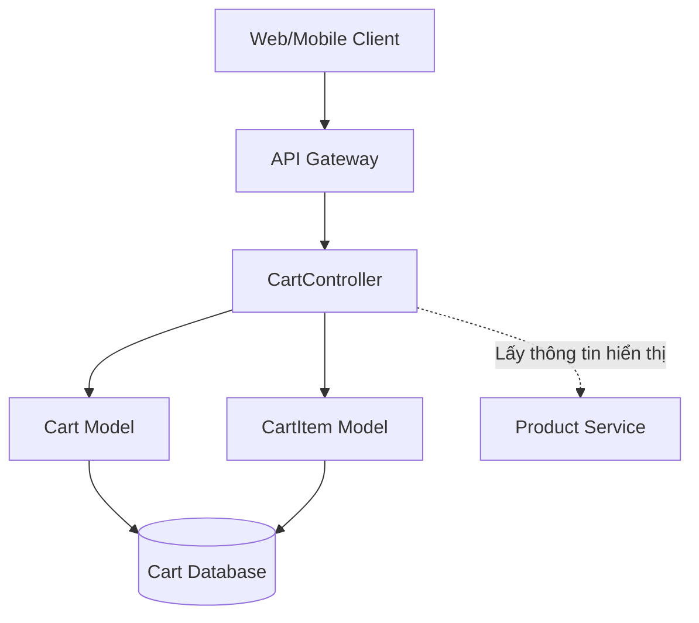
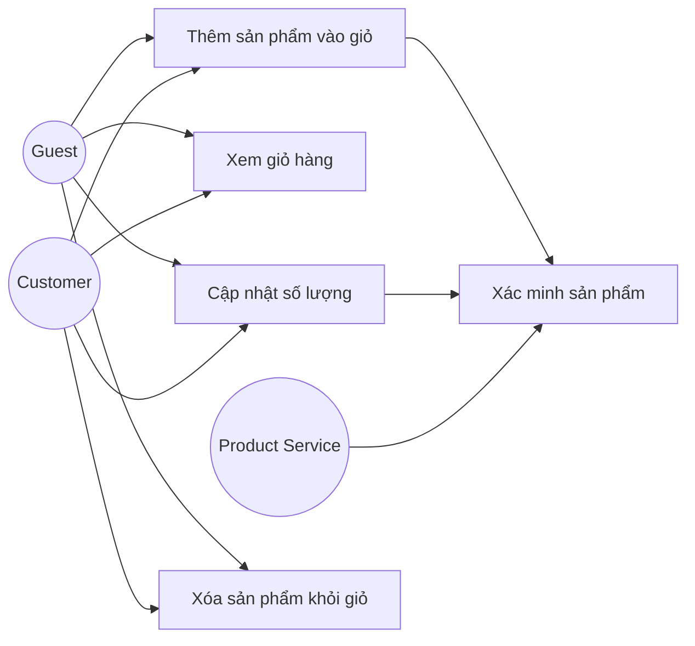
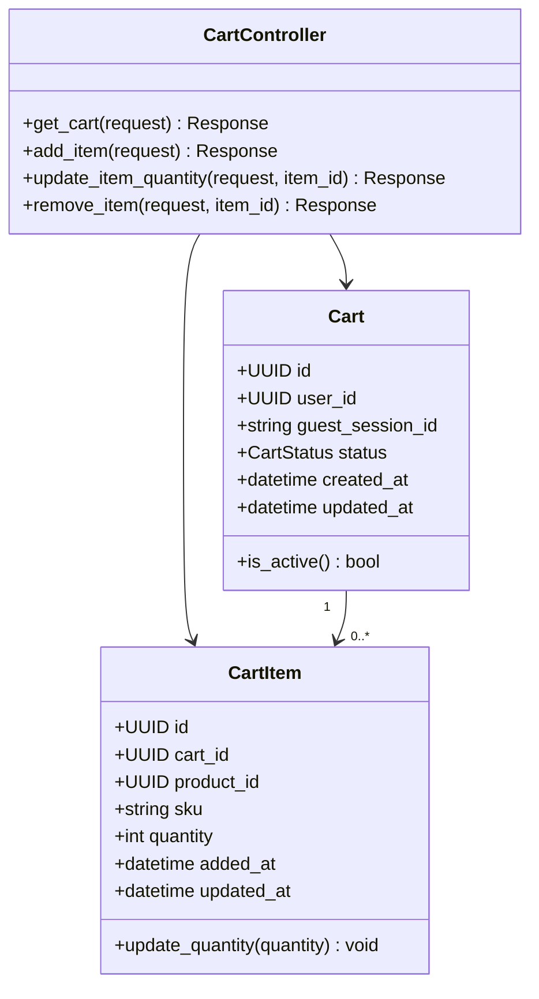
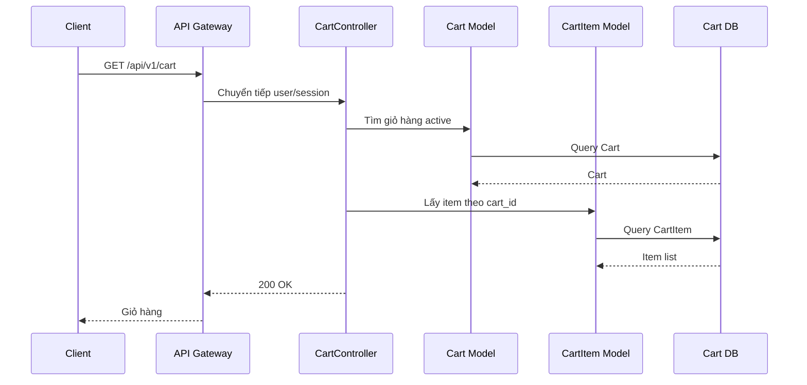
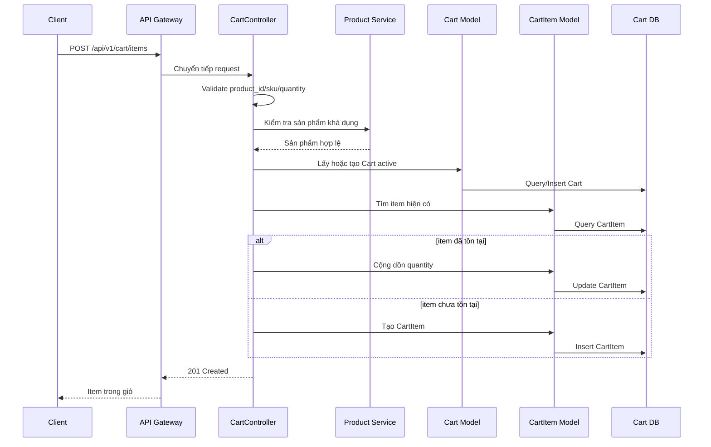
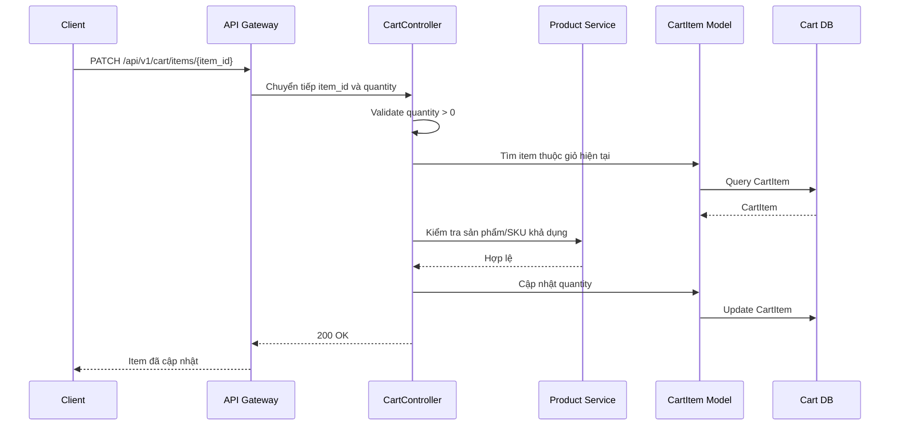
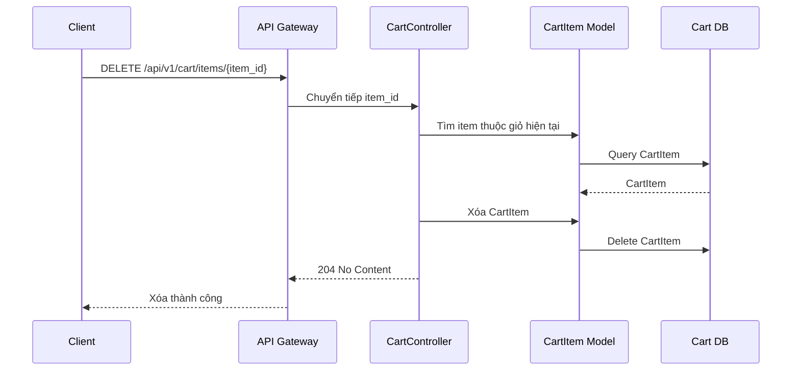

# Thiết kế chi tiết Cart Service

## 1. Tổng quan service

Cart Service thuộc Cart Context, chịu trách nhiệm quản lý giỏ hàng tạm thời của khách hàng trước khi đặt hàng. Service này lưu danh sách sản phẩm, SKU và số lượng người dùng muốn mua. Cart Service không quyết định giá cuối cùng và không sở hữu thông tin sản phẩm; khi cần hiển thị hoặc checkout, hệ thống phải xác minh lại dữ liệu với Product Service.

Thiết kế sử dụng MVC đơn giản: `CartController` nhận request, validate dữ liệu và gọi trực tiếp các model `Cart` và `CartItem`.

## 2. Phạm vi trách nhiệm

- Lấy danh sách sản phẩm đang có trong giỏ.
- Thêm sản phẩm mới vào giỏ hàng.
- Thay đổi số lượng mua của một mặt hàng.
- Loại bỏ sản phẩm khỏi giỏ hàng.

Ngoài phạm vi:

- Không tạo đơn hàng chính thức.
- Không xử lý thanh toán.
- Không sở hữu dữ liệu chi tiết sản phẩm, giá bán hoặc tồn kho.
- Không tính phí vận chuyển.

## 3. Kiến trúc nội bộ theo MVC đơn giản



| Thành phần | Trách nhiệm |
| --- | --- |
| CartController | Xử lý request xem, thêm, cập nhật và xóa item trong giỏ hàng. |
| Cart Model | Lưu giỏ hàng active của customer hoặc guest session. |
| CartItem Model | Lưu từng mặt hàng trong giỏ: product, SKU và số lượng. |
| Product Service | Cung cấp thông tin sản phẩm khi cần hiển thị hoặc xác minh. |

## 4. Controller và phương thức

| Controller | Phương thức | Mô tả |
| --- | --- | --- |
| CartController | `get_cart()` | Lấy danh sách các sản phẩm đang có trong giỏ. |
| CartController | `add_item()` | Thêm một sản phẩm mới vào giỏ hàng. |
| CartController | `update_item_quantity()` | Thay đổi số lượng mua của một mặt hàng. |
| CartController | `remove_item()` | Loại bỏ sản phẩm ra khỏi giỏ hàng. |

## 5. Use case

### 5.1 Sơ đồ use case



### 5.2 Mô tả use case

| Use case | Tác nhân | Mô tả | Ngoại lệ chính |
| --- | --- | --- | --- |
| Xem giỏ hàng | Guest, Customer | Lấy giỏ hàng active và danh sách item. | Giỏ hàng chưa tồn tại thì trả giỏ rỗng. |
| Thêm sản phẩm | Guest, Customer | Thêm product/SKU vào giỏ; nếu item đã tồn tại thì tăng số lượng. | Sản phẩm không tồn tại, ngừng bán hoặc số lượng không hợp lệ. |
| Cập nhật số lượng | Guest, Customer | Thay đổi số lượng của một item. | Item không tồn tại, số lượng nhỏ hơn 1. |
| Xóa sản phẩm | Guest, Customer | Xóa item khỏi giỏ hàng. | Item không tồn tại hoặc không thuộc giỏ hiện tại. |

## 6. Sơ đồ lớp thiết kế



## 7. Entity đề xuất

### Cart

| Trường | Kiểu | Mô tả |
| --- | --- | --- |
| `id` | UUID | Khóa chính của giỏ hàng. |
| `user_id` | UUID | Khách hàng sở hữu giỏ, null với guest. |
| `guest_session_id` | string | Định danh giỏ hàng guest. |
| `status` | enum | `ACTIVE`, `CHECKED_OUT`, `ABANDONED`. |
| `created_at` | datetime | Thời điểm tạo. |
| `updated_at` | datetime | Thời điểm cập nhật. |

### CartItem

| Trường | Kiểu | Mô tả |
| --- | --- | --- |
| `id` | UUID | Khóa chính của item. |
| `cart_id` | UUID | Giỏ hàng chứa item. |
| `product_id` | UUID | Sản phẩm được thêm vào giỏ. |
| `sku` | string | SKU hoặc biến thể sản phẩm. |
| `quantity` | integer | Số lượng muốn mua. |
| `added_at` | datetime | Thời điểm thêm vào giỏ. |
| `updated_at` | datetime | Thời điểm cập nhật. |

## 8. Quy tắc nghiệp vụ

- Mỗi customer chỉ có một giỏ hàng `ACTIVE` tại một thời điểm.
- Guest có thể có giỏ hàng theo `guest_session_id`.
- `quantity` phải lớn hơn 0.
- Nếu thêm item đã tồn tại trong giỏ, hệ thống cộng dồn số lượng.
- Cart Service chỉ lưu `product_id`, `sku`, `quantity`; giá và tồn kho phải xác minh lại với Product Service khi hiển thị hoặc checkout.
- Khi Order Service tạo đơn thành công, giỏ hàng có thể chuyển sang `CHECKED_OUT`.

## 9. Thiết kế API

Base path:

```text
/api/v1/cart
```

| Controller | Method | Endpoint | Auth | Mô tả |
| --- | --- | --- | --- | --- |
| CartController | `get_cart()` | `GET /api/v1/cart` | Tùy chọn | Lấy giỏ hàng hiện tại. |
| CartController | `add_item()` | `POST /api/v1/cart/items` | Tùy chọn | Thêm item vào giỏ. |
| CartController | `update_item_quantity()` | `PATCH /api/v1/cart/items/{item_id}` | Tùy chọn | Cập nhật số lượng item. |
| CartController | `remove_item()` | `DELETE /api/v1/cart/items/{item_id}` | Tùy chọn | Xóa item khỏi giỏ. |

### 9.1 `get_cart()`

```http
GET /api/v1/cart
Authorization: Bearer <access_token>
```

Response `200 OK`:

```json
{
  "id": "cart-001",
  "status": "ACTIVE",
  "items": [
    {
      "id": "item-001",
      "product_id": "product-001",
      "sku": "TSHIRT-BASIC-001",
      "quantity": 2
    }
  ]
}
```

### 9.2 `add_item()`

```http
POST /api/v1/cart/items
```

Request:

```json
{
  "product_id": "product-001",
  "sku": "TSHIRT-BASIC-001",
  "quantity": 1
}
```

Response `201 Created`.

### 9.3 `update_item_quantity()`

```http
PATCH /api/v1/cart/items/{item_id}
```

Request:

```json
{
  "quantity": 3
}
```

Response `200 OK`.

### 9.4 `remove_item()`

```http
DELETE /api/v1/cart/items/{item_id}
```

Response `204 No Content`.

### 9.5 Lỗi thường gặp

| HTTP status | Code | Mô tả |
| --- | --- | --- |
| 400 | `VALIDATION_ERROR` | Dữ liệu sai định dạng. |
| 404 | `CART_NOT_FOUND` | Không tìm thấy giỏ hàng. |
| 404 | `CART_ITEM_NOT_FOUND` | Không tìm thấy item. |
| 409 | `PRODUCT_NOT_AVAILABLE` | Sản phẩm không còn khả dụng. |
| 409 | `INVALID_QUANTITY` | Số lượng không hợp lệ. |

## 10. Sequence diagram

### 10.1 `get_cart()`



### 10.2 `add_item()`



### 10.3 `update_item_quantity()`



### 10.4 `remove_item()`



## 11. Tích hợp service khác

| Service | Mục đích |
| --- | --- |
| Product Service | Xác minh sản phẩm, SKU, trạng thái bán và thông tin hiển thị. |
| Order Service | Lấy giỏ hàng để tạo đơn và chuyển giỏ sang `CHECKED_OUT`. |
| User Service | Xác định `user_id` khi khách hàng đăng nhập. |

## 12. Kiểm thử đề xuất

- Lấy giỏ rỗng.
- Thêm item mới.
- Thêm item đã tồn tại và cộng dồn số lượng.
- Cập nhật số lượng hợp lệ.
- Chặn số lượng nhỏ hơn 1.
- Xóa item khỏi giỏ.
- Chặn sửa/xóa item không thuộc giỏ hiện tại.
