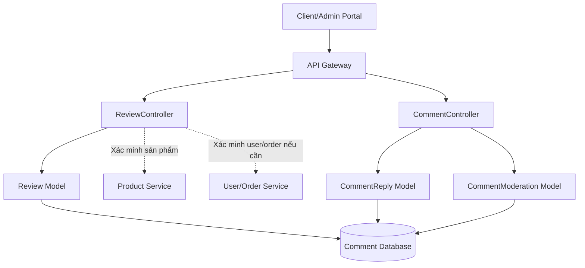
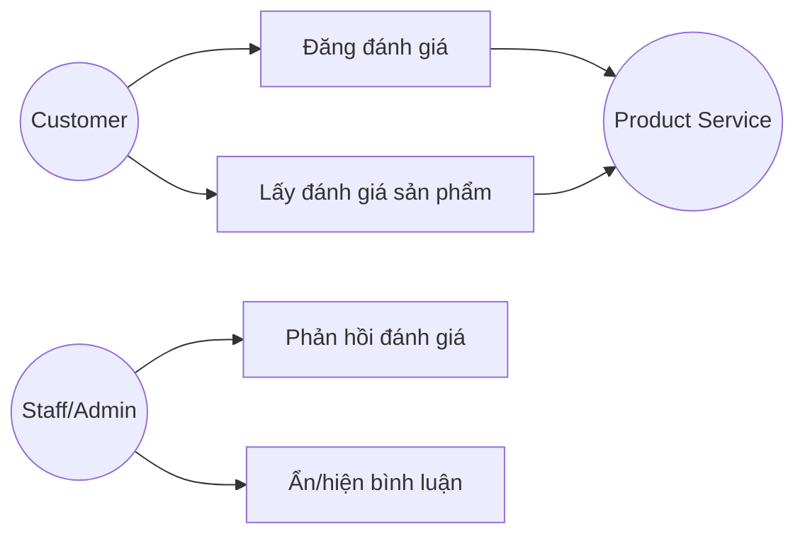
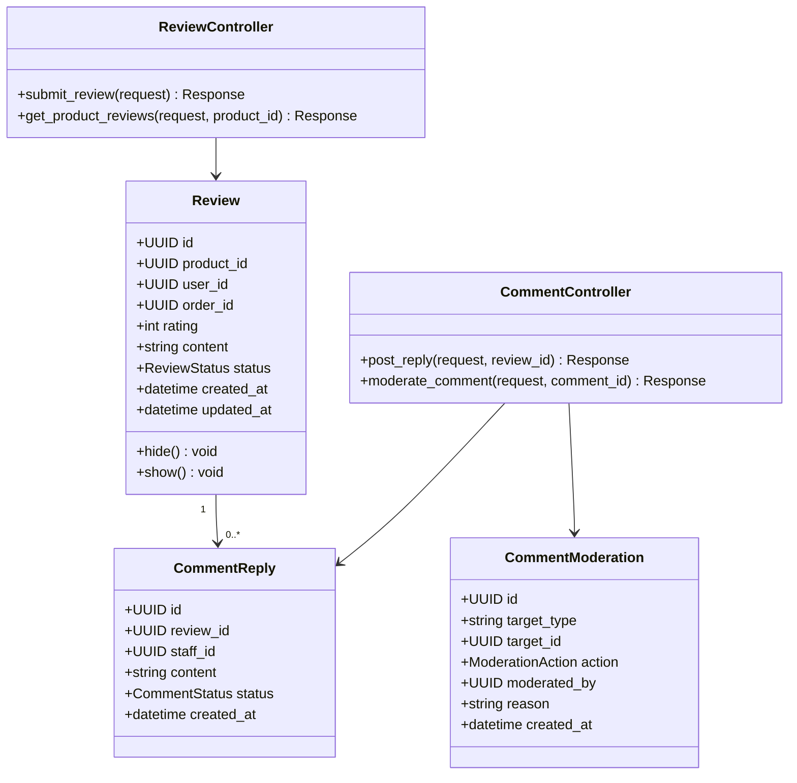
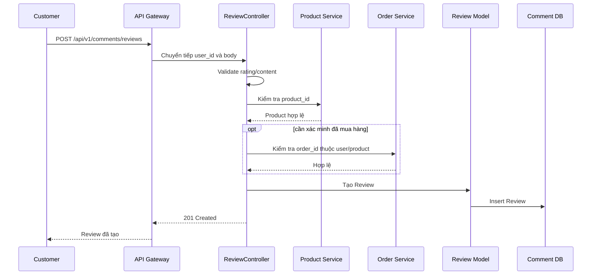
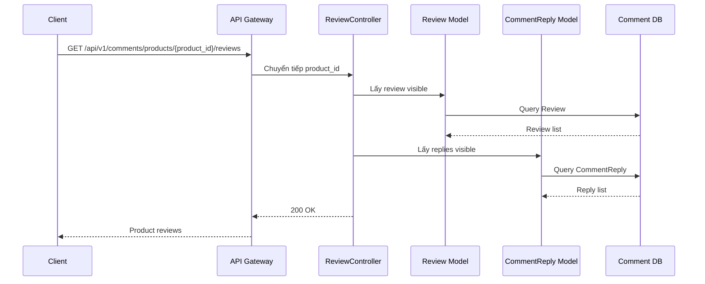
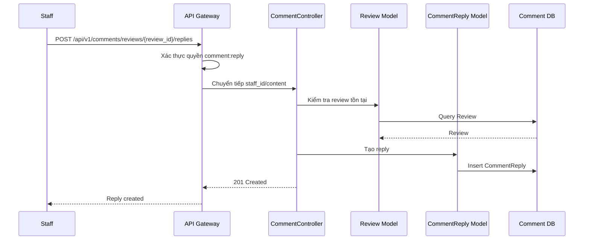
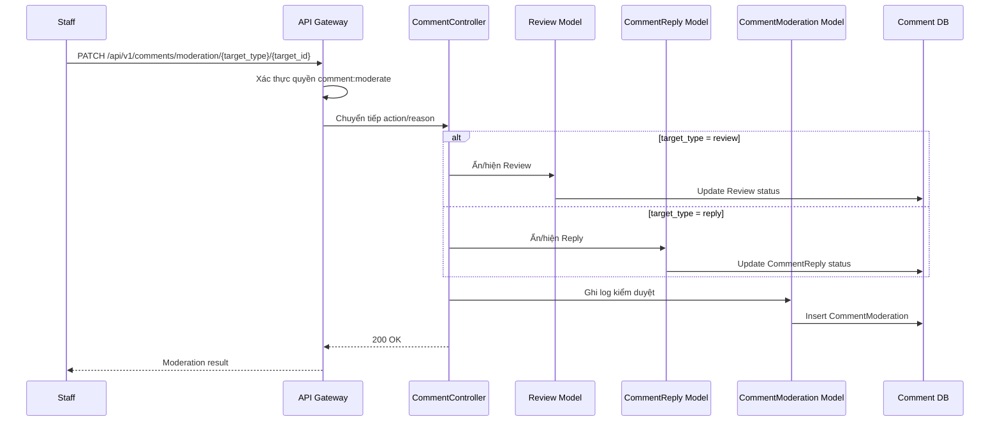

# Thiết kế chi tiết Comment Service

## 1. Tổng quan service

Comment Service thuộc Comment Context, chịu trách nhiệm quản lý đánh giá sản phẩm, bình luận phản hồi và kiểm duyệt nội dung. Service này liên kết khách hàng và sản phẩm thông qua `user_id` và `product_id`, nhưng không sở hữu dữ liệu chi tiết của User Service hoặc Product Service.

Thiết kế nội bộ dùng MVC đơn giản với `ReviewController`, `CommentController` và các model `Review`, `CommentReply`, `CommentModeration`.

## 2. Controller và phương thức

| Controller | Phương thức | Mô tả |
| --- | --- | --- |
| ReviewController | `submit_review()` | Đăng tải nhận xét và số sao cho sản phẩm. |
| ReviewController | `get_product_reviews()` | Lấy toàn bộ đánh giá của một sản phẩm cụ thể. |
| CommentController | `post_reply()` | Phản hồi lại đánh giá của khách hàng. |
| CommentController | `moderate_comment()` | Ẩn/hiện các bình luận vi phạm chính sách. |

## 3. Kiến trúc nội bộ theo MVC đơn giản



## 4. Use case



## 5. Sơ đồ lớp thiết kế



## 6. Quy tắc nghiệp vụ

- `rating` phải nằm trong khoảng 1 đến 5.
- Review phải gắn với một `product_id` hợp lệ.
- Customer chỉ được sửa/xóa review của chính mình nếu chức năng này được bổ sung sau.
- Có thể yêu cầu `order_id` để xác minh người dùng đã mua hàng trước khi đánh giá.
- Staff/Admin có thể phản hồi review.
- Nội dung vi phạm có thể bị ẩn nhưng nên giữ lại dữ liệu để audit.

## 7. Thiết kế API

Base path:

```text
/api/v1/comments
```

| Controller | Method | Endpoint | Auth | Mô tả |
| --- | --- | --- | --- | --- |
| ReviewController | `submit_review()` | `POST /api/v1/comments/reviews` | Có | Đăng đánh giá sản phẩm. |
| ReviewController | `get_product_reviews()` | `GET /api/v1/comments/products/{product_id}/reviews` | Không | Lấy đánh giá theo sản phẩm. |
| CommentController | `post_reply()` | `POST /api/v1/comments/reviews/{review_id}/replies` | Có | Phản hồi đánh giá. |
| CommentController | `moderate_comment()` | `PATCH /api/v1/comments/moderation/{target_type}/{target_id}` | Có | Ẩn/hiện nội dung vi phạm. |

### 7.1 `submit_review()`

```json
{
  "product_id": "product-001",
  "order_id": "order-001",
  "rating": 5,
  "content": "Sản phẩm tốt, giao nhanh."
}
```

### 7.2 `post_reply()`

```json
{
  "content": "Cảm ơn bạn đã đánh giá sản phẩm."
}
```

### 7.3 `moderate_comment()`

```json
{
  "action": "HIDE",
  "reason": "Nội dung vi phạm chính sách"
}
```

## 8. Sequence diagram

### 8.1 `submit_review()`



### 8.2 `get_product_reviews()`



### 8.3 `post_reply()`



### 8.4 `moderate_comment()`



## 9. Kiểm thử đề xuất

- Đăng review hợp lệ.
- Chặn rating ngoài khoảng 1-5.
- Lấy review theo sản phẩm.
- Staff phản hồi review.
- Ẩn/hiện review hoặc reply.
- Chặn customer đánh giá sản phẩm không tồn tại.
