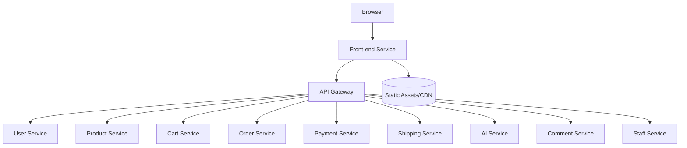
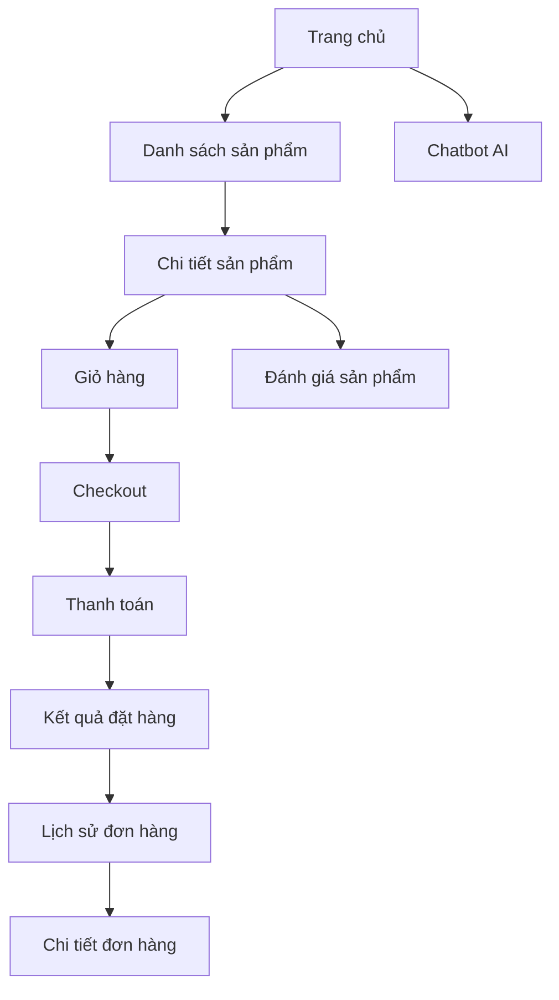
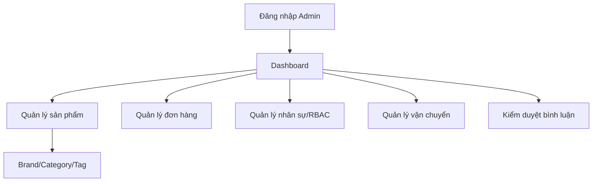
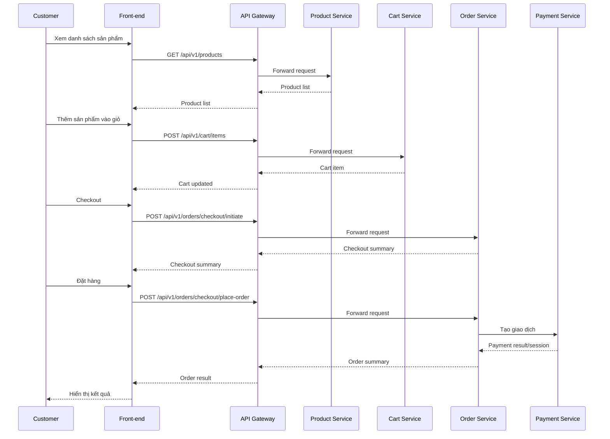
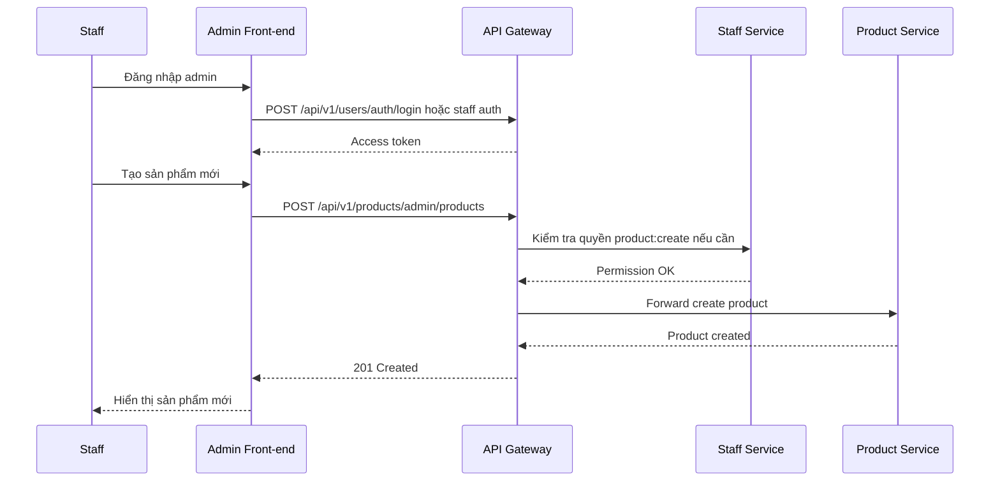

# Thiết kế Front-end Service

## 1. Tổng quan

Front-end Service là lớp giao diện người dùng của hệ thống E-Commerce. Service này cung cấp trải nghiệm cho khách hàng mua sắm và trang quản trị cho nhân sự vận hành. Front-end không gọi trực tiếp vào từng microservice mà giao tiếp với hệ thống thông qua API Gateway bằng REST API.

Trong phạm vi thiết kế này, Front-end Service có thể được triển khai bằng React, Next.js, Vue hoặc framework tương đương. Tài liệu tập trung vào trách nhiệm, module giao diện, luồng tương tác và tích hợp API.

## 2. Phạm vi trách nhiệm

- Hiển thị danh sách sản phẩm, chi tiết sản phẩm, tìm kiếm và lọc theo danh mục.
- Quản lý giỏ hàng phía người dùng.
- Hỗ trợ checkout, đặt hàng và xem lịch sử đơn hàng.
- Hiển thị phương thức thanh toán, trạng thái thanh toán và tracking vận chuyển.
- Hiển thị review, cho phép khách hàng đánh giá sản phẩm.
- Cung cấp chatbot AI và gợi ý sản phẩm.
- Cung cấp Admin Portal cho nhân sự quản lý sản phẩm, đơn hàng, staff, vận chuyển, bình luận.

## 3. Ngoài phạm vi

- Không xử lý nghiệp vụ backend.
- Không lưu dữ liệu nghiệp vụ chính thay cho microservice.
- Không gọi trực tiếp database.
- Không bỏ qua API Gateway để gọi thẳng service nội bộ.

## 4. Kiến trúc tổng quan

## 5. Module giao diện chính

| Module | Người dùng | Mô tả |
| --- | --- | --- |
| Authentication | Guest, Customer, Staff | Đăng nhập, đăng ký, đăng xuất, lưu token an toàn. |
| Product Catalog | Guest, Customer | Danh sách sản phẩm, tìm kiếm, lọc danh mục, chi tiết sản phẩm. |
| Cart | Customer, Guest | Xem giỏ hàng, thêm/xóa sản phẩm, cập nhật số lượng. |
| Checkout | Customer | Khởi tạo checkout, chọn địa chỉ, phương thức thanh toán, đặt hàng. |
| Order History | Customer | Xem lịch sử đơn hàng, chi tiết đơn hàng, yêu cầu hủy. |
| Payment | Customer | Hiển thị phương thức thanh toán và trạng thái thanh toán. |
| Shipping Tracking | Customer | Tra cứu trạng thái vận chuyển. |
| Review/Comment | Customer, Staff | Khách hàng đánh giá, staff phản hồi/kiểm duyệt. |
| AI Assistant | Customer | Chat tư vấn sản phẩm và gợi ý sản phẩm. |
| Admin Dashboard | Staff/Admin | Quản trị sản phẩm, đơn hàng, staff, role, vận chuyển, bình luận. |

## 6. Luồng điều hướng khách hàng

## 7. Luồng điều hướng Admin Portal

## 8. Tích hợp API Gateway

| Front-end feature | API Gateway endpoint |
| --- | --- |
| Đăng ký/đăng nhập | `/api/v1/users/auth/*` |
| Hồ sơ cá nhân | `/api/v1/users/me` |
| Danh sách/chi tiết sản phẩm | `/api/v1/products/**` |
| Giỏ hàng | `/api/v1/cart/**` |
| Checkout/đơn hàng | `/api/v1/orders/**` |
| Thanh toán | `/api/v1/payments/**` |
| Vận chuyển | `/api/v1/shipping/**` |
| Chatbot/gợi ý | `/api/v1/ai/**` |
| Đánh giá/bình luận | `/api/v1/comments/**` |
| Quản lý nhân sự/RBAC | `/api/v1/staff/**` |

## 9. Quản lý trạng thái phía client

| Loại state | Cách quản lý đề xuất |
| --- | --- |
| Access token | Lưu trong memory hoặc secure cookie tùy kiến trúc auth. |
| Refresh token | Ưu tiên httpOnly secure cookie nếu triển khai web production. |
| Cart state | Đồng bộ với Cart Service, cache tạm trên client để tăng trải nghiệm. |
| Product list filters | Query string trên URL để dễ chia sẻ và reload. |
| User profile | Cache sau khi login, refresh khi vào trang hồ sơ. |
| Admin permissions | Lấy từ token hoặc endpoint staff; dùng để ẩn/hiện menu. |
| AI chat session | Lưu session id và đồng bộ với AI Service. |

## 10. Sequence diagram luồng mua hàng

## 11. Sequence diagram luồng quản trị sản phẩm

## 12. Route đề xuất

### 12.1 Customer site

| Route | Mô tả |
| --- | --- |
| `/` | Trang chủ, sản phẩm nổi bật, gợi ý cá nhân hóa. |
| `/products` | Danh sách sản phẩm. |
| `/products/:slug` | Chi tiết sản phẩm. |
| `/cart` | Giỏ hàng. |
| `/checkout` | Checkout. |
| `/orders` | Lịch sử đơn hàng. |
| `/orders/:id` | Chi tiết đơn hàng. |
| `/profile` | Hồ sơ cá nhân và địa chỉ. |
| `/assistant` | Chatbot AI. |

### 12.2 Admin site

| Route | Mô tả |
| --- | --- |
| `/admin` | Dashboard. |
| `/admin/products` | Quản lý sản phẩm. |
| `/admin/products/new` | Tạo sản phẩm. |
| `/admin/orders` | Quản lý đơn hàng. |
| `/admin/staff` | Quản lý nhân sự. |
| `/admin/roles` | Quản lý vai trò/quyền. |
| `/admin/shipping` | Quản lý vận chuyển. |
| `/admin/comments` | Kiểm duyệt bình luận. |

## 13. Quy tắc bảo mật front-end

- Không lưu token nhạy cảm trong localStorage nếu có thể dùng httpOnly secure cookie.
- Không hiển thị menu admin nếu user không có permission tương ứng.
- Không tin tưởng kiểm tra quyền phía client; backend/Gateway vẫn phải kiểm tra lại.
- Escape/sanitize nội dung người dùng nhập trong review/comment/chat.
- Không log token, mật khẩu hoặc thông tin thanh toán nhạy cảm ở console.
- Tất cả request production phải dùng HTTPS.

## 14. Kiểm thử đề xuất

- Render danh sách và chi tiết sản phẩm.
- Thêm/xóa/cập nhật giỏ hàng.
- Checkout thành công.
- Xem lịch sử và chi tiết đơn hàng.
- Đăng nhập/đăng xuất.
- Chặn route admin khi không có quyền.
- Quản trị sản phẩm và đơn hàng với token staff hợp lệ.
- Chat AI và xem lịch sử chat.
- Kiểm tra lỗi API được hiển thị rõ ràng cho người dùng.
