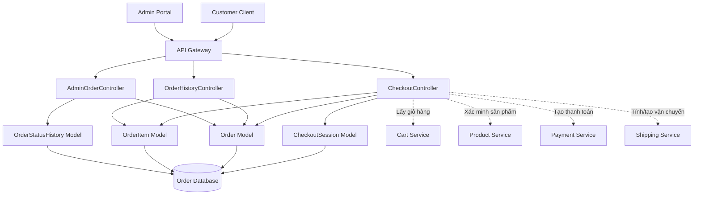
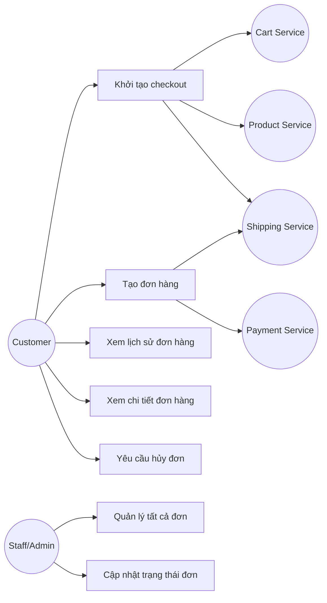
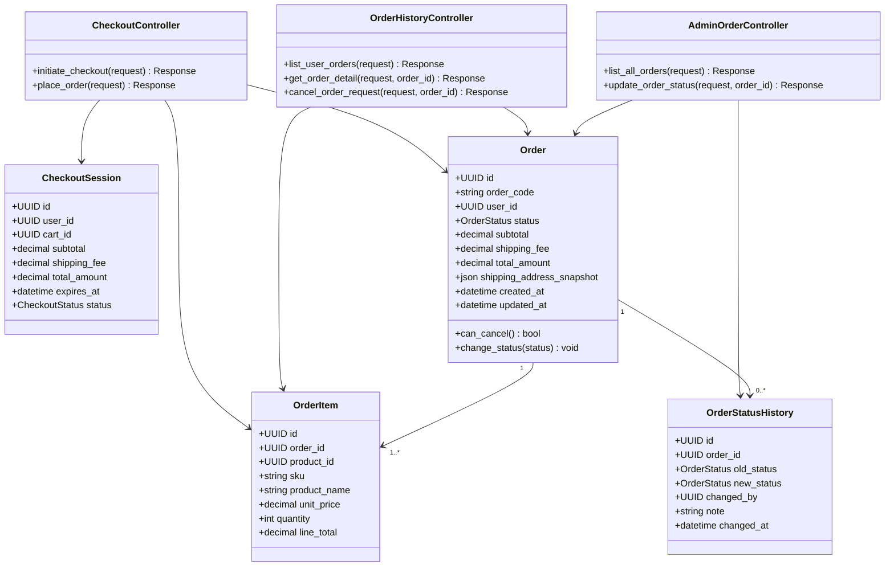
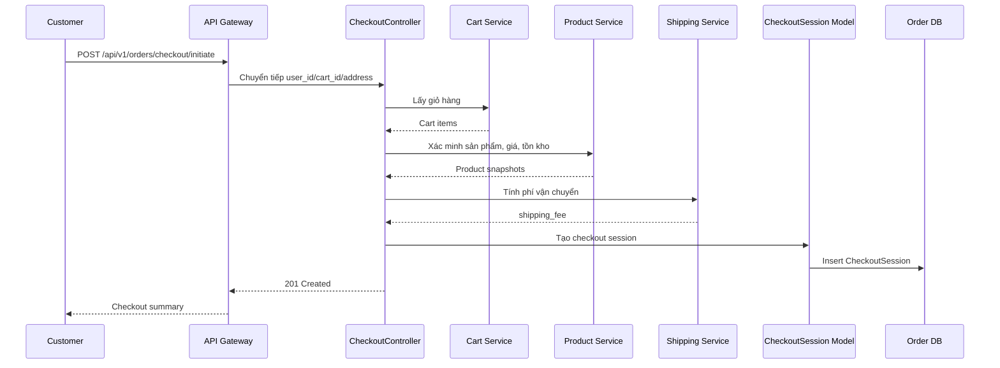
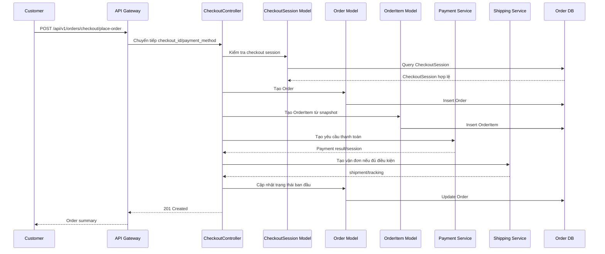
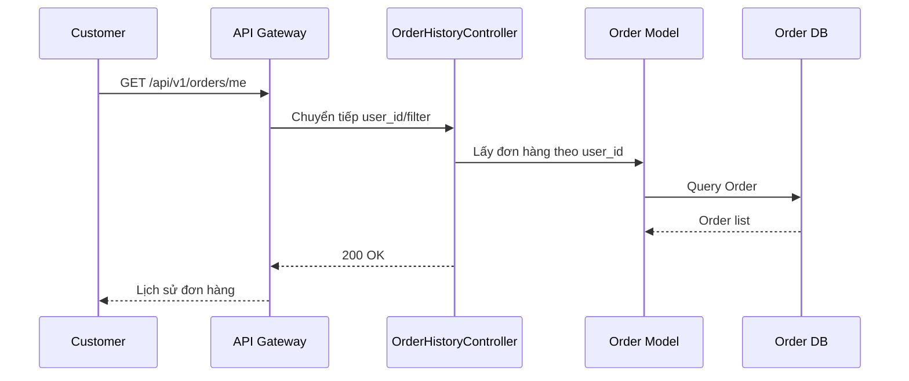
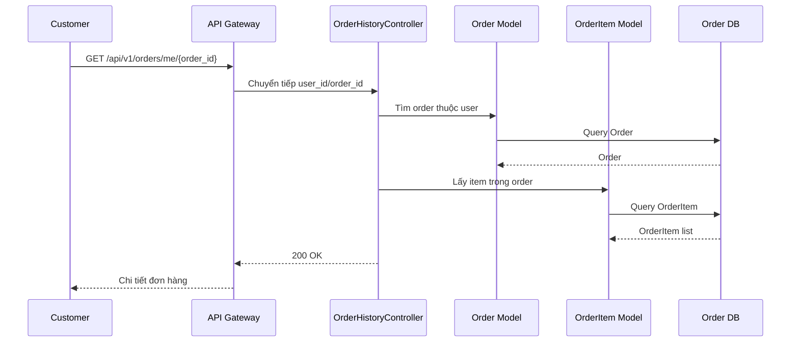
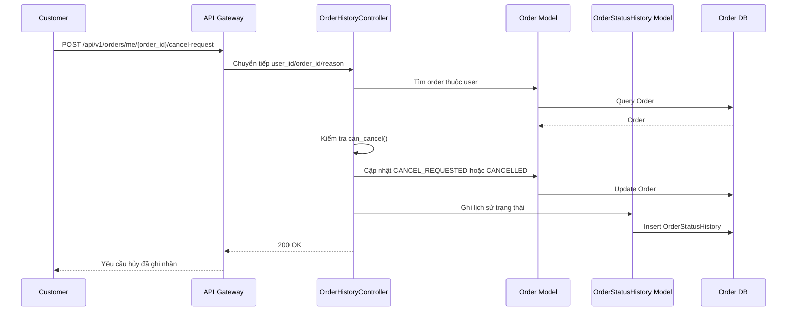
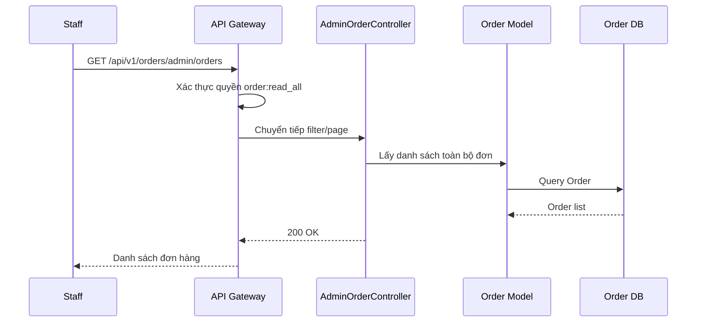
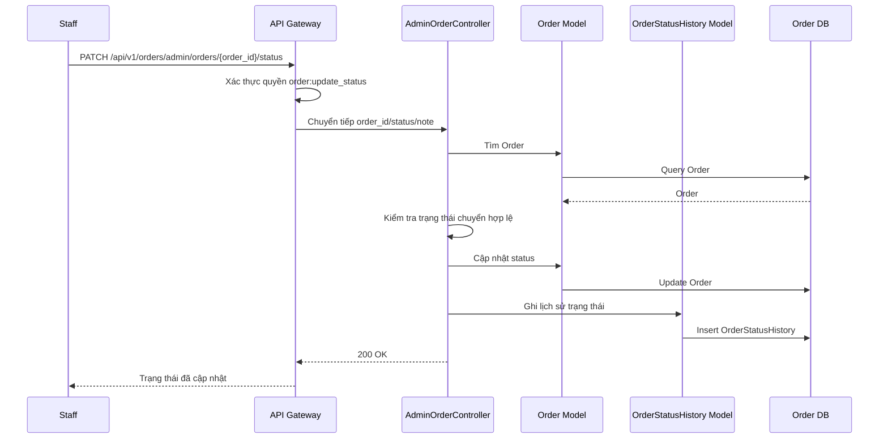

# Thiết kế chi tiết Order Service

## 1. Tổng quan service

Order Service thuộc Ordering Context, chịu trách nhiệm điều phối quy trình đặt hàng và quản lý vòng đời đơn hàng. Service này nhận dữ liệu từ Cart Service, xác minh sản phẩm với Product Service, phối hợp với Payment Service và Shipping Service để tạo đơn hàng chính thức.

Thiết kế nội bộ sử dụng MVC đơn giản. Các controller xử lý request và gọi trực tiếp các model `Order`, `OrderItem`, `OrderStatusHistory`, `CheckoutSession`.

## 2. Phạm vi trách nhiệm

- Bắt đầu quy trình thanh toán đơn hàng.
- Tạo đơn hàng chính thức vào hệ thống.
- Xem lịch sử tất cả đơn hàng đã mua.
- Xem chi tiết trạng thái và các món trong đơn.
- Gửi yêu cầu hủy đơn hàng nếu được phép.
- Quản lý toàn bộ đơn hàng của sàn thương mại.
- Thay đổi trạng thái đơn hàng như đã xác nhận, giao hàng.

Ngoài phạm vi:

- Không sở hữu giỏ hàng.
- Không sở hữu dữ liệu sản phẩm gốc.
- Không trực tiếp xử lý cổng thanh toán.
- Không trực tiếp vận chuyển hàng.

## 3. Kiến trúc nội bộ theo MVC đơn giản



## 4. Controller và phương thức

| Controller | Phương thức | Mô tả |
| --- | --- | --- |
| CheckoutController | `initiate_checkout()` | Bắt đầu quy trình thanh toán đơn hàng. |
| CheckoutController | `place_order()` | Tạo đơn hàng chính thức vào hệ thống. |
| OrderHistoryController | `list_user_orders()` | Xem lịch sử tất cả các đơn hàng đã mua. |
| OrderHistoryController | `get_order_detail()` | Xem chi tiết trạng thái và các món trong đơn. |
| OrderHistoryController | `cancel_order_request()` | Gửi yêu cầu hủy đơn hàng nếu cho phép. |
| AdminOrderController | `list_all_orders()` | Quản lý toàn bộ đơn hàng của sàn thương mại. |
| AdminOrderController | `update_order_status()` | Thay đổi trạng thái đơn hàng, ví dụ đã xác nhận hoặc giao hàng. |

## 5. Use case

### 5.1 Sơ đồ use case



### 5.2 Mô tả use case

| Use case | Tác nhân | Mô tả | Ngoại lệ chính |
| --- | --- | --- | --- |
| Khởi tạo checkout | Customer | Lấy giỏ hàng, xác minh sản phẩm, tính phí vận chuyển và tạo checkout session. | Giỏ rỗng, sản phẩm hết hàng, địa chỉ không hợp lệ. |
| Tạo đơn hàng | Customer | Tạo đơn hàng chính thức từ checkout session, tạo yêu cầu thanh toán/vận chuyển. | Checkout hết hạn, thanh toán lỗi, tồn kho không đủ. |
| Xem lịch sử | Customer | Xem danh sách đơn hàng của chính mình. | Token không hợp lệ. |
| Xem chi tiết | Customer | Xem thông tin đơn hàng và các dòng sản phẩm. | Đơn không tồn tại hoặc không thuộc customer. |
| Yêu cầu hủy | Customer | Gửi yêu cầu hủy nếu đơn còn ở trạng thái được phép. | Đơn đã giao, đang giao hoặc đã hủy. |
| Quản lý tất cả đơn | Staff/Admin | Xem tất cả đơn hàng trên sàn với bộ lọc trạng thái. | Thiếu quyền quản trị. |
| Cập nhật trạng thái | Staff/Admin | Chuyển trạng thái đơn hàng theo luồng hợp lệ. | Trạng thái chuyển không hợp lệ. |

## 6. Sơ đồ lớp thiết kế



## 7. Entity đề xuất

| Entity | Trách nhiệm chính |
| --- | --- |
| CheckoutSession | Lưu dữ liệu tạm thời trong quy trình checkout. |
| Order | Lưu đơn hàng chính thức và trạng thái tổng thể. |
| OrderItem | Lưu snapshot sản phẩm trong đơn hàng. |
| OrderStatusHistory | Lưu lịch sử thay đổi trạng thái. |

## 8. Trạng thái đơn hàng

| Trạng thái | Mô tả |
| --- | --- |
| `PENDING_PAYMENT` | Chờ thanh toán. |
| `CONFIRMED` | Đơn hàng đã được xác nhận. |
| `PROCESSING` | Đang xử lý. |
| `SHIPPING` | Đang giao hàng. |
| `COMPLETED` | Đã hoàn tất. |
| `CANCEL_REQUESTED` | Khách hàng yêu cầu hủy. |
| `CANCELLED` | Đã hủy. |
| `REFUNDED` | Đã hoàn tiền. |

## 9. Quy tắc nghiệp vụ

- Chỉ tạo đơn hàng từ checkout session hợp lệ và chưa hết hạn.
- Order phải lưu snapshot tên sản phẩm, SKU, giá và địa chỉ giao hàng tại thời điểm đặt.
- Customer chỉ xem và yêu cầu hủy đơn của chính mình.
- Chỉ cho phép hủy đơn khi trạng thái còn `PENDING_PAYMENT`, `CONFIRMED` hoặc `PROCESSING` tùy chính sách.
- Staff/Admin chỉ được cập nhật trạng thái theo luồng hợp lệ.
- Mọi thay đổi trạng thái cần ghi `OrderStatusHistory`.
- Order Service điều phối các service khác nhưng không truy cập trực tiếp database của Cart/Product/Payment/Shipping.

## 10. Thiết kế API

Base path:

```text
/api/v1/orders
```

| Controller | Method | Endpoint | Auth | Mô tả |
| --- | --- | --- | --- | --- |
| CheckoutController | `initiate_checkout()` | `POST /api/v1/orders/checkout/initiate` | Có | Bắt đầu checkout. |
| CheckoutController | `place_order()` | `POST /api/v1/orders/checkout/place-order` | Có | Tạo đơn hàng chính thức. |
| OrderHistoryController | `list_user_orders()` | `GET /api/v1/orders/me` | Có | Lịch sử đơn hàng của customer. |
| OrderHistoryController | `get_order_detail()` | `GET /api/v1/orders/me/{order_id}` | Có | Chi tiết đơn hàng. |
| OrderHistoryController | `cancel_order_request()` | `POST /api/v1/orders/me/{order_id}/cancel-request` | Có | Gửi yêu cầu hủy đơn. |
| AdminOrderController | `list_all_orders()` | `GET /api/v1/orders/admin/orders` | Có | Danh sách toàn bộ đơn hàng. |
| AdminOrderController | `update_order_status()` | `PATCH /api/v1/orders/admin/orders/{order_id}/status` | Có | Cập nhật trạng thái đơn hàng. |

### 10.1 `initiate_checkout()`

```http
POST /api/v1/orders/checkout/initiate
Authorization: Bearer <access_token>
```

Request:

```json
{
  "cart_id": "cart-001",
  "shipping_address_id": "addr-001"
}
```

Response `201 Created`:

```json
{
  "checkout_id": "checkout-001",
  "subtotal": 398000,
  "shipping_fee": 30000,
  "total_amount": 428000,
  "expires_at": "2026-06-08T21:30:00Z"
}
```

### 10.2 `place_order()`

```http
POST /api/v1/orders/checkout/place-order
Authorization: Bearer <access_token>
```

Request:

```json
{
  "checkout_id": "checkout-001",
  "payment_method": "COD"
}
```

Response `201 Created`:

```json
{
  "id": "order-001",
  "order_code": "ORD-20260608-0001",
  "status": "CONFIRMED",
  "total_amount": 428000
}
```

### 10.3 `list_user_orders()`

```http
GET /api/v1/orders/me?status=COMPLETED&page=1&page_size=20
Authorization: Bearer <access_token>
```

Response `200 OK`.

### 10.4 `get_order_detail()`

```http
GET /api/v1/orders/me/{order_id}
Authorization: Bearer <access_token>
```

Response `200 OK`.

### 10.5 `cancel_order_request()`

```http
POST /api/v1/orders/me/{order_id}/cancel-request
Authorization: Bearer <access_token>
```

Request:

```json
{
  "reason": "Tôi muốn thay đổi địa chỉ nhận hàng"
}
```

Response `200 OK`.

### 10.6 `list_all_orders()`

```http
GET /api/v1/orders/admin/orders?status=CONFIRMED&page=1&page_size=20
Authorization: Bearer <access_token>
```

Response `200 OK`.

### 10.7 `update_order_status()`

```http
PATCH /api/v1/orders/admin/orders/{order_id}/status
Authorization: Bearer <access_token>
```

Request:

```json
{
  "status": "SHIPPING",
  "note": "Đơn hàng đã bàn giao cho đơn vị vận chuyển"
}
```

Response `200 OK`.

### 10.8 Lỗi thường gặp

| HTTP status | Code | Mô tả |
| --- | --- | --- |
| 400 | `VALIDATION_ERROR` | Dữ liệu sai định dạng. |
| 401 | `UNAUTHORIZED` | Token không hợp lệ. |
| 403 | `FORBIDDEN` | Không có quyền hoặc không sở hữu đơn hàng. |
| 404 | `ORDER_NOT_FOUND` | Không tìm thấy đơn hàng. |
| 409 | `CHECKOUT_EXPIRED` | Checkout session đã hết hạn. |
| 409 | `INVALID_ORDER_STATUS_TRANSITION` | Chuyển trạng thái không hợp lệ. |
| 409 | `ORDER_CANNOT_BE_CANCELLED` | Đơn hàng không còn được hủy. |

## 11. Sequence diagram

### 11.1 `initiate_checkout()`



### 11.2 `place_order()`



### 11.3 `list_user_orders()`



### 11.4 `get_order_detail()`



### 11.5 `cancel_order_request()`



### 11.6 `list_all_orders()`



### 11.7 `update_order_status()`



## 12. Tích hợp service khác

| Service | Mục đích |
| --- | --- |
| Cart Service | Lấy giỏ hàng khi checkout. |
| Product Service | Xác minh giá, tồn kho và lưu snapshot sản phẩm. |
| Payment Service | Tạo giao dịch hoặc payment session. |
| Shipping Service | Tính phí vận chuyển và tạo vận đơn. |
| User Service | Xác định customer và địa chỉ giao hàng. |

## 13. Kiểm thử đề xuất

- Khởi tạo checkout với giỏ hợp lệ.
- Chặn checkout với giỏ rỗng.
- Chặn checkout khi sản phẩm hết hàng.
- Tạo đơn hàng từ checkout hợp lệ.
- Chặn tạo đơn khi checkout hết hạn.
- Customer chỉ xem được đơn của mình.
- Hủy đơn ở trạng thái cho phép.
- Chặn hủy đơn đang giao/đã giao.
- Admin xem toàn bộ đơn hàng.
- Admin cập nhật trạng thái theo luồng hợp lệ.
