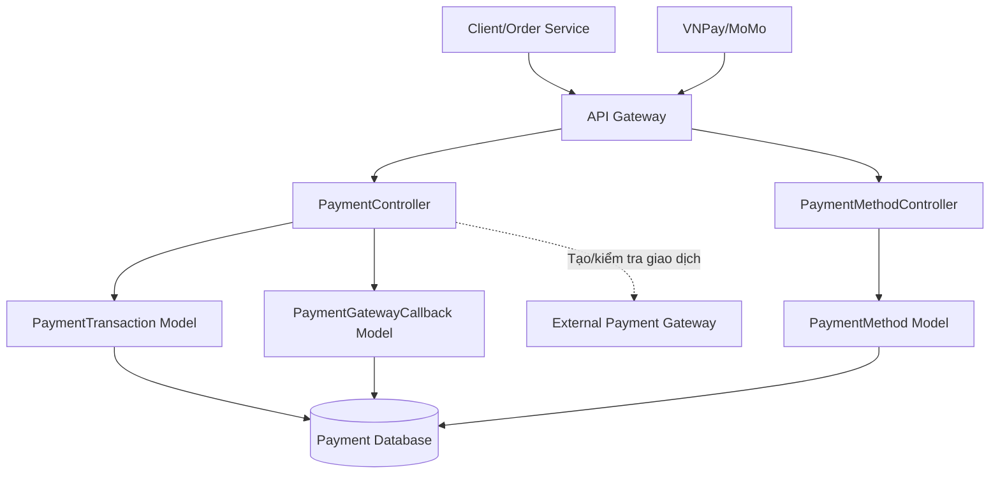
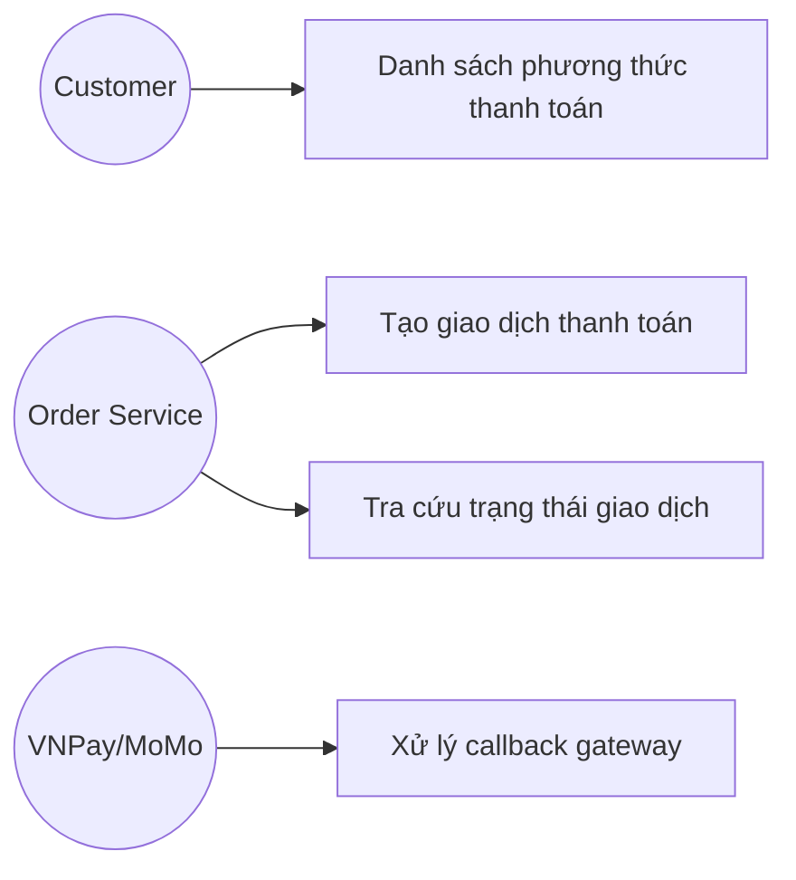
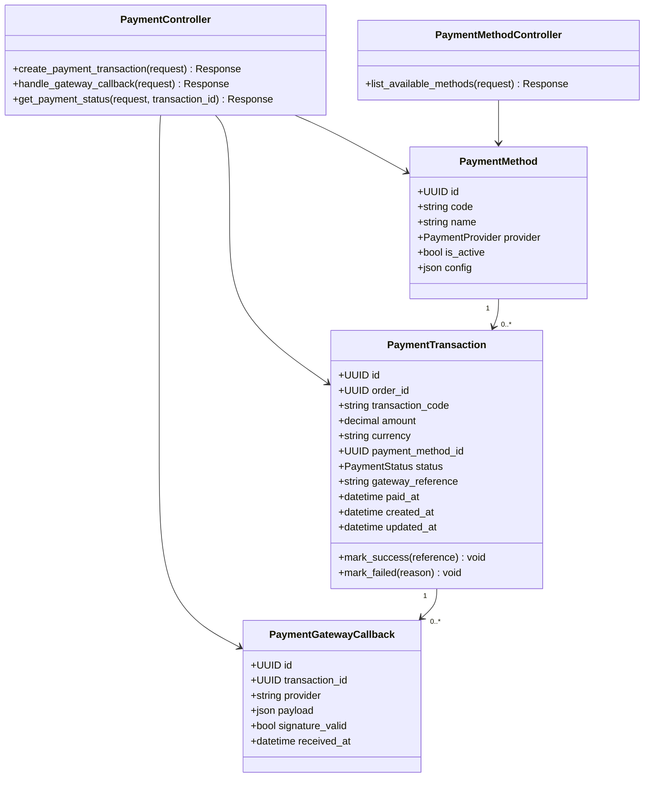
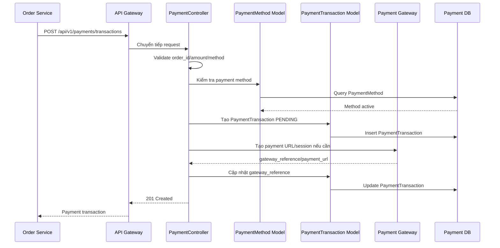
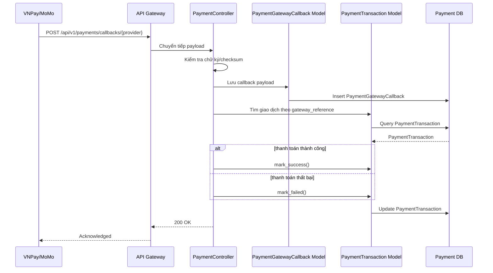
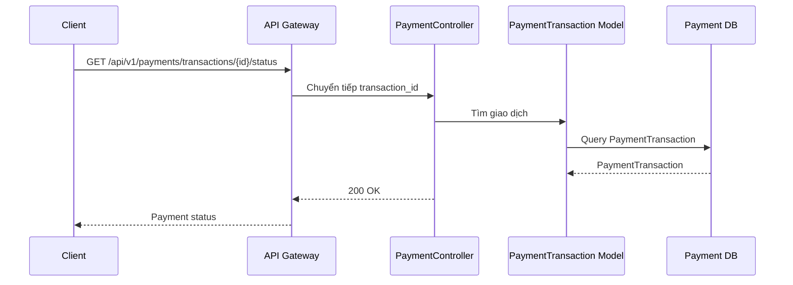
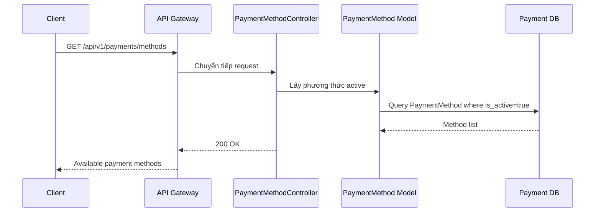

# Thiết kế chi tiết Payment Service

## 1. Tổng quan service

Payment Service thuộc Payment Context, chịu trách nhiệm tạo giao dịch thanh toán, xử lý kết quả trả về từ cổng thanh toán và cung cấp trạng thái giao dịch cho Order Service hoặc khách hàng. Service này không tạo đơn hàng và không tự ý thay đổi vòng đời đơn hàng; Order Service là nơi điều phối trạng thái đơn hàng.

Thiết kế nội bộ dùng MVC đơn giản: `PaymentController` và `PaymentMethodController` gọi trực tiếp các model `PaymentTransaction`, `PaymentMethod`, `PaymentGatewayCallback`.

## 2. Phạm vi trách nhiệm

- Tạo yêu cầu giao dịch thanh toán mới.
- Xử lý kết quả trả về từ cổng thanh toán như VNPay, MoMo.
- Tra cứu trạng thái thực tế của giao dịch.
- Liệt kê các phương thức/cổng thanh toán đang hoạt động.

Ngoài phạm vi:

- Không tạo đơn hàng.
- Không tính tổng tiền đơn hàng.
- Không xử lý vận chuyển.
- Không lưu thông tin thẻ nhạy cảm ở dạng rõ.

## 3. Kiến trúc nội bộ theo MVC đơn giản



## 4. Controller và phương thức

| Controller | Phương thức | Mô tả |
| --- | --- | --- |
| PaymentController | `create_payment_transaction()` | Tạo yêu cầu giao dịch thanh toán mới. |
| PaymentController | `handle_gateway_callback()` | Xử lý kết quả trả về từ cổng thanh toán như VNPay, MoMo. |
| PaymentController | `get_payment_status()` | Tra cứu trạng thái thực tế của giao dịch. |
| PaymentMethodController | `list_available_methods()` | Danh sách các cổng thanh toán đang hoạt động. |

## 5. Use case



| Use case | Tác nhân | Mô tả |
| --- | --- | --- |
| Tạo giao dịch | Order Service | Tạo payment transaction cho một đơn hàng. |
| Xử lý callback | Payment Gateway | Nhận kết quả thành công/thất bại từ VNPay, MoMo. |
| Tra cứu trạng thái | Order Service, Customer | Kiểm tra trạng thái mới nhất của giao dịch. |
| Danh sách phương thức | Customer | Hiển thị các phương thức thanh toán đang hoạt động. |

## 6. Sơ đồ lớp thiết kế



## 7. Quy tắc nghiệp vụ

- Mỗi giao dịch phải gắn với một `order_id`.
- `transaction_code` phải duy nhất để đối soát.
- Số tiền thanh toán phải lớn hơn 0.
- Callback từ gateway phải kiểm tra chữ ký hoặc checksum.
- Callback trùng lặp phải được xử lý idempotent.
- Payment Service không tự cập nhật đơn hàng; Order Service đọc trạng thái hoặc nhận sự kiện ở giai đoạn mở rộng sau.
- Chỉ phương thức `is_active = true` mới được hiển thị cho khách hàng.

## 8. Thiết kế API

Base path:

```text
/api/v1/payments
```

| Controller | Method | Endpoint | Auth | Mô tả |
| --- | --- | --- | --- | --- |
| PaymentController | `create_payment_transaction()` | `POST /api/v1/payments/transactions` | Có | Tạo giao dịch thanh toán. |
| PaymentController | `handle_gateway_callback()` | `POST /api/v1/payments/callbacks/{provider}` | Không | Nhận callback từ gateway. |
| PaymentController | `get_payment_status()` | `GET /api/v1/payments/transactions/{transaction_id}/status` | Có | Tra cứu trạng thái giao dịch. |
| PaymentMethodController | `list_available_methods()` | `GET /api/v1/payments/methods` | Không | Danh sách phương thức thanh toán. |

### 8.1 `create_payment_transaction()`

```http
POST /api/v1/payments/transactions
Authorization: Bearer <access_token>
```

```json
{
  "order_id": "order-001",
  "amount": 428000,
  "currency": "VND",
  "payment_method_code": "VNPAY",
  "return_url": "https://shop.example.com/payment-result"
}
```

Response `201 Created`.

### 8.2 `handle_gateway_callback()`

```http
POST /api/v1/payments/callbacks/vnpay
```

Response `200 OK`.

### 8.3 `get_payment_status()`

```http
GET /api/v1/payments/transactions/{transaction_id}/status
Authorization: Bearer <access_token>
```

Response `200 OK`:

```json
{
  "transaction_id": "payment-001",
  "order_id": "order-001",
  "status": "SUCCESS",
  "gateway_reference": "VNPAY-123456",
  "paid_at": "2026-06-08T21:30:00Z"
}
```

### 8.4 `list_available_methods()`

```http
GET /api/v1/payments/methods
```

Response `200 OK`:

```json
{
  "items": [
    {"code": "COD", "name": "Thanh toán khi nhận hàng"},
    {"code": "VNPAY", "name": "VNPay"},
    {"code": "MOMO", "name": "MoMo"}
  ]
}
```

## 9. Sequence diagram

### 9.1 `create_payment_transaction()`



### 9.2 `handle_gateway_callback()`



### 9.3 `get_payment_status()`



### 9.4 `list_available_methods()`



## 10. Lỗi thường gặp

| HTTP status | Code | Mô tả |
| --- | --- | --- |
| 400 | `VALIDATION_ERROR` | Dữ liệu sai định dạng. |
| 404 | `PAYMENT_TRANSACTION_NOT_FOUND` | Không tìm thấy giao dịch. |
| 404 | `PAYMENT_METHOD_NOT_FOUND` | Không tìm thấy phương thức thanh toán. |
| 409 | `PAYMENT_ALREADY_PROCESSED` | Giao dịch đã được xử lý. |
| 422 | `INVALID_GATEWAY_SIGNATURE` | Callback gateway không hợp lệ. |

## 11. Kiểm thử đề xuất

- Tạo giao dịch COD/VNPay/MoMo.
- Chặn số tiền không hợp lệ.
- Nhận callback thành công.
- Nhận callback thất bại.
- Chặn callback sai chữ ký.
- Xử lý callback trùng lặp idempotent.
- Liệt kê phương thức thanh toán đang hoạt động.
