# Thiết kế chi tiết Product Service

## 1. Tổng quan service

Product Service thuộc Catalog Context, chịu trách nhiệm quản lý danh mục sản phẩm hiển thị trên sàn thương mại điện tử. Service này là nguồn dữ liệu chính cho thông tin sản phẩm, danh mục, thương hiệu, thẻ tìm kiếm, hình ảnh và số lượng tồn kho thực tế.

Product Service cung cấp API công khai cho khách hàng xem, lọc và tìm kiếm sản phẩm. Đồng thời, service cung cấp API quản trị cho nhân sự vận hành đăng tải, chỉnh sửa, gỡ bỏ sản phẩm, cập nhật tồn kho và quản lý metadata như Brand, Category, Tag.

## 2. Phạm vi trách nhiệm

### 2.1 Chức năng chính

- Lấy danh sách sản phẩm đang hiển thị trên sàn.
- Xem chi tiết thông tin và thuộc tính sản phẩm.
- Lọc sản phẩm theo danh mục.
- Tìm kiếm sản phẩm theo tên hoặc từ khóa.
- Đăng tải sản phẩm mới lên hệ thống.
- Chỉnh sửa thông tin sản phẩm hiện có.
- Gỡ bỏ sản phẩm khỏi danh sách bán.
- Cập nhật số lượng tồn kho thực tế.
- Quản lý Brand, Category và Tag.

### 2.2 Ngoài phạm vi

- Không quản lý giỏ hàng.
- Không tạo đơn hàng.
- Không xử lý thanh toán hoặc vận chuyển.
- Không quản lý đánh giá/bình luận sản phẩm.
- Không trực tiếp sinh gợi ý AI, chỉ cung cấp dữ liệu catalog cho AI Service đồng bộ.

## 3. Kiến trúc nội bộ theo MVC đơn giản

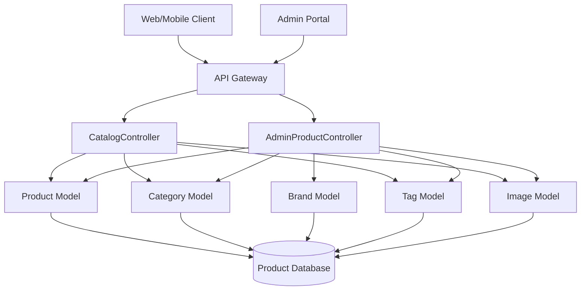

### 3.1 Thành phần

| Thành phần | Trách nhiệm |
| --- | --- |
| CatalogController | Nhận request xem danh sách, chi tiết, lọc và tìm kiếm sản phẩm. |
| AdminProductController | Nhận request quản trị sản phẩm, tồn kho và metadata. |
| Product Model | Lưu thông tin sản phẩm, giá, trạng thái, tồn kho và thuộc tính mở rộng. |
| Category Model | Lưu cây danh mục sản phẩm. |
| Brand Model | Lưu thông tin thương hiệu. |
| Tag Model | Lưu các nhãn phục vụ lọc, tìm kiếm và phân loại. |
| Image Model | Lưu hình ảnh của sản phẩm. |

Thiết kế dùng MVC đơn giản:

- Controller nhận request, validate dữ liệu, gọi model và trả response.
- Model biểu diễn dữ liệu, truy vấn database và thực hiện thao tác lưu/cập nhật/xóa.
- Không tách thêm tầng service để giữ tài liệu và triển khai ban đầu đơn giản.

## 4. Controller và phương thức

| Controller | Phương thức | Mô tả |
| --- | --- | --- |
| CatalogController | `list_products()` | Lấy danh sách sản phẩm hiển thị trên sàn. |
| CatalogController | `get_product_detail()` | Xem chi tiết thông tin và thuộc tính sản phẩm. |
| CatalogController | `filter_by_category()` | Lọc danh sách sản phẩm theo danh mục. |
| CatalogController | `search_by_keyword()` | Tìm kiếm sản phẩm theo tên hoặc từ khóa. |
| AdminProductController | `create_product()` | Đăng tải sản phẩm mới lên hệ thống. |
| AdminProductController | `update_product()` | Chỉnh sửa thông tin sản phẩm hiện có. |
| AdminProductController | `delete_product()` | Gỡ bỏ sản phẩm khỏi danh sách bán. |
| AdminProductController | `update_stock_quantity()` | Cập nhật số lượng tồn kho thực tế. |
| AdminProductController | `manage_metadata()` | Quản lý Brand, Category và các nhãn Tag. |

## 5. Tác nhân và use case

### 5.1 Tác nhân

| Tác nhân | Mô tả |
| --- | --- |
| Guest | Người dùng chưa đăng nhập, có thể xem, lọc và tìm kiếm sản phẩm. |
| Customer | Khách hàng đã đăng nhập, có thể xem, lọc và tìm kiếm sản phẩm. |
| Staff | Nhân sự vận hành có quyền quản lý catalog. |
| Admin | Quản trị viên có quyền quản lý toàn bộ sản phẩm và metadata. |
| API Gateway | Định tuyến request, kiểm tra token và chuyển tiếp identity context. |
| AI Service | Đồng bộ dữ liệu sản phẩm để xây dựng tri thức và gợi ý. |

### 5.2 Sơ đồ use case

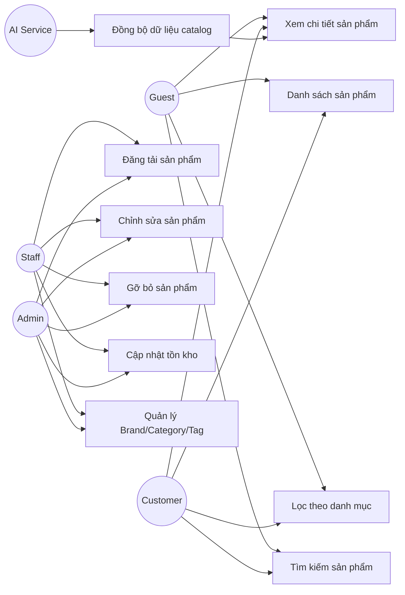

### 5.3 Mô tả use case

#### UC-01: Danh sách sản phẩm

| Mục | Nội dung |
| --- | --- |
| Tác nhân chính | Guest, Customer |
| Mục tiêu | Xem danh sách sản phẩm đang được bán trên sàn. |
| Tiền điều kiện | Sản phẩm có trạng thái `ACTIVE`. |
| Luồng chính | Người dùng gửi request; hệ thống lấy danh sách sản phẩm đang bán; áp dụng phân trang và sắp xếp; trả danh sách sản phẩm tóm tắt. |
| Luồng ngoại lệ | Tham số phân trang hoặc sắp xếp sai định dạng. |
| Hậu điều kiện | Không thay đổi dữ liệu. |

#### UC-02: Xem chi tiết sản phẩm

| Mục | Nội dung |
| --- | --- |
| Tác nhân chính | Guest, Customer |
| Mục tiêu | Xem thông tin chi tiết, hình ảnh, thuộc tính, danh mục, brand và tag của sản phẩm. |
| Tiền điều kiện | Sản phẩm tồn tại và được phép hiển thị. |
| Luồng chính | Người dùng gửi `product_id` hoặc `slug`; hệ thống tìm sản phẩm; lấy danh mục, brand, tag và hình ảnh; trả dữ liệu chi tiết. |
| Luồng ngoại lệ | Sản phẩm không tồn tại hoặc đã bị gỡ khỏi danh sách bán. |
| Hậu điều kiện | Không thay đổi dữ liệu. |

#### UC-03: Lọc theo danh mục

| Mục | Nội dung |
| --- | --- |
| Tác nhân chính | Guest, Customer |
| Mục tiêu | Xem danh sách sản phẩm thuộc một danh mục cụ thể. |
| Tiền điều kiện | Danh mục tồn tại và đang hoạt động. |
| Luồng chính | Người dùng gửi `category_id` hoặc `category_slug`; hệ thống kiểm tra danh mục; lấy sản phẩm trong danh mục đó và danh mục con nếu có; trả danh sách phân trang. |
| Luồng ngoại lệ | Danh mục không tồn tại hoặc bị ẩn. |
| Hậu điều kiện | Không thay đổi dữ liệu. |

#### UC-04: Tìm kiếm sản phẩm

| Mục | Nội dung |
| --- | --- |
| Tác nhân chính | Guest, Customer |
| Mục tiêu | Tìm sản phẩm theo tên hoặc từ khóa. |
| Tiền điều kiện | Từ khóa không rỗng. |
| Luồng chính | Người dùng gửi từ khóa; hệ thống tìm theo tên, mô tả ngắn, tag hoặc brand; trả danh sách sản phẩm phù hợp. |
| Luồng ngoại lệ | Từ khóa quá ngắn hoặc sai định dạng. |
| Hậu điều kiện | Không thay đổi dữ liệu. |

#### UC-05: Đăng tải sản phẩm

| Mục | Nội dung |
| --- | --- |
| Tác nhân chính | Staff, Admin |
| Mục tiêu | Tạo sản phẩm mới trong catalog. |
| Tiền điều kiện | Người gọi có quyền `product:create`; category và brand hợp lệ. |
| Luồng chính | Staff gửi thông tin sản phẩm; hệ thống validate dữ liệu; tạo Product; gắn tag và hình ảnh; lưu tồn kho ban đầu; trả sản phẩm đã tạo. |
| Luồng ngoại lệ | SKU/slug trùng; category hoặc brand không tồn tại; dữ liệu giá hoặc tồn kho không hợp lệ. |
| Hậu điều kiện | Sản phẩm mới được tạo ở trạng thái `DRAFT` hoặc `ACTIVE` tùy request. |

#### UC-06: Chỉnh sửa sản phẩm

| Mục | Nội dung |
| --- | --- |
| Tác nhân chính | Staff, Admin |
| Mục tiêu | Cập nhật thông tin sản phẩm hiện có. |
| Tiền điều kiện | Người gọi có quyền `product:update`; sản phẩm tồn tại. |
| Luồng chính | Staff gửi dữ liệu cập nhật; hệ thống validate; cập nhật thông tin Product, tag và image nếu có; trả sản phẩm mới. |
| Luồng ngoại lệ | Sản phẩm không tồn tại; slug/SKU trùng; dữ liệu giá không hợp lệ. |
| Hậu điều kiện | Sản phẩm được cập nhật. |

#### UC-07: Gỡ bỏ sản phẩm

| Mục | Nội dung |
| --- | --- |
| Tác nhân chính | Staff, Admin |
| Mục tiêu | Gỡ sản phẩm khỏi danh sách bán. |
| Tiền điều kiện | Người gọi có quyền `product:delete`; sản phẩm tồn tại. |
| Luồng chính | Staff gửi yêu cầu gỡ bỏ; hệ thống chuyển trạng thái sản phẩm sang `INACTIVE` hoặc `DELETED`; sản phẩm không còn hiển thị ở API public. |
| Luồng ngoại lệ | Sản phẩm không tồn tại; sản phẩm đang bị ràng buộc bởi quy trình đặc biệt nếu có. |
| Hậu điều kiện | Sản phẩm không còn trong danh sách bán. |

#### UC-08: Cập nhật tồn kho

| Mục | Nội dung |
| --- | --- |
| Tác nhân chính | Staff, Admin |
| Mục tiêu | Cập nhật số lượng tồn kho thực tế của sản phẩm. |
| Tiền điều kiện | Người gọi có quyền `product:update_stock`; sản phẩm tồn tại. |
| Luồng chính | Staff gửi số lượng mới; hệ thống validate số lượng không âm; cập nhật `stock_quantity`; trả tồn kho mới. |
| Luồng ngoại lệ | Số lượng âm hoặc sản phẩm không tồn tại. |
| Hậu điều kiện | Tồn kho thực tế được cập nhật. |

#### UC-09: Quản lý metadata

| Mục | Nội dung |
| --- | --- |
| Tác nhân chính | Staff, Admin |
| Mục tiêu | Quản lý Brand, Category và Tag phục vụ catalog. |
| Tiền điều kiện | Người gọi có quyền `product:manage_metadata`. |
| Luồng chính | Staff tạo/cập nhật/ẩn metadata; hệ thống validate mã hoặc slug không trùng; lưu thay đổi. |
| Luồng ngoại lệ | Brand/Category/Tag không tồn tại; slug trùng; dữ liệu thiếu. |
| Hậu điều kiện | Metadata catalog được cập nhật. |

## 6. Thiết kế dữ liệu và sơ đồ lớp

### 6.1 Sơ đồ lớp thiết kế

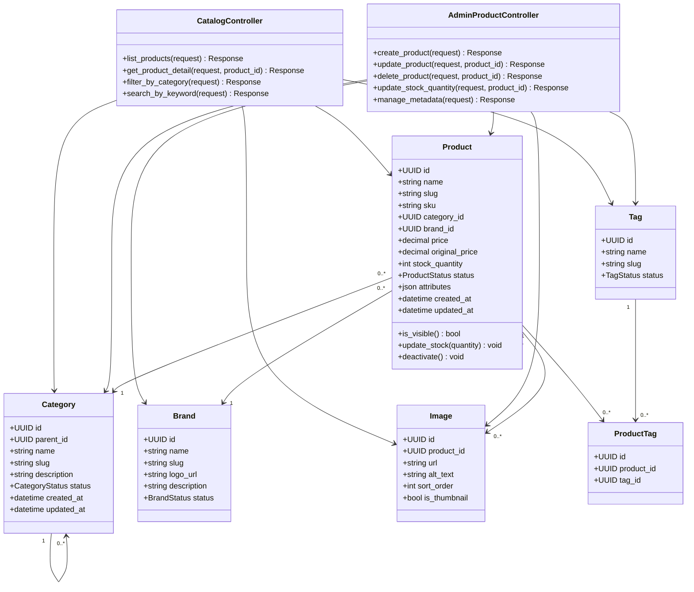

### 6.2 Entity đề xuất

#### Product

| Trường | Kiểu | Mô tả |
| --- | --- | --- |
| `id` | UUID | Khóa chính của sản phẩm. |
| `name` | string | Tên sản phẩm. |
| `slug` | string | Đường dẫn thân thiện, duy nhất. |
| `sku` | string | Mã hàng hóa, duy nhất. |
| `category_id` | UUID | Danh mục của sản phẩm. |
| `brand_id` | UUID | Thương hiệu của sản phẩm. |
| `price` | decimal | Giá bán hiện tại. |
| `original_price` | decimal | Giá gốc nếu có. |
| `stock_quantity` | integer | Số lượng tồn kho thực tế. |
| `status` | enum | `DRAFT`, `ACTIVE`, `INACTIVE`, `DELETED`. |
| `attributes` | JSON | Thuộc tính mở rộng như màu sắc, kích thước, cấu hình. |

#### Category

| Trường | Kiểu | Mô tả |
| --- | --- | --- |
| `id` | UUID | Khóa chính của danh mục. |
| `parent_id` | UUID | Danh mục cha nếu có. |
| `name` | string | Tên danh mục. |
| `slug` | string | Slug danh mục, duy nhất. |
| `description` | string | Mô tả danh mục. |
| `status` | enum | `ACTIVE`, `INACTIVE`. |

#### Brand

| Trường | Kiểu | Mô tả |
| --- | --- | --- |
| `id` | UUID | Khóa chính của thương hiệu. |
| `name` | string | Tên thương hiệu. |
| `slug` | string | Slug thương hiệu, duy nhất. |
| `logo_url` | string | Logo thương hiệu. |
| `description` | string | Mô tả thương hiệu. |
| `status` | enum | `ACTIVE`, `INACTIVE`. |

#### Tag

| Trường | Kiểu | Mô tả |
| --- | --- | --- |
| `id` | UUID | Khóa chính của tag. |
| `name` | string | Tên tag. |
| `slug` | string | Slug tag, duy nhất. |
| `status` | enum | `ACTIVE`, `INACTIVE`. |

#### Image

| Trường | Kiểu | Mô tả |
| --- | --- | --- |
| `id` | UUID | Khóa chính của hình ảnh. |
| `product_id` | UUID | Sản phẩm sở hữu hình ảnh. |
| `url` | string | URL hình ảnh. |
| `alt_text` | string | Mô tả ảnh. |
| `sort_order` | integer | Thứ tự hiển thị. |
| `is_thumbnail` | boolean | Đánh dấu ảnh đại diện. |

## 7. Quy tắc nghiệp vụ

- Chỉ sản phẩm `ACTIVE` mới hiển thị ở API public.
- `slug` và `sku` của Product phải duy nhất.
- Giá bán không được âm; `original_price` nếu có phải lớn hơn hoặc bằng `price`.
- `stock_quantity` không được âm.
- Khi xóa sản phẩm, nên soft delete bằng cách chuyển trạng thái sang `INACTIVE` hoặc `DELETED`.
- Sản phẩm phải thuộc một Category hợp lệ.
- Product có thể có nhiều Tag và nhiều Image.
- Mỗi Product nên có tối đa một ảnh thumbnail.
- Category có thể tổ chức dạng cây cha-con.
- Brand, Category và Tag bị `INACTIVE` không nên được gán cho sản phẩm mới.

## 8. Thiết kế API

### 8.1 Quy ước chung

Base path đề xuất:

```text
/api/v1/products
```

API public không bắt buộc token. API admin yêu cầu `Authorization: Bearer <access_token>` và quyền tương ứng từ Staff Service/API Gateway.

### 8.2 Danh sách endpoint

| Controller | Method | Endpoint | Auth | Mô tả |
| --- | --- | --- | --- | --- |
| CatalogController | `list_products()` | `GET /api/v1/products` | Không | Lấy danh sách sản phẩm hiển thị. |
| CatalogController | `get_product_detail()` | `GET /api/v1/products/{product_id_or_slug}` | Không | Xem chi tiết sản phẩm. |
| CatalogController | `filter_by_category()` | `GET /api/v1/products?category={category_slug}` | Không | Lọc sản phẩm theo danh mục. |
| CatalogController | `search_by_keyword()` | `GET /api/v1/products/search?q={keyword}` | Không | Tìm kiếm sản phẩm theo từ khóa. |
| AdminProductController | `create_product()` | `POST /api/v1/products/admin/products` | Có | Tạo sản phẩm mới. |
| AdminProductController | `update_product()` | `PATCH /api/v1/products/admin/products/{product_id}` | Có | Cập nhật sản phẩm. |
| AdminProductController | `delete_product()` | `DELETE /api/v1/products/admin/products/{product_id}` | Có | Gỡ bỏ sản phẩm khỏi danh sách bán. |
| AdminProductController | `update_stock_quantity()` | `PATCH /api/v1/products/admin/products/{product_id}/stock` | Có | Cập nhật tồn kho. |
| AdminProductController | `manage_metadata()` | `POST/PATCH /api/v1/products/admin/metadata/{type}` | Có | Quản lý Brand, Category, Tag. |

### 8.3 `list_products()`

```http
GET /api/v1/products?page=1&page_size=20&sort=newest
```

Response `200 OK`:

```json
{
  "items": [
    {
      "id": "9a645f09-75a3-48d4-a47c-8b93e77f94d1",
      "name": "Áo thun basic",
      "slug": "ao-thun-basic",
      "price": 199000,
      "thumbnail": "https://cdn.example.com/products/ao-thun.jpg",
      "category": {"id": "c1", "name": "Thời trang"},
      "brand": {"id": "b1", "name": "Local Brand"},
      "stock_quantity": 120
    }
  ],
  "page": 1,
  "page_size": 20,
  "total": 1
}
```

### 8.4 `get_product_detail()`

```http
GET /api/v1/products/{product_id_or_slug}
```

Response `200 OK`:

```json
{
  "id": "9a645f09-75a3-48d4-a47c-8b93e77f94d1",
  "name": "Áo thun basic",
  "slug": "ao-thun-basic",
  "sku": "TSHIRT-BASIC-001",
  "price": 199000,
  "original_price": 249000,
  "stock_quantity": 120,
  "category": {"id": "c1", "name": "Thời trang"},
  "brand": {"id": "b1", "name": "Local Brand"},
  "tags": ["basic", "cotton"],
  "images": [
    {"url": "https://cdn.example.com/products/ao-thun.jpg", "is_thumbnail": true}
  ],
  "attributes": {
    "material": "Cotton",
    "color": "Trắng",
    "size": ["M", "L", "XL"]
  }
}
```

### 8.5 `filter_by_category()`

```http
GET /api/v1/products?category=thoi-trang&page=1&page_size=20
```

Response `200 OK`: giống `list_products()`.

### 8.6 `search_by_keyword()`

```http
GET /api/v1/products/search?q=ao%20thun&page=1&page_size=20
```

Response `200 OK`: giống `list_products()`.

### 8.7 `create_product()`

```http
POST /api/v1/products/admin/products
Authorization: Bearer <access_token>
```

Request:

```json
{
  "name": "Áo thun basic",
  "slug": "ao-thun-basic",
  "sku": "TSHIRT-BASIC-001",
  "category_id": "c1",
  "brand_id": "b1",
  "price": 199000,
  "original_price": 249000,
  "stock_quantity": 120,
  "status": "ACTIVE",
  "tag_ids": ["t1", "t2"],
  "images": [
    {"url": "https://cdn.example.com/products/ao-thun.jpg", "is_thumbnail": true}
  ],
  "attributes": {
    "material": "Cotton",
    "color": "Trắng"
  }
}
```

Response `201 Created`.

### 8.8 `update_product()`

```http
PATCH /api/v1/products/admin/products/{product_id}
Authorization: Bearer <access_token>
```

Request:

```json
{
  "name": "Áo thun basic phiên bản mới",
  "price": 219000,
  "tag_ids": ["t1", "t3"]
}
```

Response `200 OK`.

### 8.9 `delete_product()`

```http
DELETE /api/v1/products/admin/products/{product_id}
Authorization: Bearer <access_token>
```

Response `204 No Content`.

### 8.10 `update_stock_quantity()`

```http
PATCH /api/v1/products/admin/products/{product_id}/stock
Authorization: Bearer <access_token>
```

Request:

```json
{
  "stock_quantity": 150
}
```

Response `200 OK`:

```json
{
  "id": "9a645f09-75a3-48d4-a47c-8b93e77f94d1",
  "sku": "TSHIRT-BASIC-001",
  "stock_quantity": 150,
  "updated_at": "2026-06-08T21:00:00Z"
}
```

### 8.11 `manage_metadata()`

```http
POST /api/v1/products/admin/metadata/category
Authorization: Bearer <access_token>
```

Request:

```json
{
  "name": "Thời trang",
  "slug": "thoi-trang",
  "parent_id": null,
  "status": "ACTIVE"
}
```

Response `201 Created`.

Endpoint `manage_metadata()` có thể dùng `type` là `brand`, `category` hoặc `tag`.

### 8.12 Lỗi thường gặp

| HTTP status | Code | Mô tả |
| --- | --- | --- |
| 400 | `VALIDATION_ERROR` | Dữ liệu thiếu hoặc sai định dạng. |
| 401 | `UNAUTHORIZED` | Thiếu hoặc sai token ở API admin. |
| 403 | `FORBIDDEN` | Không có quyền quản lý catalog. |
| 404 | `PRODUCT_NOT_FOUND` | Sản phẩm không tồn tại. |
| 404 | `CATEGORY_NOT_FOUND` | Danh mục không tồn tại. |
| 404 | `BRAND_NOT_FOUND` | Thương hiệu không tồn tại. |
| 409 | `SKU_ALREADY_EXISTS` | SKU đã tồn tại. |
| 409 | `SLUG_ALREADY_EXISTS` | Slug đã tồn tại. |

## 9. Sequence diagram cho các endpoint

### 9.1 `list_products()`

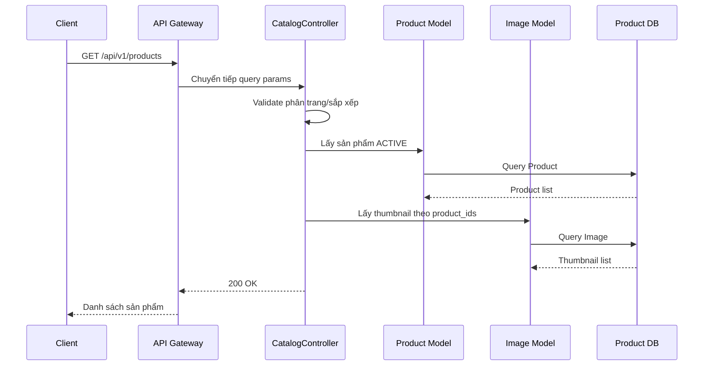

### 9.2 `get_product_detail()`

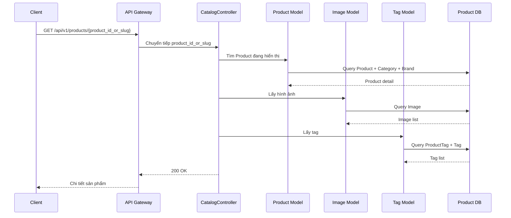

### 9.3 `filter_by_category()`

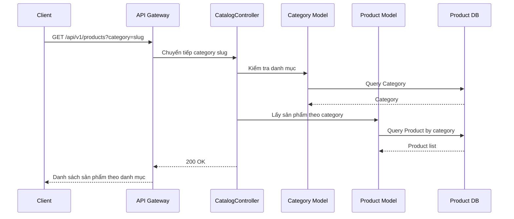

### 9.4 `search_by_keyword()`

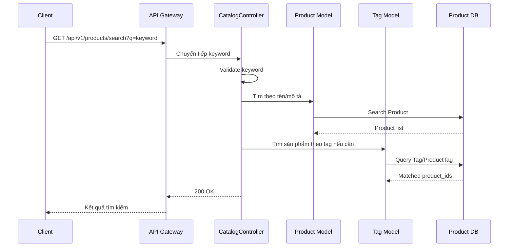

### 9.5 `create_product()`

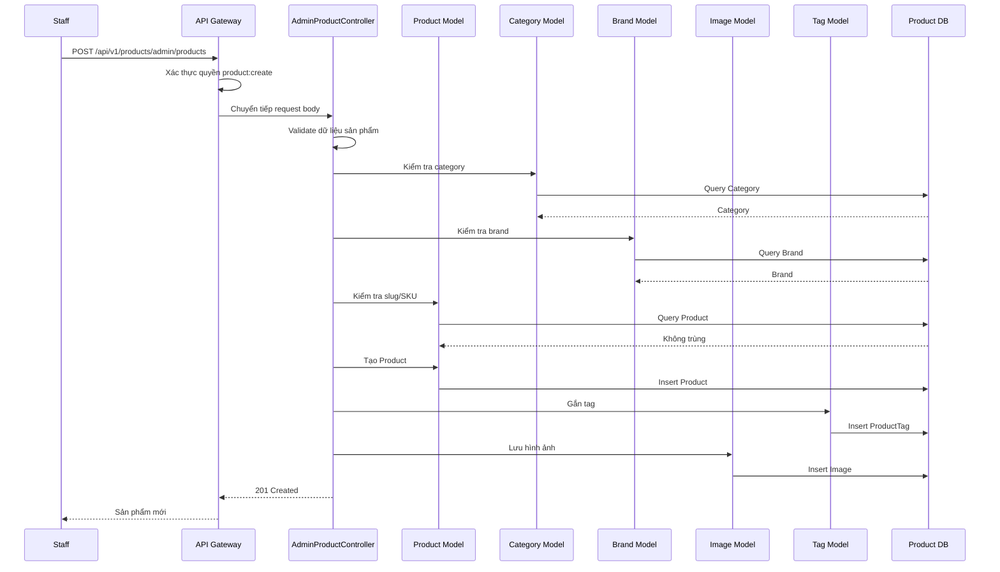

### 9.6 `update_product()`

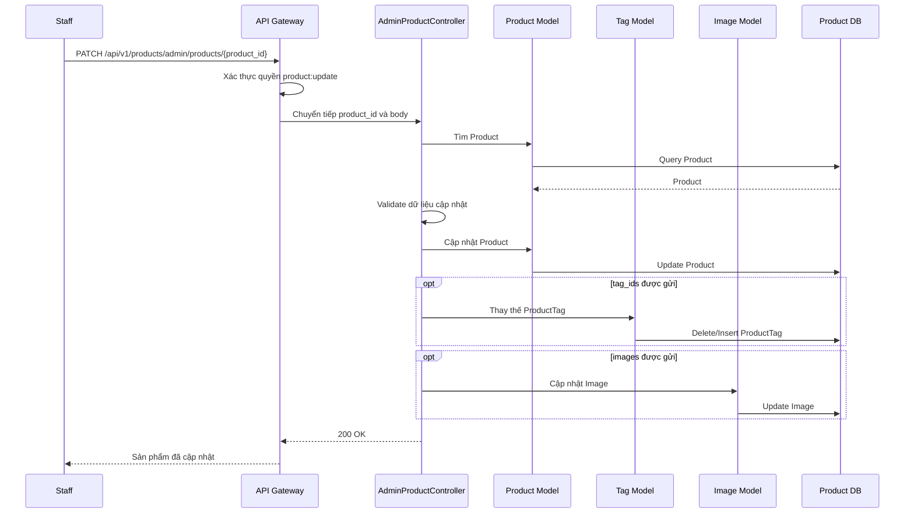

### 9.7 `delete_product()`

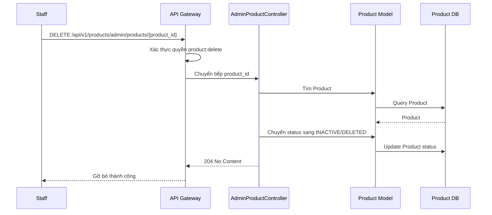

### 9.8 `update_stock_quantity()`

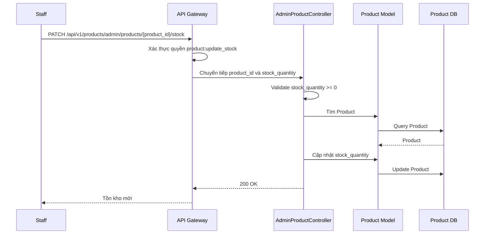

### 9.9 `manage_metadata()`

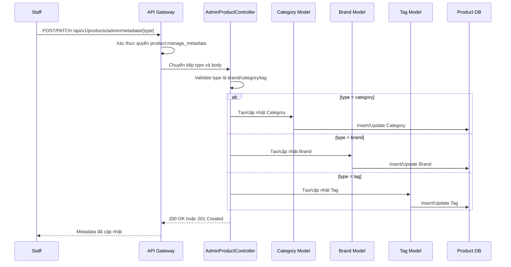

## 10. Bảo mật

- API public chỉ trả sản phẩm `ACTIVE`.
- API admin yêu cầu token hợp lệ và quyền tương ứng như `product:create`, `product:update`, `product:delete`.
- Không cho phép người không có quyền cập nhật giá, tồn kho hoặc trạng thái sản phẩm.
- Cần validate kỹ dữ liệu giá, tồn kho, slug, SKU và URL hình ảnh.
- Các thao tác admin nên được ghi audit log trong giai đoạn triển khai sau.

## 11. Tích hợp với service khác

| Service tích hợp | Chiều tương tác | Mục đích |
| --- | --- | --- |
| API Gateway | Gateway gọi Product Service | Định tuyến request và kiểm tra quyền admin. |
| Cart Service | Cart Service tham chiếu Product Service | Lấy thông tin sản phẩm hiện tại trong giỏ hàng. |
| Order Service | Order Service gọi Product Service | Kiểm tra giá, tồn kho và trạng thái sản phẩm khi checkout. |
| AI Service | AI Service đồng bộ dữ liệu Product Service | Đưa dữ liệu catalog vào Vector Database phục vụ RAG và gợi ý. |
| Comment Service | Comment Service tham chiếu `product_id` | Gắn đánh giá/bình luận với sản phẩm. |

## 12. Kiểm thử đề xuất

| Nhóm kiểm thử | Trường hợp cần kiểm tra |
| --- | --- |
| Catalog public | Lấy danh sách, xem chi tiết, lọc danh mục, tìm kiếm keyword, không hiển thị sản phẩm inactive. |
| Product admin | Tạo sản phẩm, trùng SKU/slug, cập nhật sản phẩm, gỡ sản phẩm. |
| Stock | Cập nhật tồn kho hợp lệ, chặn tồn kho âm, sản phẩm không tồn tại. |
| Metadata | Tạo/cập nhật Brand, Category, Tag; chặn slug trùng; chặn metadata inactive khi gán cho sản phẩm mới. |
| Security | Chặn API admin khi thiếu token hoặc thiếu quyền. |

## 13. Các điểm có thể mở rộng sau

- Quản lý biến thể sản phẩm riêng bằng `ProductVariant`.
- Lịch sử thay đổi giá và tồn kho.
- Đồng bộ sự kiện `ProductUpdated` cho AI Service hoặc Search index.
- Hỗ trợ nhiều kho hàng.
- Quản lý thuộc tính động theo từng ngành hàng.
