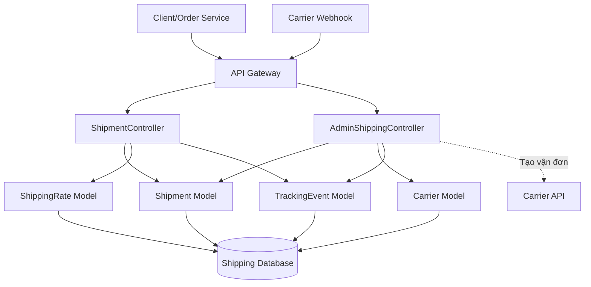
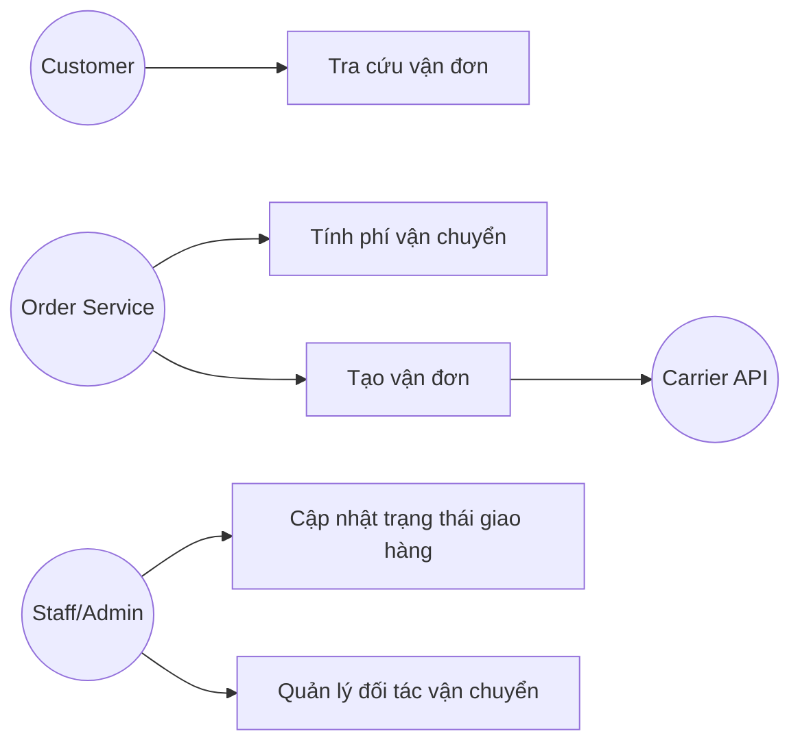
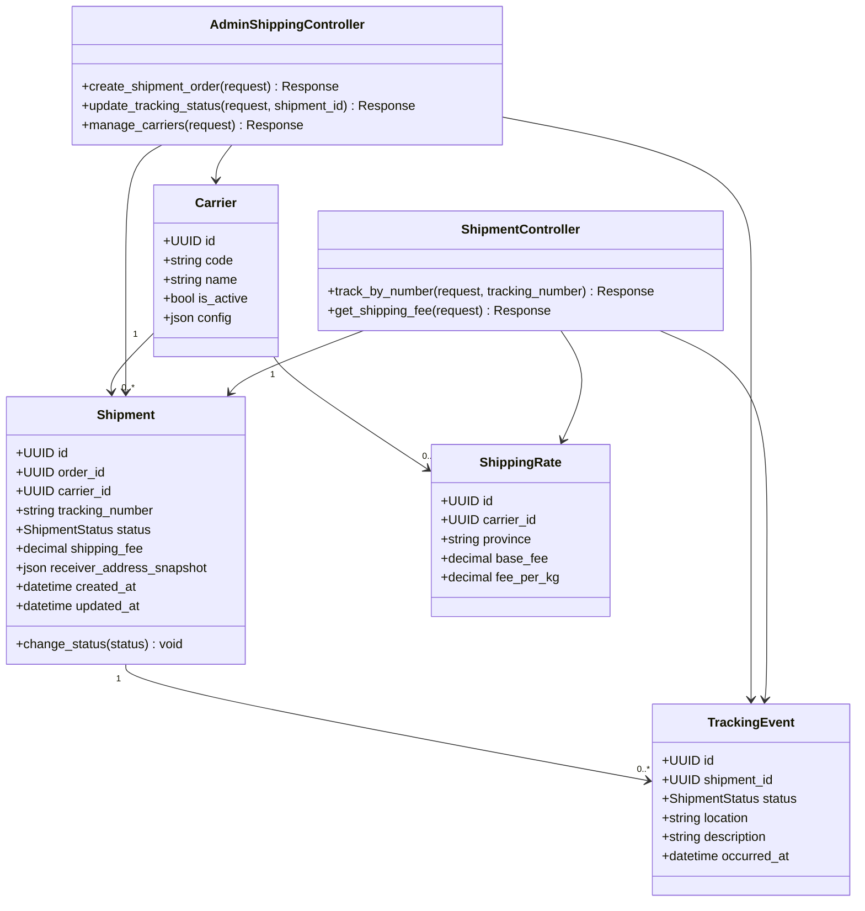
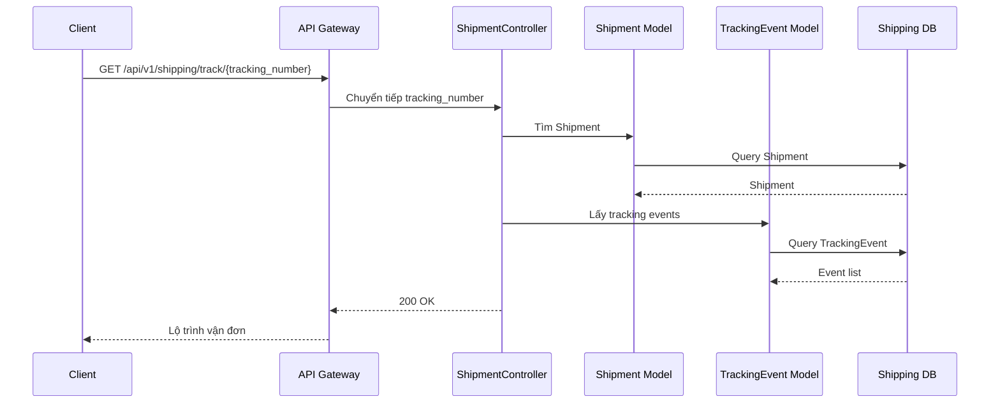
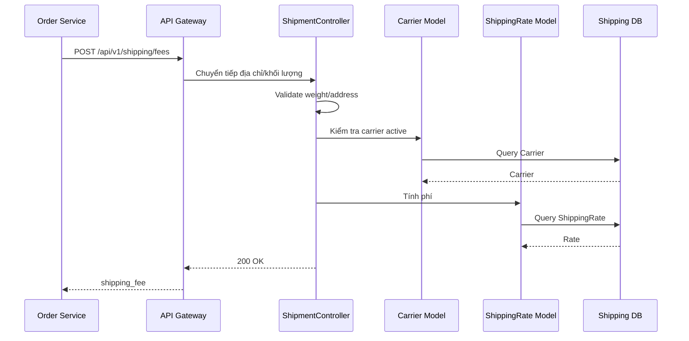
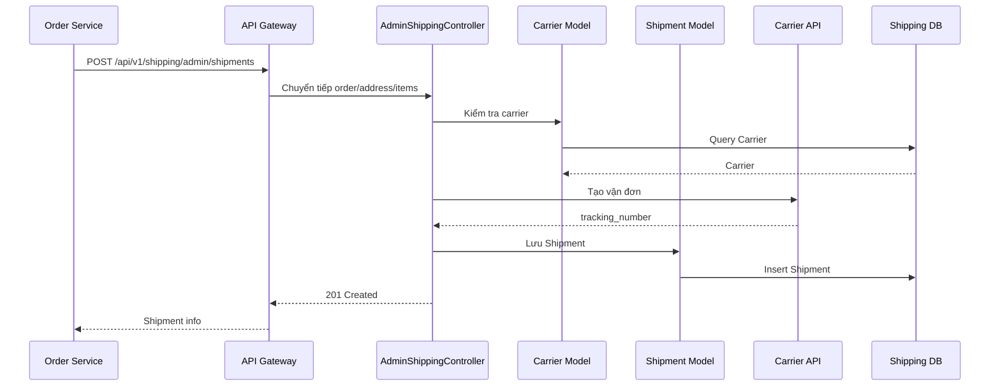
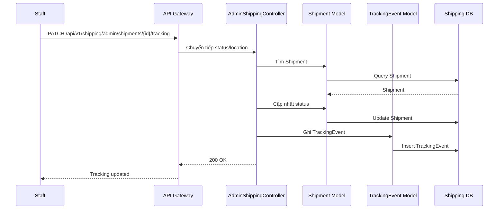
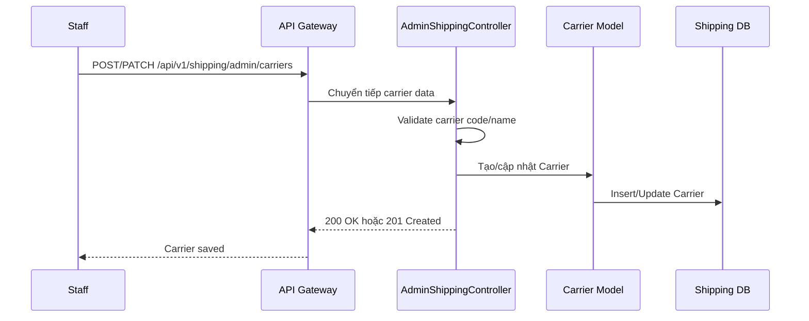

# Thiết kế chi tiết Shipping Service

## 1. Tổng quan service

Shipping Service thuộc Shipping Context, chịu trách nhiệm tính phí vận chuyển, tạo vận đơn, theo dõi hành trình giao hàng và quản lý danh sách đối tác vận chuyển. Service này phối hợp với Order Service để cập nhật trạng thái giao hàng nhưng không sở hữu vòng đời đơn hàng tổng thể.

Thiết kế nội bộ dùng MVC đơn giản với `ShipmentController`, `AdminShippingController` và các model `Shipment`, `Carrier`, `TrackingEvent`, `ShippingRate`.

## 2. Phạm vi trách nhiệm

- Tra cứu lộ trình kiện hàng theo mã vận đơn.
- Tính phí vận chuyển dựa trên địa chỉ và khối lượng.
- Đẩy thông tin đơn hàng sang đơn vị vận chuyển.
- Cập nhật trạng thái giao hàng nội bộ.
- Quản lý danh sách đối tác giao hàng.

## 3. Kiến trúc nội bộ theo MVC đơn giản



## 4. Controller và phương thức

| Controller | Phương thức | Mô tả |
| --- | --- | --- |
| ShipmentController | `track_by_number()` | Tra cứu lộ trình của kiện hàng theo mã vận đơn. |
| ShipmentController | `get_shipping_fee()` | Tính phí vận chuyển dựa trên địa chỉ và khối lượng. |
| AdminShippingController | `create_shipment_order()` | Đẩy thông tin đơn hàng sang đơn vị vận chuyển. |
| AdminShippingController | `update_tracking_status()` | Cập nhật trạng thái giao hàng nội bộ. |
| AdminShippingController | `manage_carriers()` | Quản lý danh sách các đối tác giao hàng. |

## 5. Use case



## 6. Sơ đồ lớp thiết kế



## 7. Quy tắc nghiệp vụ

- Chỉ carrier `is_active = true` mới được dùng để tính phí hoặc tạo vận đơn.
- Khối lượng phải lớn hơn 0.
- Mỗi shipment phải gắn với một `order_id`.
- `tracking_number` phải duy nhất.
- Trạng thái giao hàng phải chuyển theo luồng hợp lệ.
- Callback từ carrier cần được xác thực nếu carrier hỗ trợ chữ ký.

## 8. Thiết kế API

Base path:

```text
/api/v1/shipping
```

| Controller | Method | Endpoint | Auth | Mô tả |
| --- | --- | --- | --- | --- |
| ShipmentController | `track_by_number()` | `GET /api/v1/shipping/track/{tracking_number}` | Không | Tra cứu vận đơn. |
| ShipmentController | `get_shipping_fee()` | `POST /api/v1/shipping/fees` | Có | Tính phí vận chuyển. |
| AdminShippingController | `create_shipment_order()` | `POST /api/v1/shipping/admin/shipments` | Có | Tạo vận đơn với carrier. |
| AdminShippingController | `update_tracking_status()` | `PATCH /api/v1/shipping/admin/shipments/{shipment_id}/tracking` | Có | Cập nhật tracking nội bộ. |
| AdminShippingController | `manage_carriers()` | `POST/PATCH /api/v1/shipping/admin/carriers` | Có | Quản lý đối tác vận chuyển. |

### 8.1 `get_shipping_fee()`

```json
{
  "province": "TP. Hồ Chí Minh",
  "district": "Quận 1",
  "weight_kg": 1.5,
  "carrier_code": "GHN"
}
```

Response:

```json
{
  "carrier_code": "GHN",
  "shipping_fee": 32000,
  "estimated_days": 3
}
```

## 9. Sequence diagram

### 9.1 `track_by_number()`



### 9.2 `get_shipping_fee()`



### 9.3 `create_shipment_order()`



### 9.4 `update_tracking_status()`



### 9.5 `manage_carriers()`



## 10. Kiểm thử đề xuất

- Tính phí vận chuyển hợp lệ.
- Chặn khối lượng không hợp lệ.
- Tạo vận đơn thành công.
- Cập nhật trạng thái tracking.
- Tra cứu vận đơn theo tracking number.
- Chặn carrier inactive khi tạo vận đơn.
