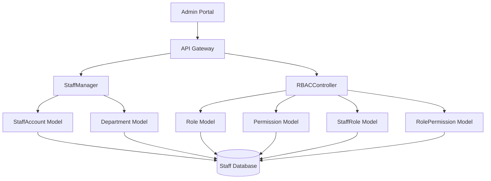
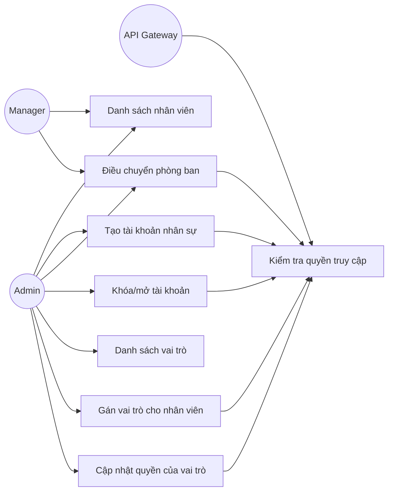
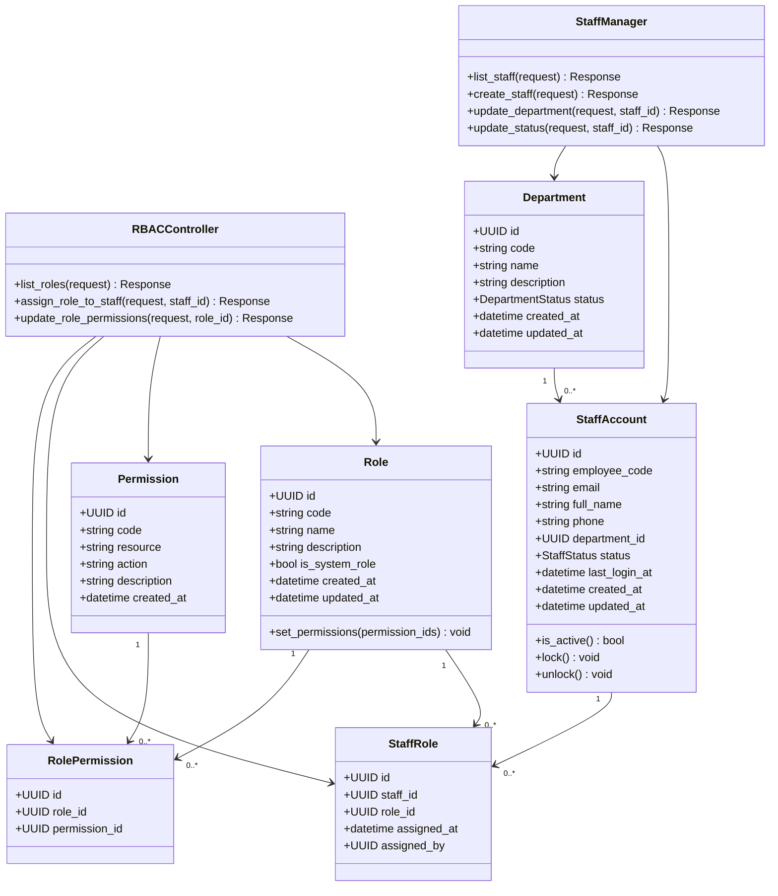
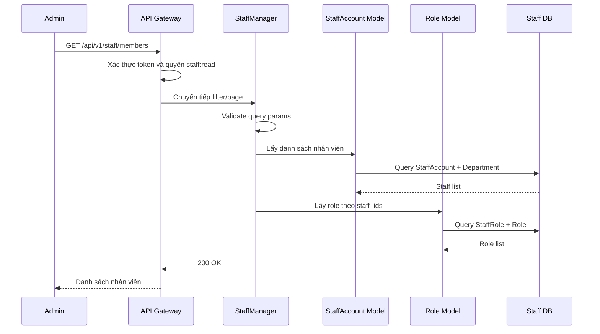
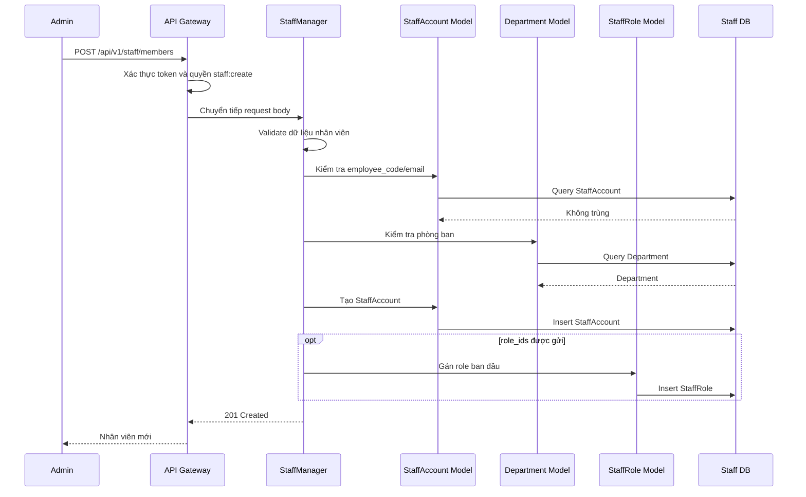
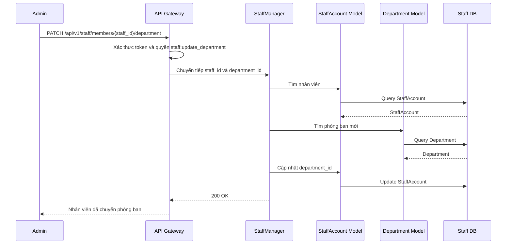
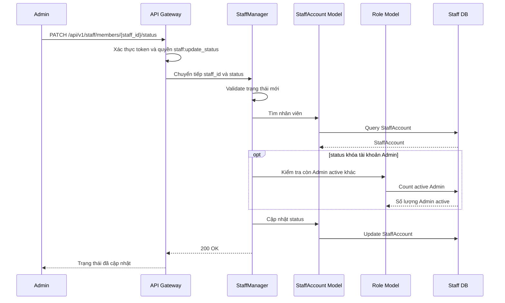
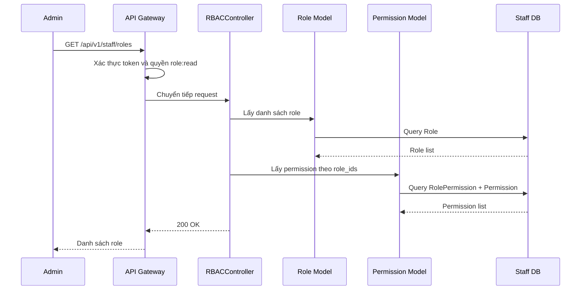
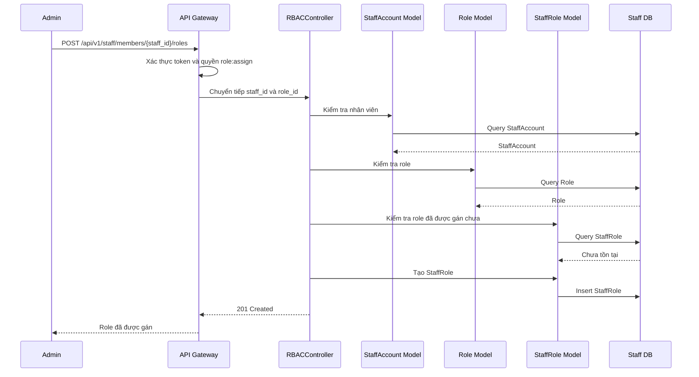
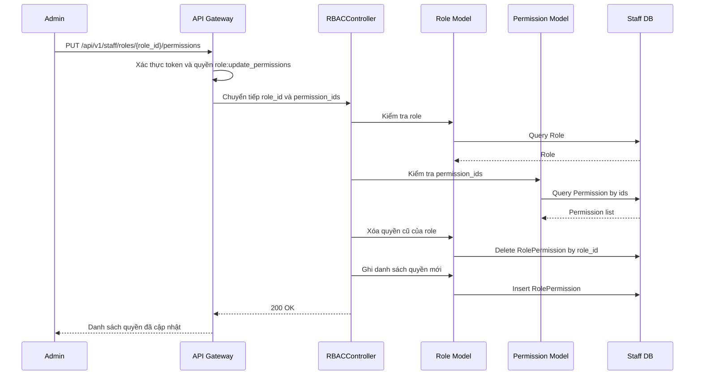

# Thiết kế chi tiết Staff Service

## 1. Tổng quan service

Staff Service thuộc Staff Context, chịu trách nhiệm quản lý nhân sự vận hành hệ thống và phân quyền truy cập theo mô hình RBAC. Service này là nguồn dữ liệu chính cho tài khoản nhân viên, phòng ban, trạng thái hoạt động, vai trò và danh sách quyền hạn của từng vai trò.

Staff Service khác với User Service. User Service quản lý khách hàng, còn Staff Service quản lý nhân sự nội bộ như Admin, Manager, Staff hoặc các nhóm vận hành khác. Các service nghiệp vụ có thể dựa vào Staff Service để xác định nhân viên có quyền thực hiện thao tác quản trị hay không.

## 2. Phạm vi trách nhiệm

### 2.1 Chức năng chính

- Liệt kê toàn bộ nhân viên vận hành.
- Tạo tài khoản cho nhân sự mới.
- Điều chuyển nhân viên giữa các phòng ban.
- Khóa hoặc mở lại tài khoản nhân viên.
- Liệt kê các vai trò trong hệ thống.
- Gán vai trò cụ thể cho một nhân viên.
- Thay đổi danh sách quyền hạn của một vai trò.

### 2.2 Ngoài phạm vi

- Không quản lý tài khoản khách hàng.
- Không xử lý đăng ký/đăng nhập khách hàng.
- Không xử lý nghiệp vụ đơn hàng, thanh toán, sản phẩm hoặc vận chuyển.
- Không lưu dữ liệu chi tiết của các service khác.

## 3. Kiến trúc nội bộ theo MVC đơn giản



### 3.1 Thành phần

| Thành phần | Trách nhiệm |
| --- | --- |
| StaffManager | Nhận request quản lý nhân sự: xem danh sách, tạo nhân viên, chuyển phòng ban, khóa/mở tài khoản. |
| RBACController | Nhận request quản lý vai trò và quyền hạn: xem role, gán role cho staff, cập nhật permission của role. |
| StaffAccount Model | Lưu tài khoản nhân viên, thông tin liên hệ, trạng thái và phòng ban hiện tại. |
| Department Model | Lưu danh sách phòng ban vận hành. |
| Role Model | Lưu vai trò như Admin, Manager, Staff. |
| Permission Model | Lưu quyền hạn chi tiết theo tài nguyên và hành động. |
| StaffRole Model | Lưu quan hệ gán vai trò cho nhân viên. |
| RolePermission Model | Lưu quan hệ giữa role và permission. |

Thiết kế dùng MVC đơn giản:

- Controller nhận request, validate dữ liệu, gọi model và trả response.
- Model biểu diễn dữ liệu, truy vấn database và thực hiện thao tác lưu/cập nhật/xóa.
- Không tách thêm tầng service để giữ thiết kế dễ hiểu và phù hợp giai đoạn phân tích ban đầu.

## 4. Controller và phương thức

| Controller | Phương thức | Mô tả |
| --- | --- | --- |
| StaffManager | `list_staff()` | Danh sách toàn bộ nhân viên vận hành. |
| StaffManager | `create_staff()` | Tạo tài khoản cho nhân sự mới. |
| StaffManager | `update_department()` | Điều chuyển nhân viên giữa các phòng ban. |
| StaffManager | `update_status()` | Khóa hoặc mở lại tài khoản nhân viên. |
| RBACController | `list_roles()` | Danh sách các vai trò như Admin, Manager, Staff. |
| RBACController | `assign_role_to_staff()` | Gán vai trò cụ thể cho một nhân viên. |
| RBACController | `update_role_permissions()` | Thay đổi danh sách quyền hạn của một vai trò. |

## 5. Tác nhân và use case

### 5.1 Tác nhân

| Tác nhân | Mô tả |
| --- | --- |
| Admin | Quản trị viên có quyền cao nhất, tạo nhân viên, khóa tài khoản, quản lý role và permission. |
| Manager | Nhân sự quản lý, có thể xem danh sách nhân viên hoặc điều chuyển nhân viên nếu được cấp quyền. |
| Staff | Nhân viên vận hành, là đối tượng được quản lý trong Staff Service. |
| API Gateway | Xác thực token, chuyển tiếp identity context và định tuyến request đến Staff Service. |

### 5.2 Sơ đồ use case



### 5.3 Mô tả use case

#### UC-01: Danh sách nhân viên

| Mục | Nội dung |
| --- | --- |
| Tác nhân chính | Admin, Manager |
| Mục tiêu | Xem danh sách nhân viên vận hành trong hệ thống. |
| Tiền điều kiện | Người gọi đã đăng nhập và có quyền `staff:read`. |
| Luồng chính | Người gọi gửi request; hệ thống kiểm tra quyền; truy vấn danh sách nhân viên; hỗ trợ lọc theo phòng ban, trạng thái hoặc từ khóa; trả dữ liệu phân trang. |
| Luồng ngoại lệ | Không có quyền truy cập; tham số lọc sai định dạng. |
| Hậu điều kiện | Không thay đổi dữ liệu. |

#### UC-02: Tạo tài khoản nhân sự

| Mục | Nội dung |
| --- | --- |
| Tác nhân chính | Admin |
| Mục tiêu | Tạo tài khoản cho nhân sự vận hành mới. |
| Tiền điều kiện | Người gọi có quyền `staff:create`; email hoặc mã nhân viên chưa tồn tại. |
| Luồng chính | Admin gửi thông tin nhân viên; hệ thống validate dữ liệu; kiểm tra trùng email/mã nhân viên; tạo `StaffAccount`; gán phòng ban; có thể gán role mặc định; trả thông tin tài khoản đã tạo. |
| Luồng ngoại lệ | Email/mã nhân viên đã tồn tại; phòng ban không tồn tại; dữ liệu thiếu hoặc sai định dạng. |
| Hậu điều kiện | Nhân viên mới được tạo ở trạng thái `ACTIVE` hoặc `PENDING_ACTIVATION` tùy chính sách. |

#### UC-03: Điều chuyển phòng ban

| Mục | Nội dung |
| --- | --- |
| Tác nhân chính | Admin, Manager |
| Mục tiêu | Chuyển nhân viên sang phòng ban khác. |
| Tiền điều kiện | Người gọi có quyền `staff:update_department`; nhân viên và phòng ban mới tồn tại. |
| Luồng chính | Người gọi gửi `staff_id` và `department_id`; hệ thống kiểm tra quyền; kiểm tra nhân viên tồn tại; kiểm tra phòng ban tồn tại; cập nhật phòng ban cho nhân viên. |
| Luồng ngoại lệ | Nhân viên không tồn tại; phòng ban không tồn tại; người gọi không có quyền. |
| Hậu điều kiện | Nhân viên được gán sang phòng ban mới. |

#### UC-04: Khóa hoặc mở tài khoản nhân viên

| Mục | Nội dung |
| --- | --- |
| Tác nhân chính | Admin |
| Mục tiêu | Khóa tài khoản nhân viên khi cần chặn truy cập hoặc mở lại khi được phép. |
| Tiền điều kiện | Người gọi có quyền `staff:update_status`; nhân viên tồn tại. |
| Luồng chính | Admin gửi trạng thái mới; hệ thống kiểm tra quyền; cập nhật trạng thái `ACTIVE`, `LOCKED` hoặc `INACTIVE`; ghi nhận thời điểm cập nhật. |
| Luồng ngoại lệ | Không được tự khóa tài khoản cuối cùng có quyền Admin; trạng thái không hợp lệ; nhân viên không tồn tại. |
| Hậu điều kiện | Trạng thái tài khoản nhân viên được cập nhật. |

#### UC-05: Danh sách vai trò

| Mục | Nội dung |
| --- | --- |
| Tác nhân chính | Admin, Manager |
| Mục tiêu | Xem danh sách vai trò và quyền hạn liên quan. |
| Tiền điều kiện | Người gọi có quyền `role:read`. |
| Luồng chính | Người gọi gửi request; hệ thống kiểm tra quyền; truy vấn danh sách role; trả role kèm danh sách permission. |
| Luồng ngoại lệ | Không có quyền truy cập. |
| Hậu điều kiện | Không thay đổi dữ liệu. |

#### UC-06: Gán vai trò cho nhân viên

| Mục | Nội dung |
| --- | --- |
| Tác nhân chính | Admin |
| Mục tiêu | Gán một vai trò cụ thể cho nhân viên. |
| Tiền điều kiện | Người gọi có quyền `role:assign`; nhân viên và role tồn tại. |
| Luồng chính | Admin gửi `staff_id` và `role_id`; hệ thống kiểm tra quyền; kiểm tra staff và role tồn tại; tạo hoặc cập nhật bản ghi `StaffRole`. |
| Luồng ngoại lệ | Nhân viên không tồn tại; role không tồn tại; role đã được gán; không có quyền. |
| Hậu điều kiện | Nhân viên có role mới hoặc danh sách role được cập nhật. |

#### UC-07: Cập nhật quyền của vai trò

| Mục | Nội dung |
| --- | --- |
| Tác nhân chính | Admin |
| Mục tiêu | Thay đổi danh sách quyền hạn của một vai trò. |
| Tiền điều kiện | Người gọi có quyền `role:update_permissions`; role và permission tồn tại. |
| Luồng chính | Admin gửi `role_id` và danh sách `permission_ids`; hệ thống kiểm tra quyền; kiểm tra role tồn tại; kiểm tra permission hợp lệ; thay thế danh sách quyền của role. |
| Luồng ngoại lệ | Role không tồn tại; permission không tồn tại; không được xóa quyền quan trọng khỏi role Admin nếu chính sách bảo vệ được bật. |
| Hậu điều kiện | Danh sách quyền của role được cập nhật. |

## 6. Thiết kế dữ liệu và sơ đồ lớp

### 6.1 Sơ đồ lớp thiết kế



### 6.2 Entity đề xuất

| Entity | Trách nhiệm chính |
| --- | --- |
| StaffAccount | Lưu tài khoản nhân viên, mã nhân viên, email, phòng ban và trạng thái. |
| Department | Lưu thông tin phòng ban. |
| Role | Lưu vai trò như Admin, Manager, Staff. |
| Permission | Lưu quyền hạn chi tiết theo tài nguyên và hành động. |
| StaffRole | Lưu quan hệ gán role cho nhân viên. |
| RolePermission | Lưu quan hệ role và permission. |

## 7. Quy tắc nghiệp vụ

- Chỉ nhân viên có quyền phù hợp mới được gọi API quản trị Staff Service.
- `employee_code` và `email` phải duy nhất.
- Không được khóa hoặc hạ quyền tài khoản Admin cuối cùng nếu hệ thống không còn Admin hoạt động nào khác.
- Nhân viên ở trạng thái `LOCKED` hoặc `INACTIVE` không được đăng nhập vào hệ thống quản trị.
- Role hệ thống như `ADMIN` có thể bị giới hạn chỉnh sửa để tránh mất quyền quản trị cốt lõi.
- Permission nên dùng định dạng `resource:action`, ví dụ `staff:create`, `role:assign`, `product:update`.
- Khi cập nhật permission của role, hệ thống thay thế toàn bộ danh sách quyền bằng danh sách mới đã được validate.
- Các thao tác quản trị quan trọng nên được ghi audit log trong giai đoạn triển khai sau.

## 8. Thiết kế API

### 8.1 Quy ước chung

Base path đề xuất:

```text
/api/v1/staff
```

Toàn bộ API Staff Service yêu cầu `Authorization: Bearer <access_token>`.

### 8.2 Danh sách endpoint

| Controller | Method | Endpoint | Auth | Mô tả |
| --- | --- | --- | --- | --- |
| StaffManager | `list_staff()` | `GET /api/v1/staff/members` | Có | Danh sách nhân viên vận hành. |
| StaffManager | `create_staff()` | `POST /api/v1/staff/members` | Có | Tạo tài khoản nhân sự mới. |
| StaffManager | `update_department()` | `PATCH /api/v1/staff/members/{staff_id}/department` | Có | Điều chuyển nhân viên sang phòng ban khác. |
| StaffManager | `update_status()` | `PATCH /api/v1/staff/members/{staff_id}/status` | Có | Khóa hoặc mở lại tài khoản nhân viên. |
| RBACController | `list_roles()` | `GET /api/v1/staff/roles` | Có | Danh sách vai trò. |
| RBACController | `assign_role_to_staff()` | `POST /api/v1/staff/members/{staff_id}/roles` | Có | Gán vai trò cho nhân viên. |
| RBACController | `update_role_permissions()` | `PUT /api/v1/staff/roles/{role_id}/permissions` | Có | Cập nhật danh sách quyền của role. |

### 8.3 `list_staff()`

```http
GET /api/v1/staff/members?department_id=<uuid>&status=ACTIVE&page=1&page_size=20
Authorization: Bearer <access_token>
```

Response `200 OK`:

```json
{
  "items": [
    {
      "id": "c3150eb3-90d7-4f1f-b7dd-045f4e0b4fa4",
      "employee_code": "EMP001",
      "email": "staff@example.com",
      "full_name": "Trần Thị B",
      "department": {"id": "d2dbe0de-69b4-492c-a4b8-383b0f99e410", "name": "Vận hành"},
      "status": "ACTIVE",
      "roles": ["STAFF"]
    }
  ],
  "page": 1,
  "page_size": 20,
  "total": 1
}
```

### 8.4 `create_staff()`

```http
POST /api/v1/staff/members
Authorization: Bearer <access_token>
```

Request:

```json
{
  "employee_code": "EMP002",
  "email": "new.staff@example.com",
  "full_name": "Lê Văn C",
  "phone": "0909333444",
  "department_id": "d2dbe0de-69b4-492c-a4b8-383b0f99e410",
  "role_ids": ["9c09fa8d-8da7-478b-9c32-2c8f5c896f0e"]
}
```

Response `201 Created`.

### 8.5 `update_department()`

```http
PATCH /api/v1/staff/members/{staff_id}/department
Authorization: Bearer <access_token>
```

Request:

```json
{
  "department_id": "6a6c00e6-116b-4d0d-a257-d5de3014b8e2"
}
```

Response `200 OK`.

### 8.6 `update_status()`

```http
PATCH /api/v1/staff/members/{staff_id}/status
Authorization: Bearer <access_token>
```

Request:

```json
{
  "status": "LOCKED",
  "reason": "Nghỉ việc"
}
```

Response `200 OK`.

### 8.7 `list_roles()`

```http
GET /api/v1/staff/roles
Authorization: Bearer <access_token>
```

Response `200 OK`:

```json
{
  "items": [
    {
      "id": "bc22b01a-6024-46be-8339-2b6f2f375066",
      "code": "ADMIN",
      "name": "Admin",
      "is_system_role": true,
      "permissions": ["staff:read", "staff:create", "role:assign"]
    }
  ]
}
```

### 8.8 `assign_role_to_staff()`

```http
POST /api/v1/staff/members/{staff_id}/roles
Authorization: Bearer <access_token>
```

Request:

```json
{
  "role_id": "bc22b01a-6024-46be-8339-2b6f2f375066"
}
```

Response `201 Created`.

### 8.9 `update_role_permissions()`

```http
PUT /api/v1/staff/roles/{role_id}/permissions
Authorization: Bearer <access_token>
```

Request:

```json
{
  "permission_ids": [
    "47b8a90c-837e-4029-9fb6-983daef8bba1",
    "a1e8d7b2-11e4-401d-8840-f2de8b2d3218"
  ]
}
```

Response `200 OK`.

### 8.10 Lỗi thường gặp

| HTTP status | Code | Mô tả |
| --- | --- | --- |
| 400 | `VALIDATION_ERROR` | Dữ liệu thiếu hoặc sai định dạng. |
| 401 | `UNAUTHORIZED` | Token không hợp lệ. |
| 403 | `FORBIDDEN` | Không có quyền thực hiện thao tác. |
| 404 | `STAFF_NOT_FOUND` | Nhân viên không tồn tại. |
| 404 | `ROLE_NOT_FOUND` | Role không tồn tại. |
| 404 | `PERMISSION_NOT_FOUND` | Permission không tồn tại. |
| 409 | `EMAIL_ALREADY_EXISTS` | Email đã tồn tại. |
| 409 | `EMPLOYEE_CODE_ALREADY_EXISTS` | Mã nhân viên đã tồn tại. |
| 409 | `LAST_ADMIN_PROTECTED` | Không được khóa hoặc làm mất quyền Admin cuối cùng. |

## 9. Sequence diagram cho các endpoint

### 9.1 `list_staff()`



### 9.2 `create_staff()`



### 9.3 `update_department()`



### 9.4 `update_status()`



### 9.5 `list_roles()`



### 9.6 `assign_role_to_staff()`



### 9.7 `update_role_permissions()`



## 10. Bảo mật

- Toàn bộ API Staff Service yêu cầu token hợp lệ.
- API Gateway hoặc Staff Service cần kiểm tra permission trước khi xử lý request.
- Nhân viên bị `LOCKED` hoặc `INACTIVE` không được truy cập hệ thống quản trị.
- Các thao tác tạo nhân viên, khóa tài khoản, gán role và cập nhật permission nên được ghi audit log.
- Không trả dữ liệu nhạy cảm như mật khẩu hoặc token trong response.
- Cần bảo vệ role Admin để tránh mất quyền quản trị cuối cùng.

## 11. Tích hợp với service khác

| Service tích hợp | Chiều tương tác | Mục đích |
| --- | --- | --- |
| API Gateway | Gateway gọi Staff Service | Định tuyến request và kiểm tra token/permission. |
| Product Service | Product Service tham chiếu quyền staff | Kiểm tra nhân viên có quyền quản lý catalog hay không. |
| Order Service | Order Service tham chiếu quyền staff | Kiểm tra nhân viên có quyền xử lý đơn hàng hay không. |
| User Service | Staff Service có thể tra cứu khách hàng khi cần | Hỗ trợ chăm sóc khách hàng, nhưng không quản lý tài khoản customer. |

## 12. Kiểm thử đề xuất

| Nhóm kiểm thử | Trường hợp cần kiểm tra |
| --- | --- |
| Staff management | Liệt kê nhân viên, tạo nhân viên, trùng email, trùng mã nhân viên, phòng ban không tồn tại. |
| Department | Chuyển phòng ban thành công, nhân viên không tồn tại, phòng ban không tồn tại. |
| Status | Khóa tài khoản, mở lại tài khoản, chặn khóa Admin cuối cùng. |
| RBAC | Liệt kê role, gán role, gán role trùng, role không tồn tại, cập nhật permission. |
| Security | Chặn request thiếu token, chặn request thiếu permission, không trả dữ liệu nhạy cảm. |

## 13. Các điểm có thể mở rộng sau

- API tạo/cập nhật phòng ban.
- API tạo/cập nhật/xóa role.
- API tạo/cập nhật permission.
- Audit log chi tiết cho thao tác quản trị.
- Chính sách phê duyệt khi thay đổi quyền quan trọng.
- Quản lý ca làm việc, vị trí công việc và lịch sử điều chuyển phòng ban.
