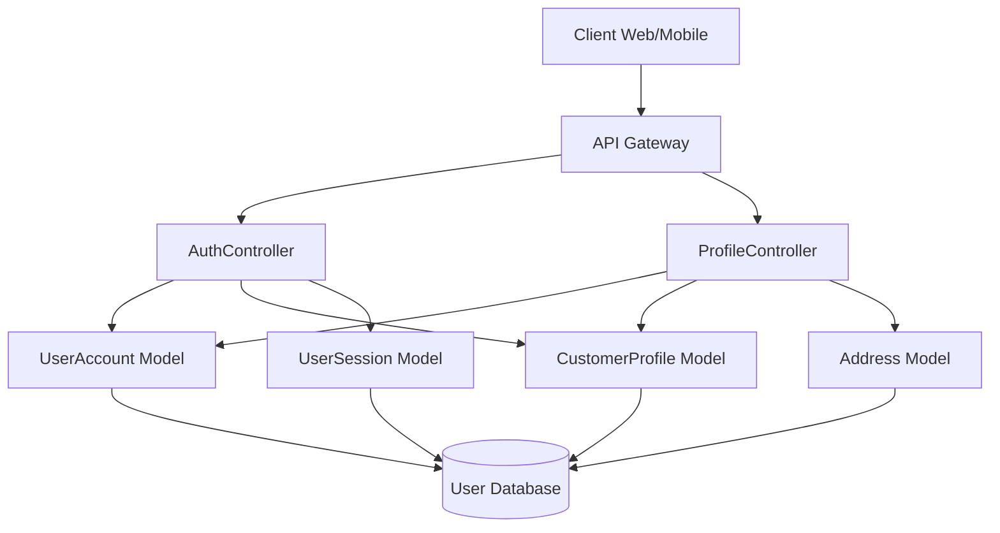
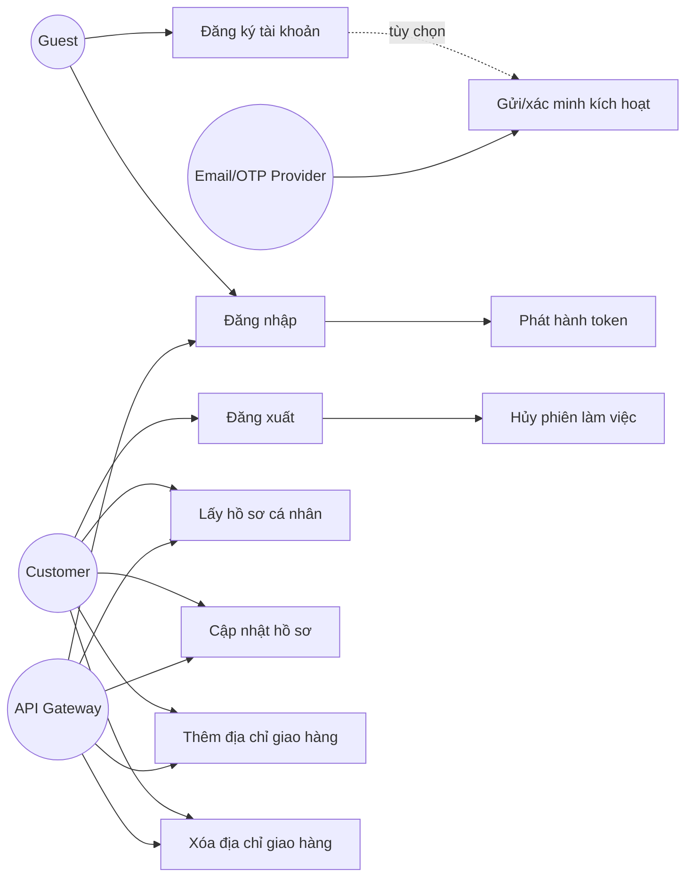
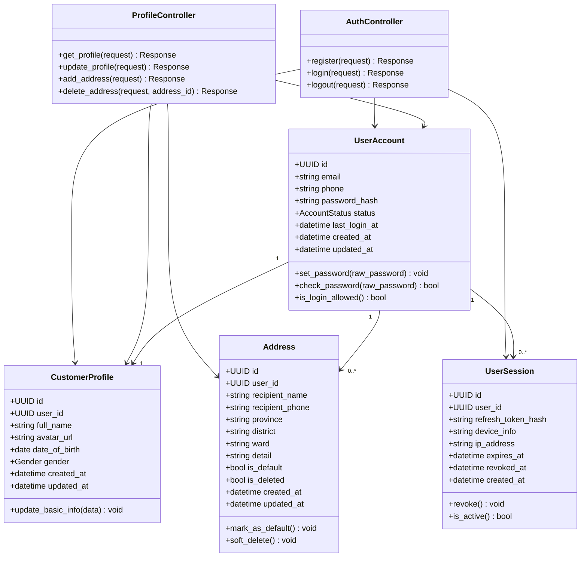
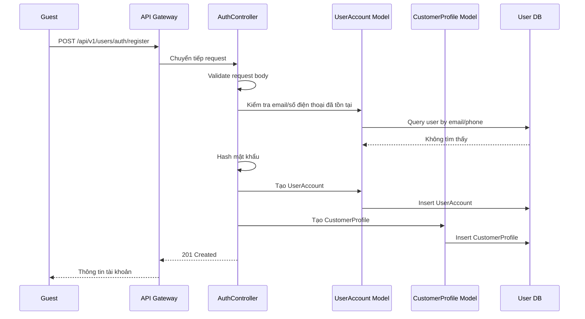
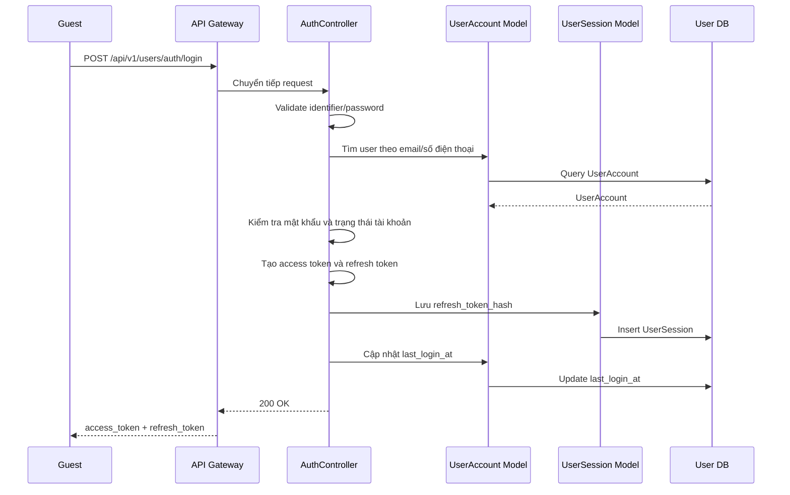
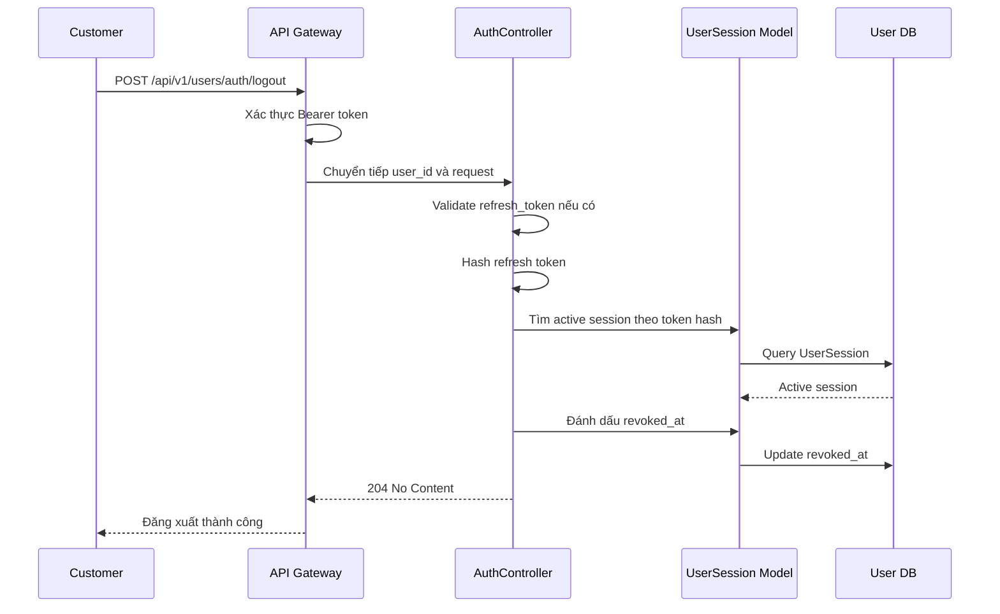
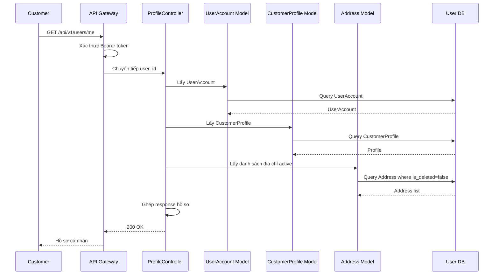
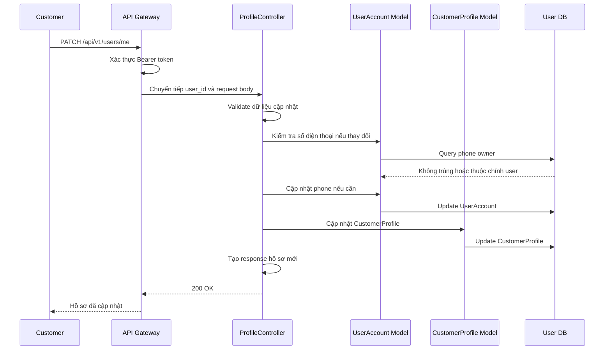
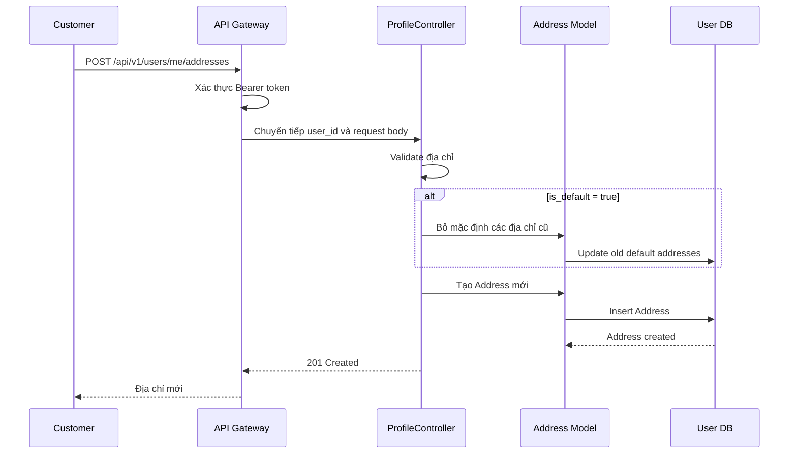
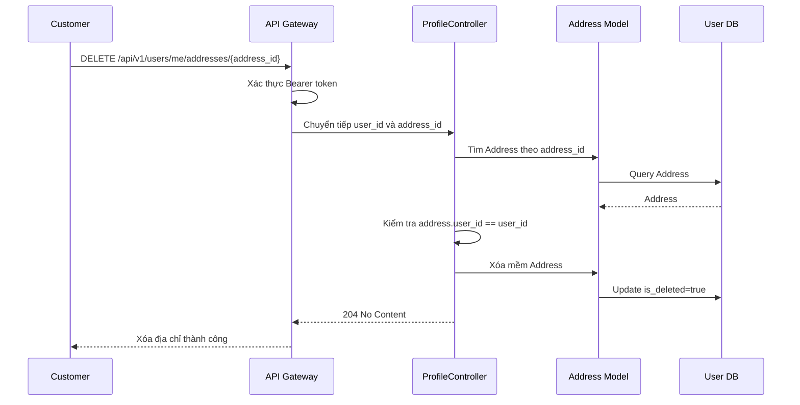

# Thiết kế chi tiết User Service

## 1. Tổng quan service

User Service thuộc Customer Context, chịu trách nhiệm quản lý định danh và hồ sơ khách hàng trong hệ thống E-Commerce. Service này là nguồn dữ liệu chính cho tài khoản khách hàng, thông tin cá nhân, trạng thái kích hoạt tài khoản và sổ địa chỉ giao hàng.

User Service không quản lý tài khoản nhân sự nội bộ. Các nghiệp vụ nhân sự, vai trò quản trị và RBAC thuộc Staff Service. Các service khác chỉ tham chiếu khách hàng thông qua `user_id` hoặc gọi REST API của User Service khi cần xác minh thông tin người dùng.

## 2. Phạm vi trách nhiệm

### 2.1 Chức năng chính

- Đăng ký tài khoản khách hàng mới.
- Xác thực đăng nhập và phát hành access token/refresh token.
- Đăng xuất và hủy phiên làm việc hiện tại.
- Lấy thông tin chi tiết hồ sơ cá nhân.
- Cập nhật thông tin cơ bản của khách hàng.
- Thêm địa chỉ giao hàng vào sổ địa chỉ.
- Xóa địa chỉ giao hàng không còn sử dụng.

### 2.2 Ngoài phạm vi

- Không quản lý tài khoản staff/admin.
- Không quản lý role/permission quản trị.
- Không xử lý thanh toán, đơn hàng hoặc giỏ hàng.
- Không lưu thông tin chi tiết sản phẩm, comment hoặc lịch sử giao dịch.

## 3. Kiến trúc nội bộ theo MVC đơn giản



### 3.1 Thành phần

| Thành phần | Trách nhiệm |
| --- | --- |
| AuthController | Nhận request đăng ký, đăng nhập, đăng xuất; validate dữ liệu đầu vào; trả response chuẩn REST. |
| ProfileController | Nhận request lấy/cập nhật hồ sơ và quản lý địa chỉ giao hàng. |
| UserAccount Model | Lưu tài khoản, email, số điện thoại, mật khẩu đã hash và trạng thái tài khoản. |
| CustomerProfile Model | Lưu thông tin hồ sơ cá nhân của khách hàng. |
| Address Model | Lưu địa chỉ giao hàng của khách hàng. |
| UserSession Model | Lưu phiên đăng nhập hoặc refresh token đã hash nếu hệ thống quản lý session phía server. |

Thiết kế này dùng MVC đơn giản:

- Controller nhận request, validate dữ liệu, gọi model và trả response.
- Model biểu diễn dữ liệu, truy vấn database và thực hiện thao tác lưu/cập nhật/xóa.
- Không tách thêm tầng service để giữ triển khai ban đầu gọn hơn.

## 4. Controller và phương thức

| Controller | Phương thức | Mô tả |
| --- | --- | --- |
| AuthController | `register()` | Đăng ký tài khoản người dùng mới. |
| AuthController | `login()` | Xác thực thông tin đăng nhập và đăng nhập vào hệ thống. |
| AuthController | `logout()` | Đăng xuất và hủy phiên làm việc hiện tại. |
| ProfileController | `get_profile()` | Lấy thông tin chi tiết hồ sơ cá nhân. |
| ProfileController | `update_profile()` | Cập nhật thông tin cơ bản như tên và số điện thoại. |
| ProfileController | `add_address()` | Thêm địa chỉ giao hàng mới vào sổ địa chỉ. |
| ProfileController | `delete_address()` | Xóa địa chỉ giao hàng không còn sử dụng. |

## 5. Tác nhân và use case

### 5.1 Tác nhân

| Tác nhân | Mô tả |
| --- | --- |
| Guest | Người dùng chưa đăng nhập, có thể đăng ký và đăng nhập. |
| Customer | Người dùng đã đăng nhập, có thể quản lý hồ sơ và sổ địa chỉ. |
| API Gateway | Thành phần định tuyến, xác thực token sơ bộ và chuyển tiếp identity context. |
| Email/OTP Provider | Dịch vụ gửi email hoặc mã xác thực kích hoạt tài khoản nếu được bổ sung. |

### 5.2 Sơ đồ use case



### 5.3 Mô tả use case

#### UC-01: Đăng ký tài khoản

| Mục | Nội dung |
| --- | --- |
| Tác nhân chính | Guest |
| Mục tiêu | Tạo tài khoản khách hàng mới để sử dụng hệ thống. |
| Tiền điều kiện | Email hoặc số điện thoại chưa tồn tại trong User Service. |
| Luồng chính | Guest gửi thông tin đăng ký; hệ thống validate dữ liệu; kiểm tra trùng email/số điện thoại; hash mật khẩu; tạo `UserAccount` và `CustomerProfile`; trả thông tin tài khoản đã tạo. |
| Luồng ngoại lệ | Email/số điện thoại đã tồn tại; mật khẩu không đạt chính sách; dữ liệu đầu vào thiếu hoặc sai định dạng. |
| Hậu điều kiện | Tài khoản được tạo với trạng thái `PENDING_VERIFICATION` hoặc `ACTIVE` tùy cấu hình kích hoạt. |

#### UC-02: Đăng nhập

| Mục | Nội dung |
| --- | --- |
| Tác nhân chính | Guest |
| Mục tiêu | Xác thực người dùng và phát hành token truy cập hệ thống. |
| Tiền điều kiện | Tài khoản tồn tại và không bị khóa. |
| Luồng chính | Guest gửi email/số điện thoại và mật khẩu; hệ thống tìm tài khoản; kiểm tra mật khẩu; kiểm tra trạng thái tài khoản; tạo session; phát hành access token và refresh token. |
| Luồng ngoại lệ | Sai thông tin đăng nhập; tài khoản bị khóa; tài khoản chưa kích hoạt nếu chính sách yêu cầu kích hoạt trước khi đăng nhập. |
| Hậu điều kiện | Customer có token hợp lệ để gọi các API yêu cầu xác thực. |

#### UC-03: Đăng xuất

| Mục | Nội dung |
| --- | --- |
| Tác nhân chính | Customer |
| Mục tiêu | Hủy phiên làm việc hiện tại. |
| Tiền điều kiện | Request có access token hợp lệ hoặc refresh token cần thu hồi. |
| Luồng chính | Customer gọi API logout; hệ thống xác định session/token; đánh dấu session là revoked; trả kết quả thành công. |
| Luồng ngoại lệ | Token không hợp lệ, token hết hạn hoặc session đã bị hủy trước đó. |
| Hậu điều kiện | Token/session hiện tại không còn được sử dụng. |

#### UC-04: Lấy hồ sơ cá nhân

| Mục | Nội dung |
| --- | --- |
| Tác nhân chính | Customer |
| Mục tiêu | Xem thông tin tài khoản, hồ sơ cá nhân và danh sách địa chỉ. |
| Tiền điều kiện | Customer đã đăng nhập. |
| Luồng chính | Customer gọi API lấy hồ sơ; hệ thống lấy `user_id` từ token; truy xuất tài khoản, profile và địa chỉ; trả dữ liệu chi tiết. |
| Luồng ngoại lệ | Token không hợp lệ; tài khoản không tồn tại hoặc bị khóa. |
| Hậu điều kiện | Không thay đổi dữ liệu. |

#### UC-05: Cập nhật hồ sơ

| Mục | Nội dung |
| --- | --- |
| Tác nhân chính | Customer |
| Mục tiêu | Cập nhật thông tin cơ bản của hồ sơ cá nhân. |
| Tiền điều kiện | Customer đã đăng nhập. |
| Luồng chính | Customer gửi thông tin cập nhật; hệ thống validate họ tên và số điện thoại; cập nhật `CustomerProfile`; trả hồ sơ mới. |
| Luồng ngoại lệ | Số điện thoại sai định dạng hoặc đã được dùng cho tài khoản khác; dữ liệu vượt độ dài cho phép. |
| Hậu điều kiện | Hồ sơ cá nhân được cập nhật. |

#### UC-06: Thêm địa chỉ giao hàng

| Mục | Nội dung |
| --- | --- |
| Tác nhân chính | Customer |
| Mục tiêu | Thêm địa chỉ giao hàng mới vào sổ địa chỉ. |
| Tiền điều kiện | Customer đã đăng nhập. |
| Luồng chính | Customer gửi thông tin địa chỉ; hệ thống validate trường bắt buộc; nếu là địa chỉ mặc định thì bỏ mặc định các địa chỉ khác; lưu địa chỉ mới; trả địa chỉ đã tạo. |
| Luồng ngoại lệ | Thiếu người nhận, số điện thoại, tỉnh/thành, quận/huyện, phường/xã hoặc địa chỉ chi tiết; vượt số lượng địa chỉ tối đa nếu có chính sách giới hạn. |
| Hậu điều kiện | Địa chỉ mới thuộc về customer hiện tại. |

#### UC-07: Xóa địa chỉ giao hàng

| Mục | Nội dung |
| --- | --- |
| Tác nhân chính | Customer |
| Mục tiêu | Xóa địa chỉ không còn sử dụng. |
| Tiền điều kiện | Customer đã đăng nhập và địa chỉ thuộc về customer. |
| Luồng chính | Customer gửi `address_id`; hệ thống kiểm tra địa chỉ tồn tại và thuộc customer; xóa mềm hoặc xóa cứng theo chính sách; trả kết quả thành công. |
| Luồng ngoại lệ | Địa chỉ không tồn tại; địa chỉ thuộc user khác; địa chỉ đang được tham chiếu bởi đơn hàng chưa hoàn tất nếu hệ thống áp dụng ràng buộc. |
| Hậu điều kiện | Địa chỉ không còn xuất hiện trong sổ địa chỉ active. |

## 6. Thiết kế dữ liệu và sơ đồ lớp

### 6.1 Sơ đồ lớp thiết kế



### 6.2 Entity đề xuất

#### UserAccount

| Trường | Kiểu | Mô tả |
| --- | --- | --- |
| `id` | UUID | Khóa chính của tài khoản. |
| `email` | string | Email đăng nhập, unique nếu được cung cấp. |
| `phone` | string | Số điện thoại, unique nếu được dùng làm định danh. |
| `password_hash` | string | Mật khẩu đã hash, không bao giờ trả ra API. |
| `status` | enum | `PENDING_VERIFICATION`, `ACTIVE`, `LOCKED`, `INACTIVE`. |
| `last_login_at` | datetime | Thời điểm đăng nhập gần nhất. |
| `created_at` | datetime | Thời điểm tạo. |
| `updated_at` | datetime | Thời điểm cập nhật. |

#### CustomerProfile

| Trường | Kiểu | Mô tả |
| --- | --- | --- |
| `id` | UUID | Khóa chính của hồ sơ. |
| `user_id` | UUID | Tham chiếu đến `UserAccount`. |
| `full_name` | string | Họ tên khách hàng. |
| `avatar_url` | string | Ảnh đại diện nếu có. |
| `date_of_birth` | date | Ngày sinh nếu có. |
| `gender` | enum | `MALE`, `FEMALE`, `OTHER`, `UNSPECIFIED`. |
| `created_at` | datetime | Thời điểm tạo. |
| `updated_at` | datetime | Thời điểm cập nhật. |

#### Address

| Trường | Kiểu | Mô tả |
| --- | --- | --- |
| `id` | UUID | Khóa chính của địa chỉ. |
| `user_id` | UUID | Chủ sở hữu địa chỉ. |
| `recipient_name` | string | Tên người nhận. |
| `recipient_phone` | string | Số điện thoại người nhận. |
| `province` | string | Tỉnh/thành phố. |
| `district` | string | Quận/huyện. |
| `ward` | string | Phường/xã. |
| `detail` | string | Địa chỉ chi tiết. |
| `is_default` | boolean | Địa chỉ mặc định. |
| `is_deleted` | boolean | Cờ xóa mềm. |
| `created_at` | datetime | Thời điểm tạo. |
| `updated_at` | datetime | Thời điểm cập nhật. |

#### UserSession

| Trường | Kiểu | Mô tả |
| --- | --- | --- |
| `id` | UUID | Khóa chính của session. |
| `user_id` | UUID | Chủ sở hữu session. |
| `refresh_token_hash` | string | Refresh token đã hash. |
| `device_info` | string | Thông tin thiết bị nếu thu thập được. |
| `ip_address` | string | IP đăng nhập. |
| `expires_at` | datetime | Thời điểm hết hạn refresh token. |
| `revoked_at` | datetime | Thời điểm bị thu hồi. |
| `created_at` | datetime | Thời điểm tạo session. |

## 7. Quy tắc nghiệp vụ

- Email hoặc số điện thoại dùng để đăng nhập phải duy nhất.
- Mật khẩu phải được hash bằng thuật toán an toàn như Argon2, bcrypt hoặc PBKDF2.
- API không bao giờ trả `password_hash`, `refresh_token_hash` hoặc dữ liệu bảo mật nội bộ.
- Tài khoản `LOCKED` hoặc `INACTIVE` không được đăng nhập.
- Token nên có thời hạn ngắn đối với access token và thời hạn dài hơn đối với refresh token.
- Logout phải thu hồi refresh token hoặc session hiện tại.
- Người dùng chỉ được xem, sửa hoặc xóa dữ liệu thuộc chính mình.
- Khi thêm địa chỉ mặc định mới, các địa chỉ còn lại của user phải được chuyển `is_default = false`.
- Xóa địa chỉ nên dùng soft delete để tránh mất lịch sử tham chiếu nếu Order Service lưu `address_id`; với đơn hàng, Order Service vẫn nên lưu snapshot địa chỉ tại thời điểm đặt hàng.

## 8. Thiết kế API

### 8.1 Quy ước chung

Base path đề xuất:

```text
/api/v1/users
```

Header chung:

| Header | Bắt buộc | Mô tả |
| --- | --- | --- |
| `Content-Type: application/json` | Có | Dùng cho request có body JSON. |
| `Authorization: Bearer <access_token>` | Tùy endpoint | Bắt buộc với các API hồ sơ và logout. |
| `X-Request-Id` | Không | Trace request qua API Gateway nếu có. |

Response lỗi chuẩn:

```json
{
  "error": {
    "code": "VALIDATION_ERROR",
    "message": "Dữ liệu không hợp lệ.",
    "details": {
      "email": "Email đã được sử dụng."
    }
  }
}
```

### 8.2 Danh sách endpoint

| Controller | Method | Endpoint | Auth | Mô tả |
| --- | --- | --- | --- | --- |
| AuthController | `register()` | `POST /api/v1/users/auth/register` | Không | Đăng ký tài khoản mới. |
| AuthController | `login()` | `POST /api/v1/users/auth/login` | Không | Đăng nhập và nhận token. |
| AuthController | `logout()` | `POST /api/v1/users/auth/logout` | Có | Đăng xuất và hủy session/token. |
| ProfileController | `get_profile()` | `GET /api/v1/users/me` | Có | Lấy hồ sơ cá nhân. |
| ProfileController | `update_profile()` | `PATCH /api/v1/users/me` | Có | Cập nhật hồ sơ cá nhân. |
| ProfileController | `add_address()` | `POST /api/v1/users/me/addresses` | Có | Thêm địa chỉ giao hàng. |
| ProfileController | `delete_address()` | `DELETE /api/v1/users/me/addresses/{address_id}` | Có | Xóa địa chỉ giao hàng. |

### 8.3 `register()`

```http
POST /api/v1/users/auth/register
```

Request:

```json
{
  "email": "customer@example.com",
  "phone": "0909123456",
  "password": "StrongPassword@123",
  "full_name": "Nguyễn Văn A"
}
```

Response `201 Created`:

```json
{
  "id": "0d84fb63-2c83-45a4-bd58-38502e60d0a8",
  "email": "customer@example.com",
  "phone": "0909123456",
  "status": "PENDING_VERIFICATION",
  "profile": {
    "full_name": "Nguyễn Văn A"
  },
  "created_at": "2026-06-08T19:30:00Z"
}
```

Lỗi thường gặp:

| HTTP status | Code | Mô tả |
| --- | --- | --- |
| 400 | `VALIDATION_ERROR` | Dữ liệu thiếu hoặc sai định dạng. |
| 409 | `EMAIL_ALREADY_EXISTS` | Email đã được sử dụng. |
| 409 | `PHONE_ALREADY_EXISTS` | Số điện thoại đã được sử dụng. |

### 8.4 `login()`

```http
POST /api/v1/users/auth/login
```

Request:

```json
{
  "identifier": "customer@example.com",
  "password": "StrongPassword@123",
  "device_info": "Chrome on Windows"
}
```

Response `200 OK`:

```json
{
  "token_type": "Bearer",
  "access_token": "<jwt-access-token>",
  "refresh_token": "<refresh-token>",
  "expires_in": 900,
  "user": {
    "id": "0d84fb63-2c83-45a4-bd58-38502e60d0a8",
    "email": "customer@example.com",
    "phone": "0909123456",
    "status": "ACTIVE",
    "full_name": "Nguyễn Văn A"
  }
}
```

Lỗi thường gặp:

| HTTP status | Code | Mô tả |
| --- | --- | --- |
| 400 | `VALIDATION_ERROR` | Thiếu identifier hoặc password. |
| 401 | `INVALID_CREDENTIALS` | Sai tài khoản hoặc mật khẩu. |
| 403 | `ACCOUNT_NOT_ACTIVE` | Tài khoản chưa kích hoạt nếu chính sách bắt buộc. |
| 423 | `ACCOUNT_LOCKED` | Tài khoản bị khóa. |

### 8.5 `logout()`

```http
POST /api/v1/users/auth/logout
Authorization: Bearer <access_token>
```

Request:

```json
{
  "refresh_token": "<refresh-token>"
}
```

Response `204 No Content`.

Lỗi thường gặp:

| HTTP status | Code | Mô tả |
| --- | --- | --- |
| 401 | `UNAUTHORIZED` | Token không hợp lệ hoặc đã hết hạn. |
| 404 | `SESSION_NOT_FOUND` | Không tìm thấy session tương ứng. |

### 8.6 `get_profile()`

```http
GET /api/v1/users/me
Authorization: Bearer <access_token>
```

Response `200 OK`:

```json
{
  "id": "0d84fb63-2c83-45a4-bd58-38502e60d0a8",
  "email": "customer@example.com",
  "phone": "0909123456",
  "status": "ACTIVE",
  "profile": {
    "full_name": "Nguyễn Văn A",
    "avatar_url": null,
    "date_of_birth": null,
    "gender": "UNSPECIFIED"
  },
  "addresses": [
    {
      "id": "3f5f7d2d-5d8f-4df5-a7e0-293ec3de51d2",
      "recipient_name": "Nguyễn Văn A",
      "recipient_phone": "0909123456",
      "province": "TP. Hồ Chí Minh",
      "district": "Quận 1",
      "ward": "Phường Bến Nghé",
      "detail": "12 Nguyễn Huệ",
      "is_default": true
    }
  ]
}
```

Lỗi thường gặp:

| HTTP status | Code | Mô tả |
| --- | --- | --- |
| 401 | `UNAUTHORIZED` | Token không hợp lệ. |
| 404 | `USER_NOT_FOUND` | Không tìm thấy tài khoản. |

### 8.7 `update_profile()`

```http
PATCH /api/v1/users/me
Authorization: Bearer <access_token>
```

Request:

```json
{
  "full_name": "Nguyễn Văn B",
  "phone": "0909988777",
  "date_of_birth": "1998-09-15",
  "gender": "MALE"
}
```

Response `200 OK`:

```json
{
  "id": "0d84fb63-2c83-45a4-bd58-38502e60d0a8",
  "email": "customer@example.com",
  "phone": "0909988777",
  "profile": {
    "full_name": "Nguyễn Văn B",
    "date_of_birth": "1998-09-15",
    "gender": "MALE"
  },
  "updated_at": "2026-06-08T19:45:00Z"
}
```

Lỗi thường gặp:

| HTTP status | Code | Mô tả |
| --- | --- | --- |
| 400 | `VALIDATION_ERROR` | Dữ liệu sai định dạng. |
| 401 | `UNAUTHORIZED` | Token không hợp lệ. |
| 409 | `PHONE_ALREADY_EXISTS` | Số điện thoại đã được dùng bởi tài khoản khác. |

### 8.8 `add_address()`

```http
POST /api/v1/users/me/addresses
Authorization: Bearer <access_token>
```

Request:

```json
{
  "recipient_name": "Nguyễn Văn B",
  "recipient_phone": "0909988777",
  "province": "TP. Hồ Chí Minh",
  "district": "Quận 3",
  "ward": "Phường Võ Thị Sáu",
  "detail": "100 Nam Kỳ Khởi Nghĩa",
  "is_default": true
}
```

Response `201 Created`:

```json
{
  "id": "7d9b6bb0-7a18-4126-8f97-787321c7c55a",
  "recipient_name": "Nguyễn Văn B",
  "recipient_phone": "0909988777",
  "province": "TP. Hồ Chí Minh",
  "district": "Quận 3",
  "ward": "Phường Võ Thị Sáu",
  "detail": "100 Nam Kỳ Khởi Nghĩa",
  "is_default": true,
  "created_at": "2026-06-08T19:50:00Z"
}
```

Lỗi thường gặp:

| HTTP status | Code | Mô tả |
| --- | --- | --- |
| 400 | `VALIDATION_ERROR` | Thiếu trường bắt buộc hoặc sai định dạng. |
| 401 | `UNAUTHORIZED` | Token không hợp lệ. |
| 409 | `ADDRESS_LIMIT_EXCEEDED` | Vượt số lượng địa chỉ tối đa nếu có giới hạn. |

### 8.9 `delete_address()`

```http
DELETE /api/v1/users/me/addresses/{address_id}
Authorization: Bearer <access_token>
```

Response `204 No Content`.

Lỗi thường gặp:

| HTTP status | Code | Mô tả |
| --- | --- | --- |
| 401 | `UNAUTHORIZED` | Token không hợp lệ. |
| 403 | `ADDRESS_ACCESS_DENIED` | Địa chỉ không thuộc customer hiện tại. |
| 404 | `ADDRESS_NOT_FOUND` | Không tìm thấy địa chỉ. |

## 9. Sequence diagram cho các endpoint

Các sequence diagram dưới đây mô tả MVC đơn giản: Controller xử lý request, kiểm tra dữ liệu và gọi trực tiếp các model để truy xuất/cập nhật database.

### 9.1 `register()`



### 9.2 `login()`



### 9.3 `logout()`



### 9.4 `get_profile()`



### 9.5 `update_profile()`



### 9.6 `add_address()`



### 9.7 `delete_address()`



## 10. Bảo mật

- Access token nên là JWT chứa `sub`, `email`, `token_type`, `iat`, `exp` và `jti`.
- Refresh token nên được lưu dạng hash trong `UserSession`.
- Token hết hạn phải trả `401 UNAUTHORIZED`.
- Không ghi log mật khẩu, access token hoặc refresh token ở dạng rõ.
- Cần rate limit cho `login()` và `register()` để giảm brute-force.
- Có thể khóa tạm tài khoản sau nhiều lần đăng nhập thất bại liên tiếp.

## 11. Tích hợp với service khác

| Service tích hợp | Chiều tương tác | Mục đích |
| --- | --- | --- |
| API Gateway | Gateway gọi User Service | Định tuyến request và chuyển identity context. |
| Order Service | Order Service tham chiếu `user_id` | Gắn đơn hàng với khách hàng và lưu snapshot địa chỉ giao hàng. |
| Comment Service | Comment Service tham chiếu `user_id` | Gắn đánh giá/bình luận với khách hàng. |
| Cart Service | Cart Service tham chiếu `user_id` | Gắn giỏ hàng với khách hàng đã đăng nhập. |
| Staff Service | Có thể gọi User Service khi cần | Hỗ trợ tra cứu thông tin khách hàng trong tác vụ chăm sóc khách hàng, không quản lý RBAC tại User Service. |

## 12. Kiểm thử đề xuất

| Nhóm kiểm thử | Trường hợp cần kiểm tra |
| --- | --- |
| Auth | Đăng ký thành công, trùng email, trùng số điện thoại, mật khẩu yếu, đăng nhập sai mật khẩu, tài khoản bị khóa. |
| Token/session | Phát hành token, logout thu hồi session, token hết hạn, refresh token không tồn tại. |
| Profile | Lấy hồ sơ thành công, cập nhật họ tên, cập nhật số điện thoại, số điện thoại trùng user khác. |
| Address | Thêm địa chỉ, thêm địa chỉ mặc định, xóa địa chỉ thuộc user, chặn xóa địa chỉ của user khác. |
| Security | Không trả password hash, không truy cập profile khi thiếu token, rate limit login/register. |

## 13. Các điểm có thể mở rộng sau

- API kích hoạt tài khoản qua email/OTP.
- API refresh token.
- API đổi mật khẩu và quên mật khẩu.
- Xác thực đa yếu tố.
- Quản lý danh sách thiết bị đăng nhập.
- Cơ chế xóa tài khoản hoặc ẩn danh dữ liệu theo yêu cầu bảo mật.
